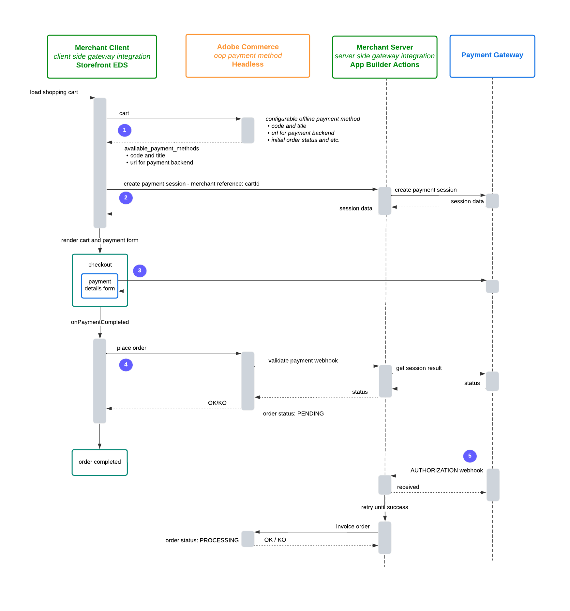

# Payment use cases

This page explores different use cases and scenarios for implementing payment methods using the Adobe Commerce checkout starter kit.

For more general use cases, refer to [use-cases](./use-cases.md).

## Integration strategies

The Adobe Commerce checkout starter kit supports several integration patterns with payment gateways based on a few key components that can be combined and adapted as needed.

### Key components

This strategy consists of the following components:

1. **OOPE Payment Method** - Database-persisted configuration managed with the [Admin REST APIs](https://developer.adobe.com/commerce/webapi/rest) based on [Commerce offline payment methods](https://experienceleague.adobe.com/en/docs/commerce-admin/stores-sales/payments/payments#offline-payment-methods).
1. **Cart GraphQL Extensions** - An enhanced GraphQL API that accommodates OOPE workflows.
1. **Client-Side Gateway Integration** - Lightweight widget using gateway SDKs in the [Adobe Commerce storefront checkout drop-in](https://experienceleague.adobe.com/developer/commerce/storefront/dropins/checkout).
1. **Server-Side Gateway Integration** - App Builder application handling gateway communication.

### Component flow

The following diagram shows a complete payment integration where the frontend handles user interactions, the backend manages business logic and data synchronization, and the external payment gateway processes the actual financial transactions. This architecture separates concerns between client-side user experience and server-side security and processing.


1. **Admin REST API connection** - The merchant connects to Adobe Commerce as a Cloud Service (SaaS) through the Admin REST API, allowing them to manage and configure the payment system from the backend.
1. **GraphQL API** - The Storefront Checkout communicates with Commerce SaaS using the GraphQL API, enabling the frontend to fetch and submit payment-related data during the checkout process.
1. **Client-side gateway integration** - The Payment Form Widget (embedded within the Storefront Checkout) handles the client-side integration with the external Payment Gateway. This allows shoppers to input payment information directly through the gateway's interface.
1. **Server-side gateway integration** - The AIO Runtime Action serves as the server-side integration point, handling backend communication between Adobe Commerce SaaS and the payment gateway. It processes events and webhooks from Commerce, makes admin REST API calls back to Commerce, and communicates with the gateway using server-side APIs.

### Standard checkout flow

Payment collection during checkout is the core requirement for any payment gateway integration. While refunds and other operations can be handled directly by merchants through their payment provider, checkout payment processing is essential.

The starter kit supports multiple checkout flow patterns. The following flow represents the standard approach used by Adobe Commerce Payment Services and many payment gateways, demonstrating a complete checkout process from cart initialization through payment processing to order completion and invoicing, with proper validation and status management at each step.

For alternative checkout flow patterns, see [Checkout session](#checkout-session-pattern) and [Client-side nonce](#client-side-nonce-pattern).



1. **Initialize cart and fetch payment methods** - The merchant client loads a shopping cart and requests cart details from Adobe Commerce. Adobe Commerce responds with available payment methods, including codes, titles, backend URLs, and configuration details for offline payment methods.
1. **Create payment session** - The merchant client initiates a payment session with the merchant server using a cart ID as reference. The merchant server then creates a payment session with the payment gateway, exchanging session data that gets relayed back to the merchant client.
1. **Render checkout and payment form** - The merchant client renders the cart and payment form. During checkout, the payment details form is presented to the user, who interacts directly with the payment gateway.
1. **Place order and validate payment** - After payment completion (`onPaymentCompleted`), the merchant client sends a `placeOrder` request to Adobe Commerce. Adobe Commerce triggers a `validate payment` webhook to the merchant server, which queries the payment gateway for session results and status. The merchant server responds with a success or failure status to Adobe Commerce, which updates the order status to `PENDING` and confirms completion to the merchant client.
1. **Authorization and invoicing** - The payment gateway sends an `authorization` webhook to the merchant server. The merchant server acknowledges receipt and attempts to `invoice order` with Adobe Commerce, retrying until successful. Upon successful invoicing, Adobe Commerce responds with a success or failure status and updates the order status to `PROCESSING`.

### Post-checkout patterns

Payment gateways often provide user interfaces where merchants can view and manage customer payments. You can use asynchronous communication patterns common in the [integration starter kit](../integration/index.md), to synchronize invoices and credit memos and their corresponding captures and refunds.

These patterns provide flexibility in how payment operations are integrated with order management, allowing developers to choose between asynchronous event-driven approaches or synchronous webhook-based validation depending on their specific requirements.

- [Non-blocking invoice creation](#non-blocking-invoice-creation)
- [Blocking invoice creation](#blocking-invoice-creation)
- [Incoming payment synchronization](#incoming-payment-synchronization)

#### Non-blocking invoice creation

Payment gateway events (capture, refund, cancellation) flow asynchronously through the merchant server to update Adobe Commerce, allowing the system to continue processing without waiting for payment confirmation.

The `observer.sales_order_invoice_save_after` and `observer.sales_order_creditmemo_save_after` events are implemented in the following diagram:


#### Blocking invoice creation

Alternatively, you can use the `plugin.magento.sales.api.invoice_repository.create` and `plugin.magento.sales.api.creditmemo_repository.create` webhooks to make invoice and credit memo creation dependent on successful payment operations, ensuring payment success before completing the financial document creation.


#### Incoming payment synchronization

Payment gateway captures and refunds are synchronized bidirectionally with Adobe Commerce through the Admin REST API, enabling real-time updates between the payment system and commerce platform.


### Checkout session pattern

In a minimal checkout flow, a checkout session is created with the payment gateway before starting the client-side payment process. Once payment is completed, the process with the gateway is effectively completed, and the only thing remaining is to find out the result and update the order.

This pattern represents a streamlined approach where the payment gateway handles the complete payment lifecycle upfront, allowing for faster order completion and reduced complexity in the checkout flow.


1. **Establish payment session** - Create a checkout session with the payment gateway before starting any client-side payment processing, establishing the foundation for the payment transaction.
1. **Complete payment client-side** - Handle the entire payment transaction through the client-side payment form, with the payment gateway processing the transaction and providing immediate confirmation.
1. **Place order immediately** - Once payment is confirmed by the gateway, place the order without waiting for additional validation, since the payment gateway has already processed and confirmed the transaction.
1. **Skip validation webhooks** - Since payment is already confirmed, payment validation webhooks become optional rather than required, streamlining the checkout process.
1. **Update order status** - The order can be finalized immediately since payment confirmation is already complete, allowing for faster order processing and customer satisfaction.

### Client-side nonce pattern

When using a payment method nonce (a secure, single-use reference to payment information), the payment is not completed with the client-side process. Instead, if payment is accepted, the client side is granted a payment nonce that can subsequently be used to create a payment transaction at the gateway.

Unlike the checkout session pattern where payment is completed client-side, the nonce pattern defers actual payment processing until the server-side validation step. This provides enhanced security by ensuring sensitive payment information is never processed directly on the client side, while still allowing for immediate order placement with the understanding that payment confirmation happens asynchronously.


1. **Load shopping cart** - The merchant client initiates the checkout process by loading the shopping cart.
1. **Generate client token** - The merchant client requests a client token from the merchant server, which then obtains it from the payment gateway.
1. **Render payment form** - Using the received token, the merchant client renders the checkout form with a payment details form.
1. **Generate payment nonce** - The customer enters payment information, which generates a secure, single-use nonce representing the payment details.
1. **Place order with nonce** - The merchant client sends the order request to Adobe Commerce, including the payment nonce.
1. **Validate payment webhook** - Adobe Commerce triggers a payment validation webhook to the merchant server, passing the nonce.
1. **Create transaction server-side** - The merchant server uses the nonce to create the actual payment transaction with the payment gateway.
1. **Process transaction response** - The payment gateway responds with success/failure status, which flows back through the merchant server to Adobe Commerce.
1. **Determine order status** - The order status is set based on the webhook type:
   - **PROCESSING** for blocking webhooks (immediate confirmation)
   - **PENDING** for non-blocking webhooks (awaiting confirmation)
1. **Optional authorization flow** - An asynchronous process handles payment authorization and order invoicing through additional webhooks.

## Get order details from Adobe Commerce using the masked cart ID

The following steps demonstrate the payment flow:

1. The payment flow starts at the frontend. When checkout is completed, the frontend sends the masked cart ID to the payment gateway.

1. The payment gateway then sends a request to the App Builder application with the masked cart ID, as this is the only information it has about the order. This request could be a webhook or an event.

1. The App Builder application uses the Adobe Commerce HTTP Client to retrieve the order details using the masked cart ID. To facilitate this, the starter kit provides the method `getOrderByMaskedCartId` in the Adobe Commerce HTTP Client.


## Validate payment info

To perform a headless checkout and payment, the Commerce instance must ensure that the payment has succeeded and the order can be placed.

### Set payment method additional data

To ingest payment gateway specific information in the payment process, the checkout process must use the [`setPaymentMethodOnCart` mutation](https://developer.adobe.com/commerce/webapi/graphql/schema/cart/mutations/set-payment-method/) in combination with the `payment_method.additional_data` field to persist the information required to validate the payment once the order is placed.

#### Using GraphQL

Use GraphQL in storefront or headless implementations where you already have the masked cart ID (from `createEmptyCart` or `customerCart`). The mutation accepts a structured array of `{ key, value }` objects, which become entries in the order payment's `additional_information`.

```graphql
setPaymentMethodOnCart(
  input: {
    cart_id: $cartId
    payment_method: {
      code: $code
      additional_data: [
        {
          key: 'sessionId',
          value: '12A34B56-1A23-1234-A123-123456A78901',
        },
        {
          key: 'status',
          value: 'DONE',
        },
      ]
    }
  }
) {
  cart {
    selected_payment_method {
      code
      title
    }
  }
}
```

#### Using REST API

Use the endpoint `/V1/carts/{cartId}/selected-payment-method` to set the payment method. For guest carts use `/V1/guest-carts/{maskedCartId}/selected-payment-method`. Unlike the GraphQL format, the REST format requires an array of `key=value` strings.

```bash
curl -X PUT \
  --url <ADOBE_COMMERCE_API_URL>/V1/carts/{cartId}/selected-payment-method \
  --header "Authorization: Bearer <TOKEN>" \
  --header "Content-Type: application/json" \
  --data '{
    "method": {
      "method": "your_payment_method_code",
      "additional_data": [
        "sessionId=12A34B56-1A23-1234-A123-123456A78901",
        "status=DONE"
      ]
    }
  }'
```

### Validate the payment with a webhook

With this additional information saved, you can configure an [Adobe Commerce Webhook](../../webhooks/index.md) to validate the payment during order placement. This webhook triggers a synchronous call to your App Builder application, which is responsible for verifying payment details before the order is finalized.

The following example demonstrates how to add a webhook to the [`observer.sales_order_place_before`](../../webhooks/use-cases/order-placement-validation.md) method:

&#8203;<Edition name="paas" /> To register a webhook, [modify the `webhooks.xml` file](../../webhooks/hooks.md) and create a new webhook with the following configuration:

```xml
<?xml version="1.0"?>
<config xmlns:xsi="http://www.w3.org/2001/XMLSchema-instance"
        xsi:noNamespaceSchemaLocation="urn:magento:module:Magento_AdobeCommerceWebhooks:etc/webhooks.xsd">
    <method name="observer.sales_order_place_before" type="before">
        <hooks>
            <batch name="out_of_process_payment_methods">
                <hook name="validate_payment"
                      url="https://<your_app_builder>.adobeioruntime.net/api/v1/web/commerce-checkout-starter-kit/validate-payment"
                      method="POST" timeout="20000" softTimeout="0" priority="100" required="true"
                      fallbackErrorMessage="Error on validation">
                    <fields>
                        <field name="payment_method" source="data.order.payment.method" />
                        <field name="payment_additional_information" source="data.order.payment.additional_information" />
                    </fields>
                    <rules>
                        <rule field="data.order.payment.method" operator="equal" value="<your_payment_method_code>" />
                    </rules>
                </hook>
            </batch>
        </hooks>
    </method>
</config>
```

&#8203;<Edition name="saas" />
For Adobe Commerce as a Cloud Service, you can [create webhooks in the Admin](../../webhooks/create-webhooks.md).

```yaml
Hook Settings

  Webhook Method: observer.sales_order_place_before
  Webhook Type: before
  Batch Name: validate_payment
  Hook Name: oope_payment_methods_sales_order_place_before
  URL: https://<your_app_builder>.runtime.adobe.io/api/v1/web/commerce-checkout-starter-kit/validate-payment
  Active: Yes
  Method: POST

Hook Fields

  Name: payment_method
  Source: data.order.payment.method

  Name: payment_additional_information
  Source: data.order.payment.additional_information

Hook Rules

  Name: data.order.payment.method
  Value: <your_payment_method_code>
  Operator: equal
```

To enhance security, enable webhook signature generation by following the [webhooks signature verification](../../webhooks/signature-verification.md) instructions.

Refer to [`actions/validate-payment.js`](https://github.com/adobe/commerce-checkout-starter-kit/blob/main/actions/validate-payment/index.js) for an example of how to validate the payment according to the payment gateway needs.

## Filter out payment method

In some cases, you may want to filter out a payment method based on the cart details or the customer's information. For example, you may want to disable a payment method based on customer group or product attributes in the cart.

You can use the `plugin.magento.out_of_process_payment_methods.api.payment_method_filter.get_list` webhook to filter out a payment method. This webhook is triggered every time the list of available payment methods is requested, allowing you to filter out the payment methods based on the cart details or customer information.

&#8203;<Edition name="paas" /> The following example demonstrates how to add a webhook to the `plugin.magento.out_of_process_payment_methods.api.payment_method_filter.get_list` method:

<InlineAlert variant="info" slots="text"/>

&#8203;<Edition name="saas" /> SaaS webhooks have slightly different naming conventions. For this example, use the `plugin.out_of_process_payment_methods.api.payment_method_filter.get_list` method.

```xml
<method name="plugin.magento.out_of_process_payment_methods.api.payment_method_filter.get_list" type="after">
    <hooks>
        <batch name="out_of_process_payment_methods">
            <hook name="payment_method_filter" url="https://<your_app_builder>.runtime.adobe.io/api/v1/web/commerce-checkout-starter-kit/filter-payment" method="POST" timeout="20000" softTimeout="0">
                <fields>
                    <field name="payload" />
                </fields>
            </hook>
        </batch>
    </hooks>
</method>
```

Payload example:

```json
{
    "payload": {
        "cart": {
            "entity_id": "1",
            "store_id": 1,
            "converted_at": null,
            "is_active": "1",
            ...
            "items": [
                {
                    "item_id": "4",
                    "quote_id": "1",
                    "product_id": "10",
                    "store_id": 1,
                    "weight": "124.000000",
                    "qty": 2,
                    "price": "600.0000",
                    "base_price": "600.0000",
                    ...
                    "product": {
                        "entity_id": "10",
                        ...
                        "attributes": {
                            "manufacturer": "Two",
                            "color": "Yellow",
                            "country_origin": "France",
                            ...
                        }
                    },
                },
                ...
            ],
        },
        "customer": {
            "entity_id": "1",
            "website_id": "1",
            "email": "test@example.com",
            "group_id": "1",
            ...
        }
    }
}
```

You can find examples of how to filter out payment methods using customer data or product attributes in your App Builder application in [`actions/filter-payment.js`](https://github.com/adobe/commerce-checkout-starter-kit/blob/main/actions/filter-payment/index.js).
