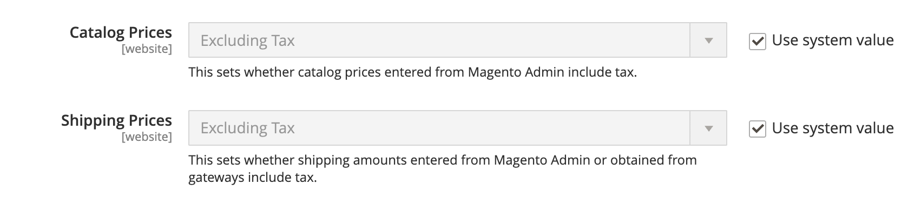
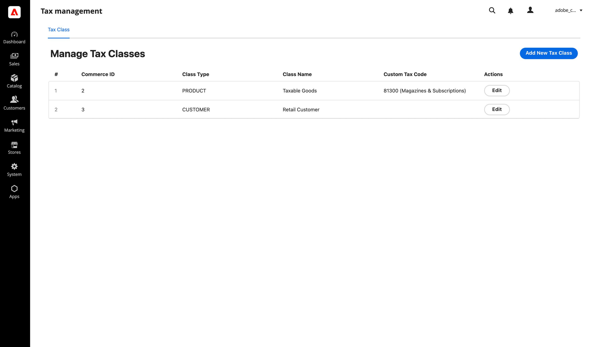

# Tax use cases

This page explores different use cases and scenarios for implementing tax integrations using the Adobe Commerce checkout starter kit.

For more general use cases, refer to [use-cases](./use-cases.md).

## Collect taxes

You can calculate and apply taxes on shopping carts during checkout by using the `collectTaxes` webhook. See [webhooks](../../webhooks/index.md) to understand and setup a webhook.

To register a webhook, you need to create a `webhooks.xml` [configuration file](../../webhooks/xml-schema.md) in your module or in the root `app/etc` directory.

The following example demonstrates how to add a webhook to the `plugin.magento.out_of_process_tax_management.api.oop_tax_collection.collect_taxes` method:

```xml
<config xmlns:xsi="http://www.w3.org/2001/XMLSchema-instance"
        xsi:noNamespaceSchemaLocation="urn:magento:module:Magento_AdobeCommerceWebhooks:etc/webhooks.xsd">
    <method name="plugin.magento.out_of_process_tax_management.api.oop_tax_collection.collect_taxes" type="before">
        <hooks>
            <batch name="collect_taxes">
                <hook
                    name="collect_taxes"
                    url="https://<your_app_builder>.runtime.adobe.io/api/v1/web/commerce-checkout-starter-kit/collect-taxes"
                    method="POST" timeout="10000" softTimeout="2000"
                    priority="300" required="true" fallbackErrorMessage="Tax calculation failed. Please try again later."
                    ttl="0"
                >
                </hook>
            </batch>
        </hooks>
    </method>
</config>
```

When the quote is recalculated, such as during a cart update or at checkout, a synchronous call is dispatched to the App Builder application that handles tax calculation. The response is returned through the oopQuote object, which includes the calculated tax fields. This webhook is only triggered when a shipping destination address is set, to avoid unnecessary calls during early cart interactions.

Refer to [`actions/collect-taxes.js`](https://github.com/adobe/commerce-checkout-starter-kit/blob/main/actions/collect-taxes/index.js) for an example of how to process the request and return the tax calculation to the commerce instance. This file can serve as a template to implement custom tax calculations.

### Payload

The Appbuilder application receives the following payload as an `oopQuote` object that contains the necessary data for the tax calculation. Once the calculation is processed, the response will populate the `tax` and `tax_breakdown` fields under the `items` array and provide the response to the commerce instance.

```json
{
  "oopQuote": {
    "customer_tax_class": "string",
    "items": [
      {
        "code": "sequence-1",
        "type": "product",
        "tax_class": "tax-1",
        "unit_price": 60,
        "quantity": 2,
        "is_tax_included": false,
        "discount_amount": 0,
        "custom_attributes": [],
        "sku": "SKU-1",
        "name": "Product Name 01",
        "tax": null,
        "tax_breakdown": []
      },
      {
        "code": "shipping",
        "type": "shipping",
        "tax_class": "Shipping Tax",
        "unit_price": 60,
        "quantity": 1,
        "is_tax_included": false,
        "discount_amount": 0,
        "custom_attributes": [],
        "sku": null,
        "name": null,
        "tax": null,
        "tax_breakdown": []
      }
    ],
    "ship_from_address": {
      "street": [],
      "city": "City1",
      "region": "Alhabama",
      "region_code": "AL",
      "country": "US",
      "postcode": "12345"
    },
    "ship_to_address": {
      "street": ["address 1", "address 2"],
      "city": "City1",
      "region": "California",
      "region_code": "CA",
      "country": "US",
      "postcode": "12345"
    },
    "billing_address": {
      "street": ["address 1", "address 2"],
      "city": "City1",
      "region": "California",
      "region_code": "CA",
      "country": "US",
      "postcode": "12345"
    },
    "shipping": {
      "shipping_method": "FREE",
      "shipping_description": "FREE"
    },
    "custom_attributes": []
  }
}
```

### Tax inclusive vs tax exclusive pricing

Adobe Commerce supports two pricing models for tax calculation: tax-inclusive and tax-exclusive pricing. The `is_tax_included` flag in the webhook payload indicates the model used for each line item:

- `is_tax_included: true` - The line item's `unit_price` already includes the full tax amount, which means that the [App Builder webhook](https://github.com/adobe/commerce-checkout-starter-kit/blob/main/actions/collect-taxes/index.js#L84) must avoid re‑adding the same tax.
- `is_tax_included: false` - The line item's `unit_price` is net and does not include tax, which means that the [App Builder webhook](https://github.com/adobe/commerce-checkout-starter-kit/blob/main/actions/collect-taxes/index.js#L84)  must add tax in addition to the net price.

#### Configure tax-inclusive pricing in Adobe Commerce

This configuration is set in the Adobe Commerce Admin under **Stores** > **Configuration** > **Sales** > **Tax** > **Calculation Settings**

 

#### Calculation examples:
The following examples illustrate how tax should be calculated in both pricing models:
* Example (inclusive): Gross price 120.00, VAT 20% → Net = 120 / 1.2 = 100.00, Tax = 20.00
* Example (exclusive): Net price 100.00, VAT 20% → Tax = 20.00, Gross = 120.00

In the [Adobe Commerce checkout starter kit](https://github.com/adobe/commerce-checkout-starter-kit/blob/main/actions/collect-taxes/index.js#L85) you can find an implementation of both pricing models.

Responses to commerce webhooks are expected to modify the original request body in various ways (see [`Webhook responses and logging`](https://developer.adobe.com/commerce/extensibility/webhooks/responses/)). The following response example uses the `replace` operation to set the tax field and the `add` operation to add different taxes to the `tax_breakdown` array.

The key points for constructing the response are:

- The `amount` in the `tax` object represents the actual tax applied to each line item.
- The `rate` in both the `tax` and `tax_breakdown` objects is included for reference to indicate which tax rate was applied.
- The `discount_compensation_amount` corresponds to the [`hidden tax`](https://experienceleague.adobe.com/en/docs/commerce-admin/stores-sales/site-store/taxes/hidden-tax-calculation), which accounts for the portion of tax adjusted by discounts.

```json
[
  {
    "op": "add",
    "path": "oopQuote/items/0/tax_breakdown",
    "value": {
      "data": {
        "code": "state_tax",
        "rate": 4.5,
        "amount": 5.4,
        "title": "State Tax",
        "tax_rate_key": "state_tax-4.5"
      }
    },
    "instance": "Magento\\OutOfProcessTaxManagement\\Api\\Data\\OopQuoteItemTaxBreakdownInterface"
  },
  {
    "op": "add",
    "path": "oopQuote/items/0/tax_breakdown",
    "value": {
      "data": {
        "code": "county_tax",
        "rate": 3.6,
        "amount": 4.32,
        "title": "County Tax",
        "tax_rate_key": "county_tax-3.6"
      }
    },
    "instance": "Magento\\OutOfProcessTaxManagement\\Api\\Data\\OopQuoteItemTaxBreakdownInterface"
  },
  {
    "op": "replace",
    "path": "oopQuote/items/0/tax",
    "value": {
      "data": {
        "rate": 8.1,
        "amount": 9.72,
        "discount_compensation_amount": 0
      }
    },
    "instance": "Magento\\OutOfProcessTaxManagement\\Api\\Data\\OopQuoteItemTaxInterface"
  }
]
```

## Update custom attributes on tax classes via Admin UI

The out-of-process tax module allows you to add custom attributes to tax classes. These attributes are useful when integrating with third-party tax systems that require standardized identifiers or additional metadata.  
For the relevant endpoints to update tax class custom attributes, see the [Tax API reference](./tax-reference.md).

To simplify management, the starter kit includes a sample Admin UI application. This single-page application, located in the [`commerce-backend-ui-1`](https://github.com/adobe/commerce-checkout-starter-kit/tree/main/commerce-backend-ui-1), connects to your Commerce instance, retrieves tax classes, and allows you to add or edit their custom attributes directly from the UI.



To set up the Admin UI application in your Commerce environment, see the [Admin UI SDK documentation](../../admin-ui-sdk/index.md).

Once custom attributes are assigned to tax classes, they are included in webhook requests during tax calculation.
Here's an example payload showing how the custom attributes from tax classes appear in the webhook request:

```json
{
  "oopQuote": {
    "customer_tax_class": "Retail Customer",
    "custom_attributes": {
      "tax_code": "005",
      "tax_label": "Retail"
    },
    ...
    "items": [
      {
        "tax_class": "Taxable Goods",
        "custom_attributes": {
          "tax_code": "001",
          "tax_label": "Textbook"
        },
        ...
      }
    ]
  }
}
```

## Propagate custom attributes of tax classes

The out-of-process tax module introduces support for assigning serialized custom attributes to tax classes. These attributes are then automatically associated with shopping cart data during cart creation and product addition. This allows for tax-related metadata to be included early in the checkout process and carried forward into subsequent operations.

### How it works

- **Customer Tax Class > Quote**:  
  When a customer creates a shopping cart, any serialized custom attributes associated with the customer's tax class are copied to the `Quote` entity.

- **Product Tax Class > Quote Item**:  
  When a product is added to the cart, serialized custom attributes from the product's tax class are copied to the corresponding `Quote Item`.

This ensures that both the `Quote` and each `Quote Item` contain tax-relevant custom data for further processing or integration.

### Quote to Order propagation

Once the customer places an order, all serialized custom attributes already present in the `Quote` and `Quote Item` entities are automatically propagated to the `Order` and `Order Item` entities, respectively.

This propagation ensures that tax class metadata—initially attached by customer and product associations—is consistently preserved throughout the entire checkout lifecycle. This allows external systems (such as tax calculation services) to access the tax class and its serialized custom attributes using:

- REST APIs
- GraphQL queries
- Event-driven integrations using Adobe Commerce Eventing

This consistency is critical for third-party integrations that rely on tax classification metadata for compliance, reporting, or invoicing purposes.
