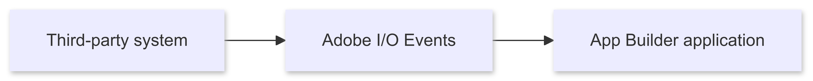

# Use cases

This page explores general use cases and scenarios that can be implemented using the Adobe Commerce checkout starter kit.

For module-specific use cases, refer to the following pages:

- [Payment](./payment-use-cases.md)
- [Shipping](./shipping-use-cases.md)
- [Tax](./tax-use-cases.md)

## Third-party events processing

Third-party systems usually offer a way to subscribe to events that are emitted when certain actions are performed. For example, with a payment gateway, we could subscribe to `Authorization`, `Capture` or `Refund` events.

Adobe I/O Events can offload the events processing, which requires configuring an event provider. The
[`configure-events`](https://github.com/adobe/commerce-checkout-starter-kit/blob/main/scripts/configure-events.js) script can manage third-party event providers required for your integration. Refer to [configure-events](./configure.md#configure-events) for more information.

After you configure the event provider, you can publish third-party events and register a consumer to process them accordingly.



### Publication

You have the following options to publish events with an App Builder app, depending on the flexibility of the third-party system.

#### Directly from third-party system (preferred)

We recommend ingesting events directly from the third-party system. This is the most efficient way to process events, but requires you to modify the source system to send the events to Adobe I/O Events.


Refer to the [Events Publishing API](https://developer.adobe.com/events/docs/guides/api/eventsingress_api/) for more information.

<InlineAlert variant="info" slots="text"/>

This example is not demonstrated in the GitHub project files, because it depends on source system details.

#### Publication using an action


If your third-party system does not support the preferred method of sending events to Adobe I/O Events, it should support registering a webhook that you can call when an event occurs. Additionally, the third party system may allow you to configure an authentication mechanism in the webhook (basic auth, OAuth) so that it only accepts authorized requests.

The starter kit demonstrates this use case in the [`actions/3rd-party-events/publish.js`](https://github.com/adobe/commerce-checkout-starter-kit/blob/main/actions/3rd-party-events/publish.js) action.

<InlineAlert variant="info" slots="text"/>

To implement this use case, the action must receive the `OAUTH_*` environment variables that allow it to retrieve an access token to publish in the event provider. You can specify this configuration using the environment variables in the [`.env` file](https://github.com/adobe/commerce-checkout-starter-kit/blob/main/env.dist), so that they match the authentication settings in your `app.config.yaml`.

### Consumption

You can consume the events using webhooks after registering the action as a consumer of the event provider.

The [`actions/3rd-party-events/consume.js`](https://github.com/adobe/commerce-checkout-starter-kit/blob/main/actions/3rd-party-events/consume.js) action provides an example of an event consumer that is registered declaratively as a Webhook in `app.config.yaml`. The value provided in the `provider_metadata` field is also used as the `AIO_EVENTS_PROVIDERMETADATA_TO_PROVIDER_MAPPING` environment variable, which allows the registration to know which provider to register the action to.

The AIO CLI provides an interactive command to register webhooks and actions as consumers of the event provider:

```shell
aio app add event
```

For more information on how to implement a consumer action and register it as a webhook, refer to
the [AppBuilder Applications with Adobe I/O Events](https://developer.adobe.com/events/docs/guides/appbuilder/) documentation.

You can also refer to the [Adobe I/O Events Webhook FAQ](https://developer.adobe.com/events/docs/support/faq/#webhook-faq) which contains information about how to handle event consumption, such as state of registration, retries, and debugging.
