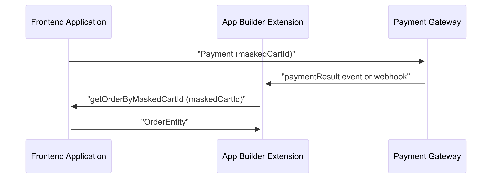

# Use cases

This page explores different use cases and scenarios that can be implemented using the Adobe Commerce checkout starter kit.

## Third-party events processing

Third-party systems usually offer a way to subscribe to events that are emitted when certain actions are performed. For example, with a payment gateway, we could subscribe to `Authorization`, `Capture` or `Refund` events.

Adobe I/O Events can offload the events processing, which requires configuring an event provider. The
[`configure-events`](https://github.com/adobe/commerce-checkout-starter-kit/blob/main/scripts/configure-events.js) script can manage third-party event providers required for your integration. Refer to [configure-events](./configure.md#configure-events) for more information.

After you configure the event provider, you can publish third-party events and register a consumer to process them accordingly.


### Publication

You have the following options to publish events with an App Builder app, depending on the flexibility of the third-party system.

#### Directly from third-party system (preferred)

We recommend ingesting events directly from the third-party system. This is the most efficient way to process events, but requires you to modify the source system to send the events to Adobe I/O Events.


Refer to the [Events Publishing API](https://developer.adobe.com/events/docs/guides/api/eventsingress_api/) for more information.

<InlineAlert variant="info" slots="text"/>

This example is not demonstrated in the GitHub project files, because it depends on source system details.

#### Publication using an action


If your third-party system does not support the preferred method of sending events to Adobe I/O Events, it should support registering a webhook that you can call when an event occurs. Additionally, the third party system may allow you to configure an authentication mechanism in the webhook (basic auth, OAuth) so that it only accepts authorized requests.

The starter kit demonstrates this use case in the [`actions/3rd-party-events/publish.js`](https://github.com/adobe/commerce-checkout-starter-kit/blob/main/actions/3rd-party-events/publish.js) action.

<InlineAlert variant="info" slots="text"/>

To implement this use case, the action must receive the `OAUTH_*` environment variables that allow it to retrieve an access token to publish in the event provider. You can specify this configuration using the environment variables in the [`.env` file](https://github.com/adobe/commerce-checkout-starter-kit/blob/main/env.dist), so that they match the authentication settings in your `app.config.yaml`.

### Consumption

You can consume the events using webhooks after registering the action as a consumer of the event provider.

The [`actions/3rd-party-events/consume.js`](https://github.com/adobe/commerce-checkout-starter-kit/blob/main/actions/3rd-party-events/consume.js) action provides an example of an event consumer that is registered declaratively as a Webhook in `app.config.yaml`. The value provided in the `provider_metadata` field is also used as the `AIO_EVENTS_PROVIDERMETADATA_TO_PROVIDER_MAPPING` environment variable, which allows the registration to know which provider to register the action to.

The AIO CLI provides an interactive command to register webhooks and actions as consumers of the event provider:

```shell
aio app add event
```

For more information on how to implement a consumer action and register it as a webhook, refer to
the [AppBuilder Applications with Adobe I/O Events](https://developer.adobe.com/events/docs/guides/appbuilder/) documentation.

You can also refer to the [Adobe I/O Events Webhook FAQ](https://developer.adobe.com/events/docs/support/faq/#webhook-faq) which contains information about how to handle event consumption, such as state of registration, retries, and debugging.

## Payment flow: Get order details from Adobe Commerce using the masked cart ID

The following steps demonstrate the payment flow:

1. The payment flow starts at the frontend. When checkout is completed, the frontend sends the masked cart ID to the payment gateway.

1. The payment gateway then sends a request to the App Builder application with the masked cart ID, as this is the only information it has about the order. This request could be a webhook or an event.

1. The App Builder application uses the Adobe Commerce HTTP Client to retrieve the order details using the masked cart ID. To facilitate this, the starter kit provides the method `getOrderByMaskedCartId` in the Adobe Commerce HTTP Client.



## Payment methods: Validate payment info

To perform a headless checkout and payment, the Commerce instance must ensure that the payment has succeeded and the order can be placed.

To ingest payment gateway specific information in the payment process, the checkout process must use the [`setPaymentMethodOnCart` mutation](https://developer.adobe.com/commerce/webapi/graphql/schema/cart/mutations/set-payment-method/) in combination with the `payment_method.additional_data` field to persist the information required to validate the payment once the order is placed.

```graphql
setPaymentMethodOnCart(
  input: {
    cart_id: $cartId
    payment_method: {
      code: $code
      additional_data: [
        {
          key: 'sessionId',
          value: '12A34B56-1A23-1234-A123-123456A78901',
        },
        {
          key: 'status',
          value: 'DONE',
        },
      ]
    }
  }
) {
  cart {
    selected_payment_method {
      code
      title
    }
  }
}
```

With this information persisted, you can configure an [Adobe Commerce Webhook](../../webhooks/index.md) so that every time an order is placed, a synchronous call dispatches to the App Builder application implementing the payment method to validate the payment.

To register a webhook, [modify the `webhooks.xml` file](../../webhooks/hooks.md) and create a new webhook with the following configuration:

```yaml
Hook Settings
  Webhook Method: observer.sales_order_place_before
  Webhook Type: before
  Batch Name validate_payment
  Hook Name: oope_payment_methods_sales_order_place_before
  URL: https://<yourappbuilder>.runtime.adobe.io/api/v1/web/commerce-checkout-starter-kit/validate-payment
  Active: Yes
  Method: POST

Hook Fields
  Field: payment_method Source: order.payment.method
  Field: payment_additional_information Source: order.payment.additional_information

Hook Rules
  Field: payment_method Value: <yourpaymentmethodcode> Operator: equal
```

You can also enable webhook signature generation by following the [webhooks signature verification](../../webhooks/signature-verification.md) instructions.

Refer to [`actions/validate-payment.js`](https://github.com/adobe/commerce-checkout-starter-kit/blob/main/actions/validate-payment/index.js) for an example of how to receive the request and validate the payment according to the payment gateway needs.

## Payment methods: Filter out payment method

In some cases, you may want to filter out a payment method based on the cart details or the customer's information. For example, you may want to disable a payment method based on customer group or product attributes in the cart.

You can use the `plugin.magento.out_of_process_payment_methods.api.payment_method_filter.get_list` webhook to filter out a payment method. This webhook is triggered every time the list of available payment methods is requested, allowing you to filter out the payment methods based on the cart details or customer information.

The following example demonstrates how to add a webhook to the `plugin.magento.out_of_process_payment_methods.api.payment_method_filter.get_list` method:

```xml
<method name="plugin.magento.out_of_process_payment_methods.api.payment_method_filter.get_list" type="after">
    <hooks>
        <batch name="check_product_stock">
            <hook name="check_product_stock" url="https://<yourappbuilder>.runtime.adobe.io/api/v1/web/commerce-checkout-starter-kit/filter-payment" method="POST" timeout="20000" softTimeout="0">
                <fields>
                    <field name="payload" />
                </fields>
            </hook>
        </batch>
    </hooks>
</method>
```

Payload example:

```json
{
    "payload": {
        "cart": {
            "entity_id": "1",
            "store_id": 1,
            "converted_at": null,
            "is_active": "1",
            ...
            "items": [
                {
                    "item_id": "4",
                    "quote_id": "1",
                    "product_id": "10",
                    "store_id": 1,
                    "weight": "124.000000",
                    "qty": 2,
                    "price": "600.0000",
                    "base_price": "600.0000",
                    ...
                    "product": {
                        "entity_id": "10",
                        ...
                        "attributes": {
                            "manufacturer": "Two",
                            "color": "Yellow",
                            "country_origin": "France",
                            ...
                        }
                    },
                },
                ...
            ],
        },
        "customer": {
            "entity_id": "1",
            "website_id": "1",
            "email": "test@example.com",
            "group_id": "1",
            ...
        }
    }
}
```

You can find examples of how to filter out payment methods using customer data or product attributes in your App Builder application in [`actions/filter-payment.js`](https://github.com/adobe/commerce-checkout-starter-kit/blob/main/actions/filter-payment/index.js).

## Shipping methods

You can add shipping methods to the checkout process by using [webhooks](../../webhooks/index.md).

To add shipping methods, you must [run a script to automatically create shipping carriers](./configure.md#create-shipping-carriers) or [create shipping carriers manually](./shipping-reference.md#shipping-api-reference) using the REST API. Only shipping methods with registered carriers are available in the checkout process.

After the webhook is registered, every time a shopping cart is requested, a synchronous call is dispatched to the App Builder application implementing the shipping method to calculate the shipping cost and provide the available shipping methods.

Refer to [`actions/shipping-methods.js`](https://github.com/adobe/commerce-checkout-starter-kit/blob/main/actions/shipping-methods/index.js) for an example of how to process the request and return the list of available shipping methods.

To register a webhook, you need to create a `webhooks.xml` [configuration file](../../webhooks/xml-schema.md) in your module or in the root `app/etc` directory.

The following example demonstrates how to add a webhook to the `plugin.magento.out_of_process_shipping_methods.api.shipping_rate_repository.get_rates` method:

```xml
<?xml version="1.0"?>
<config xmlns:xsi="http://www.w3.org/2001/XMLSchema-instance"
        xsi:noNamespaceSchemaLocation="urn:magento:module:Magento_AdobeCommerceWebhooks:etc/webhooks.xsd">
    <method name="plugin.magento.out_of_process_shipping_methods.api.shipping_rate_repository.get_rates" type="after">
        <hooks>
            <batch name="dps">
                <hook name="add_shipping_rates_dps" url="https://<yourappbuilder>.runtime.adobe.io/api/v1/web/commerce-checkout-starter-kit/shipping-methods" method="POST" timeout="5000" softTimeout="1000" priority="100" required="true">
                    <fields>
                        <field name="rateRequest" />
                    </fields>
                </hook>
            </batch>
        </hooks>
    </method>
</config>
```

You can register multiple webhooks for different shipping methods or shipping carriers by adding them into the same batch to ensure they are executed in parallel or create multiple batches to execute them sequentially.

### Remove shipping method

The `plugin.magento.out_of_process_shipping_methods.api.shipping_rate_repository.get_rates` webhook allows you to remove specific shipping methods from the list of available options.

If you use the `flatrate` shipping method, but want to disable it, you must update your webhook response to mark the shipping method as removed. This example is demonstrated in [`actions/shipping-methods.js`](https://github.com/adobe/commerce-checkout-starter-kit/blob/main/actions/shipping-methods/index.js).

## Shipping methods: Payload

The request payload contains information about all items in the cart, including product information, product attributes, shipping address, and customer information for logged-in customers.

Payload example:

```json
{
    "rateRequest": {
        "all_items": [
            {
                "item_id": "1",
                "quote_id": "1",
                "created_at": "2025-02-18 14:57:03",
                "updated_at": "2025-02-24 03:44:49",
                "product_id": "9",
                "store_id": 1,
                "parent_item_id": null,
                "is_virtual": "0",
                "sku": "simple-product-1",
                "name": "Simple product 1",
                "price": 500,
                "base_price": 500,
                ...
                "product": {
                    "entity_id": "9",
                    "attribute_set_id": "4",
                    "type_id": "simple",
                    "sku": "simple-product-1",
                    "price": "500.000000",
                    ...
                    "attributes": {
                        "manufacturer": "Demo Company",
                        "color": "Red",
                        "country_origin": "Japan",
                        ...
                    }
                }
            }
        ],
        "dest_country_id": "US",
        "dest_region_id": 12,
        "dest_region_code": "CA",
        "dest_street": "3320 N Crescent Dr\nBeverly Hills",
        "dest_city": "Los Angeles",
        "dest_postcode": "70210",
        "package_value": 1100,
        "package_value_with_discount": 1100,
        "package_weight": 124,
        "package_qty": 2,
        "package_physical_value": 1100,
        "free_method_weight": 124,
        "store_id": 1,
        "website_id": "1",
        "free_shipping": 0,
        "base_currency": {
            "currency_code": "USD"
        },
        "package_currency": {
            "currency_code": "USD"
        },
        ...
        "customer": {
            "entity_id": "1",
            "website_id": "1",
            "email": "test@example.com",
            "group_id": "1",
            "firstname": "John",
            "middlename": null,
            "lastname": "Doe",
            ...
        }
    }
}
```

You can find examples of how to use shipping addresses, customer data, and product attributes in your App Builder application in [`actions/shipping-methods.js`](https://github.com/adobe/commerce-checkout-starter-kit/blob/main/actions/shipping-methods/index.js).

## Shipping methods: GraphQL

In the `setShippingAddressesOnCart` mutation, available shipping methods that are returned by the webhook are appended to the `available_shipping_methods` field.

You can use the `additional_data` field to pass an array of key-value pairs to provide additional information about the shipping method from the webhook.

```json
{
  "data": {
    "setShippingAddressesOnCart": {
      "cart": {
        "shipping_addresses": [
          {
            "firstname": "John",
            "lastname": "Doe",
            "company": "Company Name",
            "street": ["3320 N Crescent Dr", "Beverly Hills"],
            "city": "Los Angeles",
            "region": {
              "code": "CA",
              "label": "California"
            },
            "postcode": "70210",
            "telephone": "123-456-0000",
            "country": {
              "code": "US",
              "label": "US"
            },
            "available_shipping_methods": [
              {
                "amount": {
                  "currency": "USD",
                  "value": 17
                },
                "available": true,
                "carrier_code": "DPS",
                "carrier_title": "Demo Postal Service",
                "error_message": "",
                "method_code": "dps_shipping_one",
                "method_title": "Demo Custom Shipping One",
                "price_excl_tax": {
                  "currency": "USD",
                  "value": 17
                },
                "price_incl_tax": {
                  "currency": "USD",
                  "value": 17
                },
                "additional_data": [
                  {
                    "key": "additional_data_key",
                    "value": "additional_data_value"
                  },
                  {
                    "key": "additional_data_key2",
                    "value": "additional_data_value2"
                  },
                  {
                    "key": "additional_data_key3",
                    "value": "additional_data_value3"
                  }
                ]
              },
              {
                "amount": {
                  "currency": "USD",
                  "value": 18
                },
                "available": true,
                "carrier_code": "DPS",
                "carrier_title": "Demo Postal Service",
                "error_message": "",
                "method_code": "dps_shipping_two",
                "method_title": "Demo Custom Shipping Two",
                "price_excl_tax": {
                  "currency": "USD",
                  "value": 18
                },
                "price_incl_tax": {
                  "currency": "USD",
                  "value": 18
                },
                "additional_data": []
              }
            ]
          }
        ]
      }
    }
  }
}
```

In the `setShippingMethodsOnCart` mutation, you can set the shipping method provided by webhook. Its information is stored in the `selected_shipping_method` field with the `additional_data`, if provided.

```json
{
  "data": {
    "setShippingMethodsOnCart": {
      "cart": {
        "shipping_addresses": [
          {
            "selected_shipping_method": {
              "amount": {
                "currency": "USD",
                "value": 17
              },
              "carrier_code": "DPS",
              "carrier_title": "Demo Postal Service",
              "method_code": "dps_shipping_one",
              "method_title": "Demo Custom Shipping One",
              "price_excl_tax": {
                "currency": "USD",
                "value": 17
              },
              "price_incl_tax": {
                "currency": "USD",
                "value": 17
              },
              "additional_data": [
                {
                  "key": "additional_data_key",
                  "value": "additional_data_value"
                },
                {
                  "key": "additional_data_key2",
                  "value": "additional_data_value2"
                },
                {
                  "key": "additional_data_key3",
                  "value": "additional_data_value3"
                }
              ]
            }
          }
        ]
      }
    }
  }
}
```


## Tax management

You can calculate and apply taxes on shopping carts during checkout by using the collectTaxes webhook. See [webhooks](../../webhooks/index.md). to understand and setup a webhook.

To register a webhook, you need to create a `webhooks.xml` [configuration file](../../webhooks/xml-schema.md) in your module or in the root `app/etc` directory.

The following example demonstrates how to add a webhook to the `plugin.magento.out_of_process_tax_management.api.oop_tax_collection.collect_taxes` method:

```xml
<config xmlns:xsi="http://www.w3.org/2001/XMLSchema-instance"
        xsi:noNamespaceSchemaLocation="urn:magento:module:Magento_AdobeCommerceWebhooks:etc/webhooks.xsd">
    <method name="plugin.magento.out_of_process_tax_management.api.oop_tax_collection.collect_taxes" type="before">
        <hooks>
            <batch name="collect_taxes">
                <hook name="my_hook"
                      url="AppBuilder Action URL"
                method="POST" timeout="10000"
                softTimeout="2000" priority="300" required="true"
                fallbackErrorMessage="Error on validation"
                ttl="0"
                >
                    <headers>
                        <header name="x-gw-ims-org-id">{env:APP_BUILDER_IMS_ORG_ID}</header>
                        <header name="Authorization">Bearer {env:APP_BUILDER_AUTH_TOKEN}</header>
                    </headers>
                </hook>
            </batch>
        </hooks>
    </method>
</config>
```

Once the webhook is registered, every time a shopping cart is requested, a synchronous call is dispatched to the App Builder application implementing the tax calculation and provide the response through an oopQuote object containing the tax fields.

Please refer to [`actions/tax-calculation.js`](https://github.com/adobe/commerce-checkout-starter-kit/blob/main/actions/tax-calculation/index.js) for an example of how to process the request and return the tax calculation to the commerce instance. This link can be served as a template to implement custom tax calculations.

## Tax calculation: Payload

The Appbuilder application receives the following payload as an oopQuote object that contains the necessary data for the tax calculation. Once the calculation is processed, the response will populate the "tax" and "tax_breakdown" fields under "items" and provide the response to the commerce instance.

```json
{
    "oopQuote": {
        "customer_tax_class": "string",
        "items": [
            {
                "code": "sequence-1",
                "type": "product",
                "tax_class": "tax-1",
                "unit_price": "60",
                "quantity": "2",
                "is_tax_included": false,
                "discount_amount": 0,
                "custom_attributes": [],
                "sku": "SKU-1",
                "name": "Product Name 01",
                "tax": null,
                "tax_breakdown": []
            },
                                {
                "code": "sequence-1",
                "type": "shipping",
                "tax_class": "tax-1",
                "unit_price": "10",
                "quantity": "1",
                "is_tax_included": false,
                "discount_amount": 0,
                "custom_attributes": [],
                "sku": "SKU-1",
                "name": "Product Name 01",
                "tax": null,
                "tax_breakdown": []
            }
        ],
        "ship_from_address": {
            "street": "Sesam Street",
            "city": "City1",
            "region": "Alhabama",
            "region_code": "AL",
            "country": "US",
            "postcode": "12345"
        },
        "ship_to_address": {
            "street": "Sesam Street",
            "city": "City1",
            "region": "California",
            "region_code": "CA",
            "country": "US",
            "postcode": "12345"
        },
        "billing_address": {
            "street": "Sesam Street",
            "city": "City1",
            "region": "California",
            "region_code": "CA",
            "country": "US",
            "postcode": "12345"
        },
        "shipping": {
            "shipping_method": "FREE",
            "shipping_description": "FREE"
        },
        "custom_attributes": []
    }
}
```

## Tax calculation: App Builder Response

Sample App builder response that will populate the "tax" and "tax_breakdown" attributes.

```json
[
    {
        "op": "add",
        "path": "oopQuote/items/0/tax_breakdown",
        "value": {
            "data": {
                "code": "state_tax",
                "rate": 4.5,
                "amount": 5.4,
                "title": "State Tax",
                "tax_rate_key": "state_tax-4.5"
            }
        },
        "instance": "Magento\\OutOfProcessTaxManagement\\Api\\Data\\OopQuoteItemTaxBreakdownInterface"
    },
    {
        "op": "add",
        "path": "oopQuote/items/0/tax_breakdown",
        "value": {
            "data": {
                "code": "county_tax",
                "rate": 3.6,
                "amount": 4.32,
                "title": "County Tax",
                "tax_rate_key": "county_tax-3.6"
            }
        },
        "instance": "Magento\\OutOfProcessTaxManagement\\Api\\Data\\OopQuoteItemTaxBreakdownInterface"
    },
    {
        "op": "replace",
        "path": "oopQuote/items/0/tax",
        "value": {
            "data": {
                "rate": 8.1,
                "amount": 9.72,
                "discount_compensation_amount": 0
            }
        },
        "instance": "Magento\\OutOfProcessTaxManagement\\Api\\Data\\OopQuoteItemTaxInterface"
    },
    {
        "op": "add",
        "path": "oopQuote/items/1/tax_breakdown",
        "value": {
            "data": {
                "code": "state_tax",
                "rate": 4.5,
                "amount": 0.45,
                "title": "State Tax",
                "tax_rate_key": "state_tax-4.5"
            }
        },
        "instance": "Magento\\OutOfProcessTaxManagement\\Api\\Data\\OopQuoteItemTaxBreakdownInterface"
    },
    {
        "op": "add",
        "path": "oopQuote/items/1/tax_breakdown",
        "value": {
            "data": {
                "code": "county_tax",
                "rate": 3.6,
                "amount": 0.36,
                "title": "County Tax",
                "tax_rate_key": "county_tax-3.6"
            }
        },
        "instance": "Magento\\OutOfProcessTaxManagement\\Api\\Data\\OopQuoteItemTaxBreakdownInterface"
    },
    {
        "op": "replace",
        "path": "oopQuote/items/1/tax",
        "value": {
            "data": {
                "rate": 8.1,
                "amount": 0.81,
                "discount_compensation_amount": 0
            }
        },
        "instance": "Magento\\OutOfProcessTaxManagement\\Api\\Data\\OopQuoteItemTaxInterface"
    }
]


## Tax management: Update custom attributes on tax classes via Admin UI

The out-of-process tax module allows you to add custom attributes to tax classes. These attributes are useful when integrating with third-party tax systems that require standardized identifiers or additional metadata.  
For the relevant endpoints to update tax class custom attributes, see the [Tax API reference](./tax-reference.md).

To simplify management, the starter kit includes a sample Admin UI application. This single-page application, located in the [`commerce-backend-ui-1`](https://github.com/adobe/commerce-checkout-starter-kit/tree/main/commerce-backend-ui-1), connects to your Commerce instance, retrieves tax classes, and allows you to add or edit their custom attributes directly from the UI.


To set up the Admin UI application in your Commerce environment, see the [Admin UI SDK documentation](../../admin-ui-sdk/index.md).

Once custom attributes are assigned to tax classes, they are included in webhook requests during tax calculation.
Here's an example payload showing how the custom attributes from tax classes appear in the webhook request:

```json
{
  "oopQuote": {
    "customer_tax_class": "Retail Customer",
    "custom_attributes": {
      "tax_code": "005",
      "tax_label": "Retail"
    },
    ...
    "items": [
      {
        "tax_class": "Taxable Goods",
        "custom_attributes": {
          "tax_code": "001",
          "tax_label": "Textbook"
        },
        ...
      }
    ]
  }
}
```
