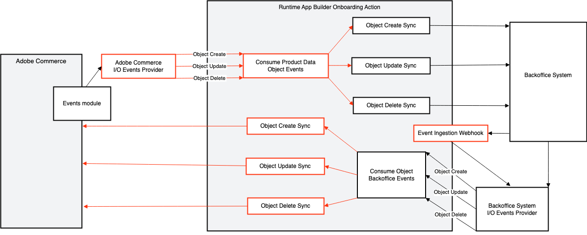

# Data flow overview

This page describes the data flows that are currently available for Adobe Commerce integration starter kit.

The following image indicates the general path of data using the red boxes and lines. The term "Object" in this diagram refers to the objects in Adobe Commerce, for example, Products, Customers, or Orders.

<InlineAlert variant="info" slots="text"/>

Not all data flows support create, update, and delete operations. Review the specific data flow page for more information.

The starter kit supports the following data flows:

- [Customers](./customers.md)
- [Orders](./orders.md)
- [Products](./products.md)
- [Shipment](./shipments.md)
- [Stock](./stock.md)
