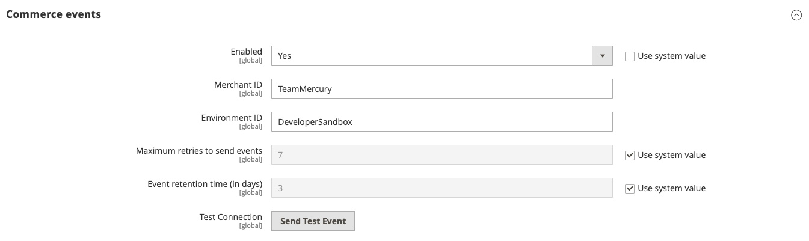

import ProjectRequirements from '/src/_includes/project-requirements.md'

# Install Adobe Commerce integration starter kit

Give us 45 minutes, and we will help you integrate Commerce with your back office system following our best practices.

## Prerequisites

To get started with Adobe Commerce integration starter kit:

<ProjectRequirements />

## Big picture

Integrating Adobe Commerce with your enterprise resource planning (ERP), order management system (OMS), or customer relationship management (CRM) is now easier with Adobe Commerce integration starter kit. The starter kit reduces the cost of integrating with ERP solutions and improves reliability of real-time connections. It includes reference integrations for commonly used commerce data like orders, products, and customers. It also includes onboarding scripts and a standardized architecture for developers to build while following best practices.


## Create your integration (step-by-step)

The best part about the integration starter kit is that it provides a standardized architecture that follows Adobe Commerce best practices. We think that you can get through this single-page tutorial in under an hour.

<InlineAlert variant="info" slots="text"/>

Support services for the starter kit include the basic functionality and configuration. Because the starter kit is a scaffolding designed to make custom integrations easier, Adobe does not provide support services for modified code or your custom integrations.

### Onboarding

[Projects Overview](https://developer.adobe.com/developer-console/docs/guides/projects/) describes the different types of projects and how to manage them. Here, we'll create a templated project.

1. Log in to the Adobe Developer Console and select the desired organization from the dropdown menu in the top-right corner.

1. Click **Create new project from template**.

   

   If the **Create project from template** option is not displayed, it might be because your request to access App Builder has not yet been approved.

1. Select **App Builder**. The **Set up templated project** page displays.

   

1. Specify a project title and app name. Make sure the **Include Runtime with each workspace** checkbox is selected. You can optionally create a custom workspace other than the default **Stage** workspace. To create a custom workspace, click **Add Workspace**, and enter a name and description. Click **Save**. The Console creates a project and workspaces.

   

1. In your workspace, click the **Add service** pop-up menu and select **API**.

   

1. Add the following services to your workspace. Each service must be added individually. You cannot add multiple services simultaneously.

   - I/O Events
   - I/O Management API
   - Adobe I/O Events for Adobe Commerce
   - Adobe Commerce as a Cloud Service - If you are adding the Adobe Commerce as a Cloud Service API for the first time:
       - Check the `.env` file to ensure that the `commerce.accs` scope is added to OAUTH_SCOPES.
       - [Download the workspace configuration](#download-the-workspace-configuration-file) and run `aio app use` again.

   <InlineNestedAlert variant="info" header="true" iconPosition="right">

   Adobe Commerce as a Cloud Service API is only required when accessing Adobe Commerce as a Cloud Service.

   </InlineNestedAlert>

   Click one of these services, such as **I/O Management API**. Then click **Next**.

   

1. On the **Configure API** page, select the **OAuth Server-to-Server** option and click **Save configured API**.

   

   <InlineNestedAlert variant="info" header="true" iconPosition="right">

   You can set up server-to-server authentication using JSON Web Tokens (JWT). However, this method has been deprecated in favor of OAuth and must be replaced no later than January 1, 2025. See [Service Account Authentication](https://developer.adobe.com/developer-console/docs/guides/authentication/JWT/) for details on implementing this solution.

   </InlineNestedAlert>

1. Use the **Add service** pop-up menu to select and add the other required services.

1. If you are using JWT authentication, unzip the downloaded `config.zip` file. The extracted `config` directory should contain a `certificate_pub.crt` and a `private.key` file. The `private.key` file is required to configure the Commerce Admin.

#### Download the workspace configuration file

The console can generate a JSON file that defines the configuration of your workspace. You will use this file to configure the Commerce Admin and to set up the starter kit.

To download a `.json` file containing your workspace configuration:

1. Go to the overview page of your workspace.

1. Click the **Download All** button in the top-right corner.

   The `<Workspace-name>.json` file downloads automatically. In this example, the file is named `977AmethystGazelle-1340225-Stage.json`. Rename the file `workspace.json` and save it in the `scripts/onboarding/config/` directory of the starter kit.  

#### PaaS or SaaS

The integration starter kit is designed to work with all Adobe Commerce versions, but only one at a time. This means that you can use either Adobe Commerce on Cloud / on Premises (PaaS) or Adobe Commerce as a Cloud Service (SaaS). By default, the starter kit will check for PaaS authentication first using **OAuth1**, before it checks for SaaS authentication using **IMS**.

&#8203;<Edition name="paas" /> For PaaS configurations, refer to [Create an integration in Adobe Commerce (PaaS only)](#create-an-integration-in-adobe-commerce-paas-only) and make sure your environment variables `COMMERCE_XXXX` are set correctly in the `.env` file.

&#8203;<Edition name="saas" /> For SaaS configurations, refer to [Create an integration in Adobe Commerce as a Cloud Service](#create-an-integration-in-adobe-commerce-as-a-cloud-service) and make sure the environment variables file does not contain `COMMERCE_XXXX` variables.

<InlineAlert variant="info" slots="text"/>

`app.config.yaml` has both sets of environment variables declared. These determine the runtime action context. This file works regardless of offering, so you do not need to modify it.

#### Create an integration in Adobe Commerce (PaaS only)

<Edition name="paas" />

A Commerce integration generates the consumer key, consumer secret, access token, and access token secret that are required to connect to the starter kit. It also identifies the available API resources that are needed for the integration.

<InlineAlert variant="info" slots="text"/>

This section applies to **PaaS** customers only. For **SaaS** customers, see [Create an integration in Adobe Commerce as a Cloud Service](#create-an-integration-in-adobe-commerce-as-a-cloud-service).

Use the following steps to create and activate an integration.

1. From the Admin, go to **System** > Extensions > **Integrations**.

1. Click **Add New Integration**. The **New Integration** page displays.

   

1. Enter a name for the integration in the **Name** field. Leave the other fields blank.

1. Click **API** under the Basic Settings menu to display the **Available APIs** screen. Change the value of the **Resource Access** drop-down menu to **All**.

1. Click **Integration Info** and enter your Admin password in the **Your Password** field. Click **Save** to return to the Integration page.

1. Click the **Activate** link in the grid.

  

1. On the next page, click the **Allow** button to display the **Integration Tokens for Extensions** page.

   

   You will need the integration details (consumer key, consumer secret, access token, and access token secret) to configure the starter kit. Copy these values to a safe place and click **Done**.

#### Create an integration in Adobe Commerce as a Cloud Service

<Edition name="saas" />

To configure authentication for Adobe Commerce as a Cloud Service (SaaS), you need to add OAuth server-to-server credentials to your environment.

<InlineAlert variant="info" slots="text"/>

This section applies to **SaaS** customers only. For **PaaS** customers, see [Create an integration in Adobe Commerce](#create-an-integration-in-adobe-commerce-paas-only).

1. In the [Adobe Developer Console](https://developer.adobe.com/console):

   1. Navigate to your project or create a new one.

   1. Add the **I/O Management API** to enable server-to-server authentication capabilities. For more information, refer to [server-to-server authentication](https://developer.adobe.com/developer-console/docs/guides/authentication/ServerToServerAuthentication/implementation#setting-up-the-oauth-server-to-server-credential/).

1. Store the credentials from Adobe Developer Console in the integration starter kit's `.env` file. The following values are required:

   ```text
   OAUTH_CLIENT_ID=<string> # Your client ID
   OAUTH_CLIENT_SECRET=<string> # Your client secret
   OAUTH_SCOPES=<array> # ['scope1', 'scope2']
   ```

   The following values are optional:

   ```text
   OAUTH_HOST=<string> # default: https://ims-na1.adobelogin.com
   ```

#### Install Adobe I/O Events for Adobe Commerce (Commerce 2.4.4 and 2.4.5 only)

If you are running Adobe Commerce 2.4.6 or higher, the modules that enable eventing are installed automatically. Skip to the next step. If you are running Commerce 2.4.4 or 2.4.5, you must install modules to enable eventing, as described in [Install Adobe I/O Events for Adobe Commerce](../../events/installation.md).

### Download and configure the starter kit

Use the following steps to download and configure the Adobe Commerce integration starter kit. The starter kit is located in a [public repository](https://github.com/adobe/commerce-integration-starter-kit).

1. Clone the repo using SSH:

   ```bash
   git clone git@github.com:adobe/commerce-integration-starter-kit.git
   ```

1. Change directories to the downloaded repo and copy the `env.dist` file.

   ```bash
   cd <download-directory> && cp env.dist .env
   ```

1. Fill in the values in the `.env` file. The file describes where you can find the values for each environment variable. The following values are required:

   ```text
   COMMERCE_CONSUMER_KEY=
   COMMERCE_CONSUMER_SECRET=
   COMMERCE_ACCESS_TOKEN=
   COMMERCE_ACCESS_TOKEN_SECRET=
   ```

   Also set the value for `PROJECT_NAME` in the `.env` file. When multiple applications are involved, each having their own event provider, the `PROJECT_NAME` variable distinguishes between them during event subscription. This allows each application to subscribe to the same event using a unique alias.

   ```text
   PROJECT_NAME=
   ```

   * Example: `PROJECT_NAME='test_app'`
   * Event Subscription: `test_app.observer.catalog_product_save_commit_after`

When configuring the `COMMERCE_BASE_URL` environment variable, the format differs between [PaaS and SaaS](#paas-or-saas):

- &#8203;<Edition name="paas" />For PaaS (On-Premise/Cloud):

   - `COMMERCE_BASE_URL` must include your base site URL + `/rest/`
   - Example: `https://<environment-name>.us-4.magentosite.cloud/rest/`

- &#8203;<Edition name="saas" />For SaaS (Adobe Commerce as a Cloud Service):

   - `COMMERCE_BASE_URL` must be the REST API endpoint provided by Adobe Commerce
   - Example: `https://na1-sandbox.api.commerce.adobe.com/<tenant-id>/`

Make sure to use your actual environment name or tenant ID in the URL. The examples above use placeholder values.

#### Configure the starter kit

1. Install npm dependencies:

   ```bash
   npm install
   ```

1. Run the following Adobe I/O commands to connect your starter kit project to the App Builder project you created earlier:

   ```bash
   aio login
   aio console org select
   aio console project select
   aio console workspace select
   ```

1. Sync your local application with the App Builder project using the following command:

   ```bash
   aio app use --merge
   ```

1. The `app.config.yaml` file in the repo's root directory defines which packages to deploy. The Integration Starter Kit provides packages for Commerce products, customers, orders, shipments, and stocks and their external back office counterparts. Comment out any unneeded packages that are not applicable to your project.

   <InlineNestedAlert variant="info" header="true" iconPosition="right">

   The `info` action is enabled by default. This action is reserved for future use. Do not disable or delete the `info` action.

   </InlineNestedAlert>

#### Deploy the project

Run the following command to deploy the project. The command deploys the runtime actions needed for the onboarding step:

```bash
aio app deploy
```

You can confirm the success of the deployment in the Adobe Developer Console by navigating to the Runtime section on your workspace.


#### Complete the configuration

The next steps in the onboarding process configures event registrations and completes the eventing configuration in Adobe Commerce.

**Configure the event registrations**

By default, the `scripts/onboarding/config/starter-kit-registrations.json` config file creates all the registrations for all entities that are present in the repo's `app.config.yaml` file. You can edit this file to remove any unnecessary Commerce or back office registrations. For example, the YAML file shown in the [Configure the project](#configure-the-starter-kit) section comments out the `product-backoffice` package. In this case, you must remove backoffice from the product entity:

```json
{
  "product": ["commerce"],
  "customer": ["commerce", "backoffice"],
  "order": ["commerce", "backoffice"],
  "stock": ["commerce", "backoffice"]
}
```

The Customize Registrations and Events [code sample](https://github.com/adobe/adobe-commerce-samples/blob/main/starter-kit/customize-registrations-and-events/README.md) shows how you can configure your event registrations.

**Execute the onboarding**

Run the following command to generate the IO Event providers and the registrations for your starter kit project.

<InlineAlert variant="info" slots="text"/>

As of version `1.12.0`, your Commerce instance can connect to additional event providers.

```bash
npm run onboard
```

The console displays the provider's IDs. The commerce instance and provider IDs will be used to configure your Commerce instance. You will need the backoffice provider ID to send the events to the App builder project.

```terminal
Process of On-Boarding done successfully: [
  {
    key: 'commerce',
    id: '<Commerce Provider ID>',
    instanceId: '<Instance ID of Commerce Provider',
    label: 'Commerce Provider'
  },
  {
    key: 'backoffice',
    id: '<Backoffice Provider ID>',
    instanceId: '<Instance ID of backoffice provider',
    label: 'Backoffice Provider'
  }
]
```

Check your App in the Developer Console to confirm the registrations were created.


**Complete the Adobe Commerce eventing configuration**

<InlineAlert variant="info" slots="text"/>

The following steps are not required when using Adobe I/O Events version `1.12.0` or later. The onboarding script will configure the Adobe Commerce instance automatically.

Proceed to the next section, or continue following the steps in this section to validate that the configuration is correct.

You must configure Commerce to communicate with your project. Configuration includes copying and pasting the contents of the workspace configuration file that you downloaded from the Adobe Developer Console.

1. In the Commerce Admin, navigate to **Stores** > Settings > **Configuration** > **Adobe Services** > **Adobe I/O Events** > **General configuration**. The following screen displays.

   

1. Select the server-to-server authorization method you implemented from the **Adobe I/O Authorization Type** menu. Adobe recommends using OAuth. JWT has been deprecated.

1. Copy the contents of the `<workspace-name>.json` file into the **Adobe I/O Workspace Configuration** field.

1. Enter a unique identifier in the **Adobe I/O Event Provider Instance ID** field. This unique value identifies your Commerce instance, which allows Commerce events to connect to the correct `Event Provider` in Adobe I/O. This ID corresponds to the **Provider** displayed when [subscribing to events](../../events/configure-commerce.md#subscribe-and-register-events).

   <InlineNestedAlert variant="info" header="true" iconPosition="right">

   This value must contain English alphanumeric characters, underscores (_), and hyphens (-) only.

   </InlineNestedAlert>

1. Click **Save Config**, but do not leave the page. The next section creates an event provider, which is necessary to complete the configuration.

1. Enable Commerce Eventing by setting **Enabled** to `Yes`.

   

   **Note**: You must enable cron to allow Commerce to send events to the endpoint.

1. Enter the merchant's company name in the **Merchant ID** and the environment name in the **Environment ID** field. The values of these fields will be combined and added as a `source` attribute to your event data to identify the source of the events. It can be useful for event filtration or other logic if you are using the same event provider for several environments or projects.

   <InlineNestedAlert variant="info" header="true" iconPosition="right">

   The **Merchant ID** and **Environment ID** fields only support alphanumeric characters and underscores.

   </InlineNestedAlert>

   ```javascript
   "source": "<merchant-id>.<environment-id>"
   ```

1. (Optional) By default, if an error occurs when Adobe Commerce attempts to send an event to Adobe I/O, Commerce retries a maximum of seven times. To change this value, uncheck the **Use system value** checkbox and set a new value in the **Maximum retries to send events** field.

1. (Optional) By default, Adobe Commerce runs a cron job (clean_event_data) every 24 hours that deletes event data three days old. To change the number of days to retain event data, uncheck the **Use system value** checkbox and set a new value in the **Event retention time (in days)** field.

1. Click **Save Config**.

**Subscribe to events in Adobe Commerce**

To automatically subscribe to Commerce events using Adobe I/O Events, run the `commerce-event-subscribe` script in the `scripts/commerce-event-subscribe/config/` directory.

```bash
npm run commerce-event-subscribe
```

For earlier versions, follow the steps below to subscribe to the events manually.

Use the `bin/magento events:subscribe` command to subscribe to events, as described in [Subscribe and register events](../../events/configure-commerce.md#subscribe-and-register-events). The following table defines the events for each supported entity that you must subscribe to and lists the required fields, if applicable.

Entity | Event | Required fields
--- | --- | ---
Product | `observer.catalog_product_delete_commit_after` | `sku`
Product | `observer.catalog_product_save_commit_after`   | `sku`, `created_at`, `updated_at`
Customer | `observer.customer_save_commit_after` | `created_at`, `updated_at`
Customer | `observer.customer_delete_commit_after` | `entity_id`
Customer group | `observer.customer_group_save_commit_after` | `customer_group_code`
Customer group | `observer.customer_group_delete_commit_after` | `customer_group_code`
Order | `observer.sales_order_save_commit_after` | `created_at`, `updated_at`
Stock | `observer.cataloginventory_stock_item_save_commit_after` | `product_id`
