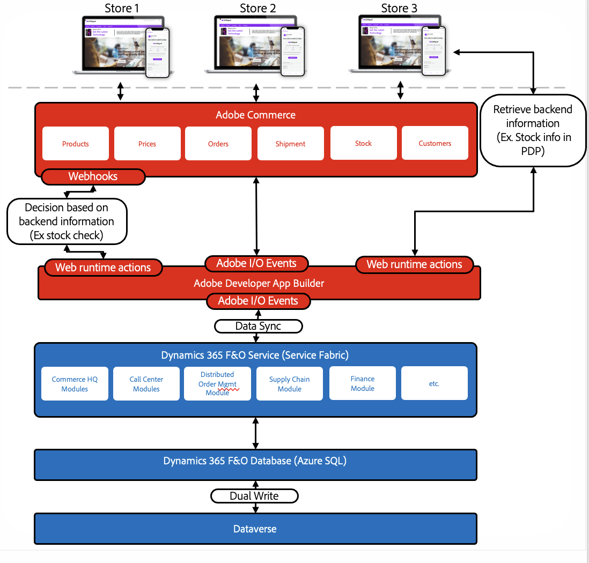

# Microsoft Dynamics Finance and Operations Accelerator for Adobe Commerce

The [Microsoft Dynamics Finance and Operations Accelerator for Adobe Commerce](https://exchange.adobe.com/apps/ec/ab76757u7q/msft-d365-fo-for-adobe-commerce) reference application provides developers with a basic understanding of the types of applications they can create with Adobe Commerce integration starter kit. Adobe and its partners created this application using the starter kit. Use it to help you understand how to integrate Adobe Commerce with other systems.

Microsoft's Dynamics 365 Finance and Operations (D365 F&O) is an enterprise resource planning (ERP) tool for medium and large businesses to handle their operational processes, such as finance, sales, purchase orders, and more.

This reference application provides a base implementation for the most common data flows you can use when integrating Adobe Commerce with D365 F&O.

### Features

- **Out-of-the-Box Integration** - Leverage Adobe's serverless extensibility architecture to integrate data between Adobe Commerce and D365 F&O out-of-the-box.
- **Sync common data types for ecommerce** - Sync customer, products, prices, and stock data from D365 F&O to Commerce.
- **Send orders to Microsoft Dynamics F&O** - Send orders from Commerce to D365 F&O.
- **Notify customers of shipment** - Notify customers of an order shipment when an order status updates in D365 F&O.

### Use cases

This reference application uses starter kit [data flows](./data-flows.md) for the following use cases:

- **Customer data flow**
  - Customer
    - Adobe Commerce synchronizes new and updated merchant data to D365 F&O.
    - Microsoft F&O synchronizes new and updated merchant data to Adobe Commerce.
  - Customer groups
    - Microsoft F&O synchronizes new and updated customer groups to Adobe Commerce.
- **Products data flow**
  - Customer
    - Adobe Commerce synchronizes new and updated products to D365 F&O
- **Order data flow**
  - Order and order flow
    - Adobe Commerce synchronizes new orders to D365 F&O
    - D365 F&O synchronizes changes in order flow to Adobe Commerce
