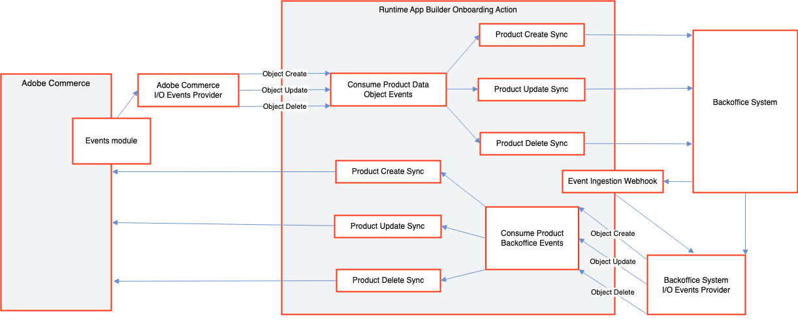
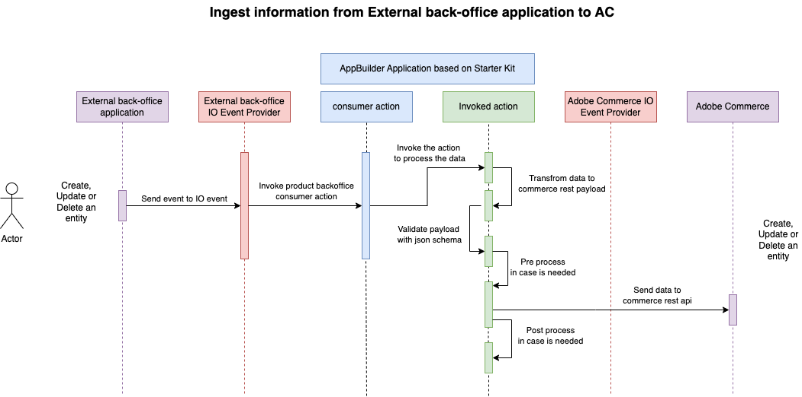

# Enrich the shopping experience

This runtime action is responsible for notifying Adobe Commerce when an `<object>` is created, updated, or deleted in the external backoffice application.

The `create`, `update`, and `delete` runtime actions in the Adobe Commerce integration starter kit perform one of the following functions:

- [Expose Commerce data](send-data.md) - Notifies an external back-office application when an `<object>` is created, updated, or deleted in Adobe Commerce. Actions that react to Adobe Commerce events and notify the external back-office application are located in the `actions/<object>/commerce` folder.
- [Enrich Shopping experience](receive-data.md) - Notifies Adobe Commerce when an `<object>` is created, updated, or deleted in an external back-office application. Actions that react to back-office application events and notify Adobe Commerce are located in the `actions/<object>/external` folder.



- **Preprocessing data** - Any preprocessing needed before calling the Adobe Commerce API can be implemented in the `preProcess` function in the `pre.js` file.
- **Postprocessing data** - Any postprocessing needed after calling the Adobe Commerce API can be implemented in the `postProcess` function in the `post.js` file.

## Incoming information

The incoming information depends on the external API. The following sample implementation can be modified to accommodate your specific integration needs.



### `customer`

<CodeBlock slots="heading, code" repeat="3" languages="JSON, JSON, JSON" />

#### create

```json
{
  "email": "sample@email.com",
  "name": "John",
  "lastname": "Doe"
}
```

#### update

```json
{
  "id": 1234,
  "email": "sample@email.com",
  "name": "John",
  "lastname": "Doe"
}
```

#### delete

```json
{
  "id": 1234
}
```

### `customer_group`

<CodeBlock slots="heading, code" repeat="3" languages="JSON, JSON, JSON" />

#### create

```json
{
  "name": "A Group Name",
  "taxClassId": 25
}
```

#### update

```json
{
  "id": 8,
  "name": "A Group Name",
  "taxClassId": 25
}
```

#### delete

```json
{
  "id": 8
}
```

### `order`

<CodeBlock slots="heading, code" repeat="1" languages="JSON" />

#### update

```json
{
  "id": 99,
  "status": "shipped",
  "notifyCustomer": false
}
```

### `product`

<CodeBlock slots="heading, code" repeat="3" languages="JSON, JSON, JSON" />

#### create

```json
{
  "sku": "b7757d8a-3f3a-4ffd-932a-28cb07debef6",
  "name": "A Product Name",
  "description": "A product description"
}
```

#### update

```json
{
  "sku": "b7757d8a-3f3a-4ffd-932a-28cb07debef6",
  "name": "A Product Name",
  "price": 99.99,
  "description": "A product description"
}
```

#### delete

```json
{
  "sku": "b7757d8a-3f3a-4ffd-932a-28cb07debef6"
}
```

### `shipment`

<CodeBlock slots="heading, code" repeat="2" languages="JSON, JSON" />

#### create

```json
{
  "orderId": 6,
  "items": [
    {
      "orderItemId": 7,
      "qty": 1
    }
  ],
  "tracks": [
    {
      "trackNumber": "Custom Value",
      "title": "Custom Title",
      "carrierCode": "custom"
    }
  ],
  "comments": [
    {
      "notifyCustomer": false,
      "comment": "Order Shipped from API",
      "visibleOnFront": true
    }
  ],
  "stockSourceCode": "default"
}
```

#### update

```json
{
  "id": 32,
  "orderId": 7,
  "items": [
    {
      "entityId": 18,
      "orderItemId": 7,
      "qty": 1
    }
  ],
  "tracks": [
    {
      "entityId": 18,
      "trackNumber": "Custom Value",
      "title": "Custom Title",
      "carrierCode": "custom"
    }
  ],
  "comments": [
    {
      "entityId": 18,
      "notifyCustomer": false,
      "comment": "Order Shipped from API",
      "visibleOnFront": true
    }
  ],
  "stockSourceCode": "default"
}
```

### `stock`

<CodeBlock slots="heading, code" repeat="1" languages="JSON" />

#### update

```json
{
  "sourceItems": [
    {
      "sku": "sku-one",
      "source": "source-one",
      "quantity": 0,
      "outOfStock": true
    },
    {
      "sku": "sku-two",
      "source": "source-two",
      "quantity": 66,
      "outOfStock": false
    }
  ]
}
```

## Data validation

The incoming data is validated against a JSON schema defined in the `schema.json` file.

### `customer`

<CodeBlock slots="heading, code" repeat="3" languages="JSON, JSON, JSON" />

#### create

```json
{
  "type": "object",
  "properties": {
    "name": { "type": "string" },
    "lastname": {"type":  "string"},
    "email": {"type":  "string"}
  },
  "required": ["name", "lastname", "email"],
  "additionalProperties": true
}
```

#### update

```json
{
  "type": "object",
  "properties": {
    "id": {"type": "number"},
    "name": { "type": "string" },
    "lastname": {"type": "string"},
    "email": {"type":  "string"}
  },
  "required": ["id", "name", "lastname", "email"],
  "additionalProperties": true
}
```

#### delete

```json
{
  "type": "object",
  "properties": {
    "id": { "type": "number" }
  },
  "required": ["id"],
  "additionalProperties": false
}
```

### `customer_group`

<CodeBlock slots="heading, code" repeat="3" languages="JSON, JSON, JSON" />

#### create

```json
{
  "type": "object",
  "properties": {
    "name": { "type": "string" },
    "taxClassId": { "type": "number" }
  },
  "required": ["name", "taxClassId"],
  "additionalProperties": true
}
```

#### update

```json
{
  "type": "object",
  "properties": {
    "sku": { "type": "string" },
    "name": { "type": "string" },
    "price": {"type":  "number"},
    "description": {"type":  "string"}
  },
  "required": ["sku", "name", "price", "description"],
  "additionalProperties": true
}
```

#### delete

```json
{
  "customer_group_id": 6,
  "customer_group_code": "Group name code",
  "tax_class_id": 4,
  "tax_class_name": "Tax class name",
  "extension_attributes": {
    "exclude_website_ids":[]
  }
}
```

### `order`

<CodeBlock slots="heading, code" repeat="1" languages="JSON" />

#### update

```json
{
  "type": "object",
  "properties": {
    "id": { "type": "integer" },
    "status": { "type": "string" },
    "notifyCustomer": { "type":  "boolean"}
  },
  "required": ["id", "status"],
  "additionalProperties": true
}
```

### `product`

<CodeBlock slots="heading, code" repeat="3" languages="JSON, JSON, JSON" />

#### create

```json
{
  "type": "object",
  "properties": {
    "sku": { "type": "string" },
    "name": { "type": "string" },
    "price": {"type":  "number"},
    "description": {"type":  "string"}
  },
  "required": ["sku", "name", "description"],
  "additionalProperties": true
}
```

#### update

```json
{
  "type": "object",
  "properties": {
    "sku": { "type": "string" },
    "name": { "type": "string" },
    "price": {"type":  "number"},
    "description": {"type":  "string"}
  },
  "required": ["sku", "name", "price", "description"],
  "additionalProperties": true
}
```

#### delete

```json
{
  "type": "object",
  "properties": {
    "sku": { "type": "string" }
  },
  "required": ["sku"],
  "additionalProperties": false
}
```

### `shipment`

<CodeBlock slots="heading, code" repeat="2" languages="JSON, JSON" />

#### create

```json
{
  "type": "object",
  "properties": {
    "orderId": { "type":  "string" },
    "items": {
      "type": "array",
      "items": {
        "type": "object",
        "properties": {
          "orderItemId": { "type":  "number" },
          "qty": { "type":  "number" }
        },
        "required": ["orderItemId", "qty"],
        "additionalProperties": false
      }
    },
    "tracks": {
      "type": "array",
      "items": {
        "type": "object",
        "properties": {
          "trackNumber": { "type":  "string" },
          "title": { "type":  "string" },
          "carrierCode": { "type":  "string" }
        },
        "required": ["trackNumber", "title", "carrierCode"],
        "additionalProperties": false
      }
    },
    "comments" : {
      "type": "array",
      "items": {
        "type": "object",
        "properties": {
          "notifyCustomer": { "type":  "boolean" },
          "comment": { "type":  "string" },
          "visibleOnFront": { "type":  "boolean" }
        },
        "required": ["notifyCustomer", "comment", "visibleOnFront"],
        "additionalProperties": false
      }
    },
    "stockSourceCode": { "type":  "string" }
  },
  "required": ["orderId", "items", "tracks", "comments", "stockSourceCode"],
  "additionalProperties": false
}
```

#### update

```json
{
  "type": "object",
  "properties": {
    "id": { "type":  "number" },
    "orderId": { "type":  "number" },
    "items": {
      "type": "array",
      "items": {
        "type": "object",
        "properties": {
          "entityId": { "type":  "number" },
          "orderItemId": { "type":  "number" },
          "qty": { "type":  "number" }
        },
        "required": ["entityId", "orderItemId", "qty"],
        "additionalProperties": false
      }
    },
    "tracks": {
      "type": "array",
      "items": {
        "type": "object",
        "properties": {
          "entityId": { "type":  "number" },
          "trackNumber": { "type":  "string" },
          "title": { "type":  "string" },
          "carrierCode": { "type":  "string" }
        },
        "required": ["entityId", "trackNumber", "title", "carrierCode"],
        "additionalProperties": false
      }
    },
    "comments" : {
      "type": "array",
      "items": {
        "type": "object",
        "properties": {
          "entityId": { "type":  "number" },
          "notifyCustomer": { "type":  "boolean" },
          "comment": { "type":  "string" },
          "visibleOnFront": { "type":  "boolean" }
        },
        "required": ["entityId", "notifyCustomer", "comment", "visibleOnFront"],
        "additionalProperties": false
      }
    },
    "stockSourceCode": { "type":  "string" }
  },
  "required": ["id", "orderId", "items", "tracks", "comments", "stockSourceCode"],
  "additionalProperties": false
}
```

### `stock`

<CodeBlock slots="heading, code" repeat="1" languages="JSON" />

#### update

```json
{
  "type": "array",
  "items": {
    "properties": {
      "sku": { "type": "string" },
      "source": { "type": "string" },
      "quantity": { "type":  "number" },
      "outOfStock": { "type": "boolean" }
    },
    "required": [ "sku", "source", "quantity", "outOfStock" ],
    "additionalProperties": true
  }
}
```

## Payload transformation

If necessary, make any transformation changes necessary for the external backoffice application's formatting in the `transformData` function in the `transformer.js` file.

## Interact with the Adobe Commerce API

The interaction with the Adobe Commerce API is defined in the `sendData` function in the `sender.js` file. This function delegates to the following methods and locations:

- `customer`
  - `createCustomer` - `actions/customer/commerceCustomerApiClient.js`
  - `updateCustomer` - `actions/customer/commerceCustomerApiClient.js`
  - `deleteCustomer` - `actions/customer/commerceCustomerApiClient.js`
- `customer_group`
  - `createCustomerGroup` - `actions/customer-group/commerceCustomerGroupApiClient.js`
  - `updateCustomerGroup` - `actions/customer-group/commerceCustomerGroupApiClient.js`
  - `deleteCustomerGroup` - `actions/customer-group/commerceCustomerGroupApiClient.js`
- `order`
  - `addComment` - `actions/order/commerceOrderApiClient.js`
- `product`
  - `createProduct` - `actions/product/commerceProductApiClient.js`
  - `updateProduct` - `actions/product/commerceProductApiClient.js`
  - `deleteProduct` - `actions/product/commerceProductApiClient.js`
- `shipment`
  - `createShipment` - `actions/order/commerceShipmentApiClient.js`
  - `updateShipment` - `actions/order/commerceShipmentApiClient.js`
- `stock`
  - `updateStock` - `actions/stock/commerceStockApiClient.js`

Parameters from the environment can be accessed from `params`. Add the necessary parameters in the `actions/<object>/external/actions.config.yaml` under `created -> inputs`, `updated -> inputs`, or `deleted -> inputs` as follows:

<CodeBlock slots="heading, code" repeat="3" languages="yaml, yaml, yaml" />

#### create

```yaml
created:
  function: created/index.js
  web: 'no'
  runtime: nodejs:16
  inputs:
    LOG_LEVEL: debug
    COMMERCE_BASE_URL: $COMMERCE_BASE_URL
    COMMERCE_CONSUMER_KEY: $COMMERCE_CONSUMER_KEY
    COMMERCE_CONSUMER_SECRET: $COMMERCE_CONSUMER_SECRET
    COMMERCE_ACCESS_TOKEN: $COMMERCE_ACCESS_TOKEN
    COMMERCE_ACCESS_TOKEN_SECRET: $COMMERCE_ACCESS_TOKEN_SECRET
  annotations:
    require-adobe-auth: true
    final: true
```

#### update

```yaml
updated:
  function: updated/index.js
  web: 'no'
  runtime: nodejs:16
  inputs:
    LOG_LEVEL: debug
    COMMERCE_BASE_URL: $COMMERCE_BASE_URL
    COMMERCE_CONSUMER_KEY: $COMMERCE_CONSUMER_KEY
    COMMERCE_CONSUMER_SECRET: $COMMERCE_CONSUMER_SECRET
    COMMERCE_ACCESS_TOKEN: $COMMERCE_ACCESS_TOKEN
    COMMERCE_ACCESS_TOKEN_SECRET: $COMMERCE_ACCESS_TOKEN_SECRET
  annotations:
    require-adobe-auth: true
    final: true
```

#### delete

```yaml
deleted:
  function: deleted/index.js
  web: 'no'
  runtime: nodejs:16
  inputs:
    LOG_LEVEL: debug
    COMMERCE_BASE_URL: $COMMERCE_BASE_URL
    COMMERCE_CONSUMER_KEY: $COMMERCE_CONSUMER_KEY
    COMMERCE_CONSUMER_SECRET: $COMMERCE_CONSUMER_SECRET
    COMMERCE_ACCESS_TOKEN: $COMMERCE_ACCESS_TOKEN
    COMMERCE_ACCESS_TOKEN_SECRET: $COMMERCE_ACCESS_TOKEN_SECRET
  annotations:
    require-adobe-auth: true
    final: true
```

## Expected responses

If the runtime action works correctly, a `200` response indicates the event is complete.

```javascript
return {
    statusCode: 200
}
```

If the validation fails, the runtime action will respond with a `400` error, which prevents message processing from being retried by Adobe I/O.

```javascript
return {
    statusCode: 400,
    error: errors
}
```

The runtime action will respond with a `500` error if there is an issue with the application integration. You can send an array of errors, so the consumer can log the information and trigger the retry mechanism.

```javascript
return {
    statusCode: 500,
    error: errors
}
```

## `stock` runtime action best practices

The `stock` synchronization that connects a third-party system and Adobe Commerce uses the Adobe Commerce [inventory/source-items](https://adobe-commerce.redoc.ly/2.4.6-admin/tag/inventorysource-items/#operation/PostV1InventorySourceitems) REST endpoint to process the stock updates. The REST endpoint is included in the starter kit as an example implementation and depending on the integration's nonfunctional requirements, we suggest the following best practices:

- Payload size limit enforced by Adobe I/O Runtime - The [maximum `payload` size](https://developer.adobe.com/runtime/docs/guides/using/system_settings/) in Adobe I/O Runtime is not configurable. If an event carries a payload above the limit, for example, when dealing with a full stock synchronization event, it will cause an error. To prevent this situation, we recommend modifying the third-party system to generate event payloads within the `payload` limits.

- Timeouts during the event processing - The [execution time range](https://developer.adobe.com/runtime/docs/guides/using/system_settings/) for a runtime action in Adobe I/O Runtime differs for `blocking` and `non-blocking` calls, with the limit being higher for `non-blocking` calls.
  - You can resolve timeouts in runtime action executions depending on their cause:
    - If the timeout is caused by a slow or busy Adobe Commerce REST API call, try using the [asynchronous web endpoints](https://developer.adobe.com/commerce/webapi/rest/use-rest/asynchronous-web-endpoints/). This approach will cause the Commerce API to respond quickly because the data is processing asynchronously.
    - If the timeout is caused by a long-running runtime action, for example, an action that interacts with multiple APIs sequentially and the total processing time exceeds the limits, we recommend using the [journaling approach](https://developer.adobe.com/app-builder/docs/resources/journaling-events/) for consuming events.
