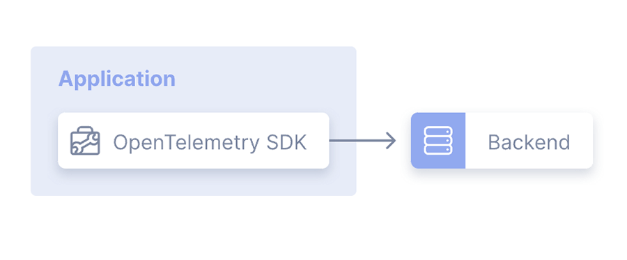
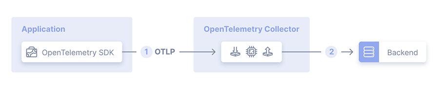
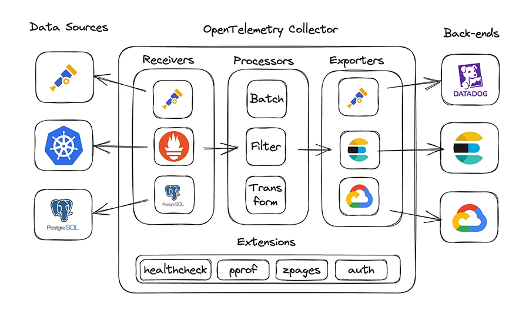

# OpenTelemetry overview

This overview serves as a curated collection of the most important concepts and patterns from the official [OpenTelemetry documentation](https://opentelemetry.io/docs/).

## What is OpenTelemetry?

OpenTelemetry is an open-source framework for collecting, processing, and exporting telemetry data from applications, such as traces, metrics, and logs. It provides standardized APIs and SDKs that enable consistent observability across distributed systems, regardless of language or platform.

The framework is governed by a comprehensive specification that defines the behavior and requirements for all OpenTelemetry components, ensuring interoperability and consistency across different implementations.

## OpenTelemetry Protocol (OTLP)

The [OpenTelemetry Protocol (OTLP)](https://opentelemetry.io/docs/specs/otlp/) is the default, vendor-neutral protocol for transmitting telemetry data between components such as SDKs, collectors, and backends. OTLP supports traces, metrics, and logs, and enables efficient, standardized communication across the observability pipeline.

### Supported transmission protocols

OTLP supports multiple transmission protocols and encodings to accommodate different environments and performance requirements:

- **gRPC (Protobuf)** is the primary protocol for OTLP, offering efficient, bi-directional streaming and low-latency communication between components. All data is encoded using Protobuf.

- **HTTP/Protobuf** uses HTTP as the transport protocol with Protobuf-encoded payloads (`Content-Type: application/x-protobuf`). This is widely supported and efficient for most production use cases.

- **HTTP/JSON** uses HTTP as the transport protocol with JSON-encoded payloads (`Content-Type: application/json`). The JSON encoding follows the Protobuf-to-JSON mapping defined by the OTLP spec, making it suitable for environments where Protobuf is not practical or for easier debugging and interoperability. Not all backends support JSON yet, but it is part of the official specification.

### Default ports

- **OTLP/gRPC** - Uses port `4317` by default.
- **OTLP/HTTP** - Both Protobuf and JSON use port `4318` by default.

## Usage patterns

OpenTelemetry supports exporting telemetry data either directly from your application or through a Collector service, each suited to different deployment needs.

### Application-level export

The simplest pattern is to export your telemetry signals directly to an observability backend. This is usually done through a language-specific OpenTelemetry SDK. It is the easiest to setup and requires no intermediate infrastructure, which makes it suitable for development/test environments, but not for production use cases.

### Collector-based export

The OpenTelemetry Collector is a standalone service designed to receive, process, and export telemetry data from multiple sources. It acts as an intermediary between instrumented applications and observability backends, providing a flexible and scalable way to manage telemetry pipelines.

When using a Collector, your application sends telemetry data to the Collector endpoint instead of directly to the backend. The Collector receives this data (through its receivers), applies optional processing (such as batching, filtering, or transformation), and then exports it to one or more destinations using its configured exporters. This architecture decouples your application from backend-specific exporters and allows you to centralize telemetry management, transformation, and routing.

[Collectors](https://opentelemetry.io/docs/collector/) are commonly deployed in two patterns:

- **[Agent](ttps://opentelemetry.io/docs/collector/deployment/agent/):** Runs as a sidecar or daemon on the same host as your application, collecting telemetry locally before forwarding it to a central Collector or backend.

- **[Gateway](https://opentelemetry.io/docs/collector/deployment/gateway/):** Runs as a remote service, aggregating telemetry from multiple sources before exporting to observability platforms.

This approach is recommended for production environments, as it enables advanced features like multi-destination export, data enrichment, and dynamic configuration without modifying application code.

<InlineAlert variant="info" slots="text" />

When exporting [telemetry directly from the application](#application-level-export), the pipeline model described above does not fully apply. There are no receivers involved. The SDK sends data directly to the backend using an exporter (with optional, in-code processing).

#### Architecture: Receivers, processors, exporters

The OpenTelemetry Collector follows a pipeline model consisting of three key components: **receivers**, **processors**, and **exporters**.

1. Telemetry data is first collected by receivers, which ingest data from instrumented applications or external sources.
1. The data then passes through processors, which can modify, batch, or filter the telemetry data before it is sent to exporters.
1. Exporters are responsible for delivering the processed data to external observability platforms or storage systems.

## Supported services and backends

OpenTelemetry is highly versatile and is rapidly becoming the standard for observability across the industry. It is supported by a wide range of cloud providers, monitoring platforms, and open source tools, enabling you to export telemetry data to systems like: AWS X-Ray, Google Cloud Operations, Azure Monitor, Datadog, New Relic, Jaeger, Zipkin, Prometheus, and many others.

## What does _instrumentation_ mean?

For a system to be [observable](https://opentelemetry.io/docs/concepts/observability-primer/#what-is-observability), it must be instrumented: that is, code from the system's components must emit [signals](https://opentelemetry.io/docs/concepts/signals/traces/), such as [traces](https://opentelemetry.io/docs/concepts/signals/), [metrics](https://opentelemetry.io/docs/concepts/signals/metrics/), and [logs](https://opentelemetry.io/docs/concepts/signals/logs/). Using OpenTelemetry, you can instrument your code automatically or manually.

### Automatic instrumentation

Automatic instrumentation in OpenTelemetry comes in two main forms:

**[Zero-code instrumentation](https://opentelemetry.io/docs/concepts/instrumentation/zero-code/)** enables you to collect telemetry from your application without changing its source code. This is typically achieved by using agents, environment variables, or runtime hooks that automatically instrument supported libraries and frameworks. Zero-code is ideal for quickly adding observability, especially when you cannot or do not want to modify application code. It provides visibility into what is happening at the edges of your application and is a fast way to get started.

**[Native instrumentation](https://opentelemetry.io/docs/concepts/instrumentation/libraries/)** refers to libraries and platforms that have OpenTelemetry support built in. When you use these libraries, they emit telemetry data automatically, providing deep and reliable observability. OpenTelemetry recommends native instrumentation as the most robust approach, since it is directly maintained by library authors and ensures consistent, high-quality telemetry.

### Manual instrumentation

Manual, code-based instrumentation involves explicitly adding OpenTelemetry API calls to your application code. This approach gives you full control to create custom spans, metrics, and logs that reflect your business logic and critical operations. Manual instrumentation is essential for capturing deep, application-specific insights that automatic or zero-code instrumentation cannot provide.

You can use manual instrumentation alongside automatic and native approaches for the most complete observability. It is especially valuable for tracking custom workflows, business transactions, or any logic not covered by existing libraries or frameworks.

For details and examples, see the [OpenTelemetry code-based instrumentation guide](https://opentelemetry.io/docs/concepts/instrumentation/code-based/).
