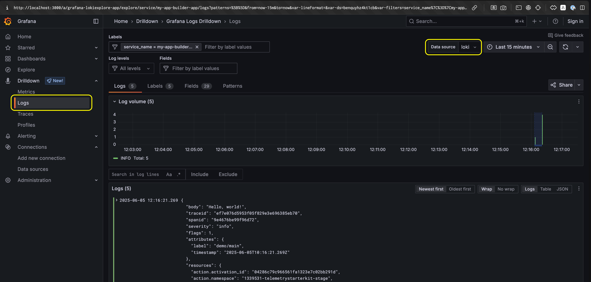

# Grafana instrumentation

This guide demonstrates how to configure Grafana with App Builder runtime actions for both local development and deployed scenarios. We will use a complete observability stack with Tempo (traces), Prometheus (metrics), and Loki (logs), all integrated through an OpenTelemetry Collector.

<InlineAlert variant="warning" slots="text" />

This guide showcases how to leverage tunneling to forward telemetry data from a remote/deployed App Builder action to a local observability stack. Adobe does not recommend this approach for production environments. It is only intended for local development, while you are testing your App Builder actions.

## Prerequisites

- Docker and Docker Compose
- An App Builder project with OpenTelemetry instrumentation
- A [tunneling](../tunnel-forwarding.md) tool for App Builder
  - This example uses Cloudflare Tunnel (cloudflared).

## Local development

The following sections cover the complete setup for local development where both actions and observability tools run locally.

### Architecture

- Runtime actions run locally through `aio app dev`
- Direct connection to local OpenTelemetry Collector on `localhost:4318`
- Full observability stack (Grafana, Tempo, Prometheus, Loki) runs in Docker
- All telemetry data flows through the collector for consistent processing

### Docker Compose configuration

Create a `docker-compose.yaml` file to run the complete observability stack:

```yaml
services:
  otel-collector:
    image: otel/opentelemetry-collector-contrib:lates
    container_name: otel-collector
    restart: unless-stopped
    volumes:
      - "./otel-collector-config.yaml:/etc/otelcol-contrib/config.yaml"
    ports:
      - "4317:4317"
      - "4318:4318"
    networks: [telemetry]
    depends_on: [tempo, loki]

  tempo:
    image: grafana/tempo:lates
    container_name: tempo
    restart: unless-stopped
    volumes:
      - "./tempo.yaml:/etc/tempo.yaml"
    networks: [telemetry]
    command:
      - "-config.file=/etc/tempo.yaml"

  prometheus:
    image: prom/prometheus:lates
    container_name: prometheus
    restart: unless-stopped
    volumes:
      - "./prometheus.yaml:/etc/prometheus/prometheus.yml"
    ports:
      - "9090:9090" # Prometheus UI
    networks: [telemetry]
    depends_on: [otel-collector]

  loki:
    image: grafana/loki:lates
    container_name: loki
    restart: unless-stopped
    networks: [telemetry]
    command:
      - "-config.file=/etc/loki/local-config.yaml"

  grafana:
    image: grafana/grafana:lates
    container_name: grafana
    restart: unless-stopped
    ports:
      - "3000:3000"
    volumes:
      - "grafana-storage:/var/lib/grafana"
    networks: [telemetry]
    depends_on: [loki, prometheus, tempo]

networks:
  telemetry:
    driver: bridge

volumes:
  grafana-storage:
```

### OpenTelemetry collector configuration

Create an [`otel-collector-config.yaml`](https://github.com/adobe/commerce-integration-starter-kit/blob/main/otel-collector-config.yaml) file to configure how the collector processes and exports telemetry data:

```yaml
receivers:
  otlp:
    protocols:
      http:
        endpoint: 0.0.0.0:4318

      # Uncomment this if you want to use the gRPC protocol
      # grpc:
        # endpoint: 0.0.0.0:4317

processors:
  batch:

exporters:
  # Traces to Tempo
  otlphttp/tempo:
    endpoint: http://tempo:4318

  # Metrics to Prometheus
  prometheus:
    endpoint: "0.0.0.0:8889"

  # Logs to Loki
  loki:
    endpoint: http://loki:3100/loki/api/v1/push

service:
  pipelines:
    traces:
      receivers: [otlp]
      processors: [batch]
      exporters: [otlphttp/tempo]

    metrics:
      receivers: [otlp]
      processors: [batch]
      exporters: [prometheus]

    logs:
      receivers: [otlp]
      processors: [batch]
      exporters: [loki]
```

### Tempo configuration

Create a [`tempo.yaml`](https://github.com/adobe/commerce-integration-starter-kit/blob/main/tempo.yaml) file for trace storage configuration:

```yaml
server:
  http_listen_port: 3200

distributor:
  receivers:
    otlp:
      protocols:
        http:
          endpoint: 0.0.0.0:4318

ingester:
  trace_idle_period: 10s
  max_block_bytes: 100_000_000
  max_block_duration: 5m

compactor:
  compaction:
    block_retention: 1h

storage:
  trace:
    backend: local
    local:
      path: /tmp/tempo
    wal:
      path: /tmp/tempo/wal
```

### Prometheus configuration

Create a [`prometheus.yaml`](https://github.com/adobe/commerce-integration-starter-kit/blob/main/prometheus.yaml) file to scrape metrics from the collector:

```yaml
global:
  scrape_interval: 15s

scrape_configs:
  - job_name: 'otel-collector-app-metrics'
    static_configs:
      - targets: ['otel-collector:8889']
```

### Telemetry configuration

Configure your App Builder actions to send telemetry to the local collector:

```ts
// telemetry.{ts,js}
import {
  defineTelemetryConfig,
  getAioRuntimeResource,
  getPresetInstrumentations
} from "@adobe/aio-lib-telemetry";

import {
  OTLPTraceExporterProto,
  OTLPLogExporterProto,
  OTLPMetricExporterProto,
  PeriodicExportingMetricReader,
  SimpleLogRecordProcessor
} from "@adobe/aio-lib-telemetry/otel";

function localCollectorConfig(isDev: boolean) {
  return {
    // Not specifying any export URL will default to find an Open Telemetry Collector instance in localhost.
    traceExporter: new OTLPTraceExporterProto(),
    metricReader: new PeriodicExportingMetricReader({
      exporter: new OTLPMetricExporterProto(),
    }),

    logRecordProcessors: [
      new SimpleLogRecordProcessor(new OTLPLogExporterProto()),
    ]
  }
}

export const telemetryConfig = defineTelemetryConfig((params, isDev) => {
  // Direct connection to local OpenTelemetry Collector
  const sdkConfig = {
    serviceName: "my-app-builder-app",
    instrumentations: getPresetInstrumentations("simple"),
    resource: getAioRuntimeResource(),

    ...localCollectorConfig(isDev),
  };

  return {
    sdkConfig,
    diagnostics: {
      logLevel: isDev ? "debug" : "info",
    },
  };
});
```

## Visualize the data

After running your actions, you can view the collected telemetry data in Grafana:

1. Open [http://localhost:3000](http://localhost:3000) in your browser
1. Navigate to the data sources and explore your traces, metrics, and logs
1. Create custom dashboards to visualize your telemetry data

Start the stack:

```bash
docker-compose up -d
```

This will start all the services and you can then access Grafana at http://localhost:3000 to view your telemetry data.

<InlineAlert variant="info" slots="text" />

By default, the Grafana docker image is protected with a username and password, which defaults to `admin` for both fields. You will need to change it when you first log in.

You can also disable authentication (not recommended), by specifying the following environment variables (in the `grafana` service):

```yaml
environment:
  - GF_AUTH_DISABLE_LOGIN_FORM=true
  - GF_AUTH_ANONYMOUS_ENABLED=true
  - GF_AUTH_ANONYMOUS_ORG_ROLE=Admin
```

### Configure data sources

Go to **Configuration** > **Data Sources**, and click on **Add data source** for each of the components:

- **Tempo (Traces)**:
   1. Select **Tempo**
   1. Set URL to `http://tempo:3200`

- **Prometheus (Metrics)**:
   1. Select **Prometheus**
   1. Set URL to `http://prometheus:9090`

- **Loki (Logs)**:
   1. Select **Loki**
   1. Set URL to `http://loki:3100`


### Traces

Go to **Drilldown** and select the **Traces** tab in the left sidebar. Initially, you might see an error message - this is normal since the default Grafana queries will not find any data yet. Ensure **Tempo** is selected as your data source. In the dashboard, look for the **Traces** tab where you will find your different traces listed.


If you select a trace, you will see the details of the trace, including the spans that make up the trace and all the associated attributes. You can also copy the trace ID (in the top-right corner) and use it to search the associated logs and metrics.


### Metrics

Navigate to **Drilldown** and select the **Metrics** tab from the left sidebar. Ensure **Prometheus** is selected as your data source. You will likely see pre-configured visualizations displaying the metrics that Grafana has detected.


### Logs

Go to **Drilldown** and select the **Logs** tab from the left sidebar. Make sure **Loki** is set as your data source. Initially, you will see a basic log preview interface. To access the full-featured log viewer with better navigation and configuration options, click the **Show Logs** button.



## App Builder

For deployed App Builder actions, the setup is identical to [local development](#local-development), but with one key difference: **tunneling**. You will use the same Docker stack locally, but expose the OpenTelemetry Collector through a tunnel so your deployed actions can reach it.

<InlineAlert variant="warning" slots="text" />

**Hybrid Development Solution**: Describes a hybrid "dev-in-prod" approach where you test deployed App Builder actions while keeping your observability tools local for easier debugging and development.

**Production deployments**: For real production deployments, you should host your OpenTelemetry Collector and observability stack (Grafana, Tempo, Prometheus, Loki) on proper cloud infrastructure (AWS, Azure, GCP, and others) and configure your App Builder actions to send telemetry directly to those hosted endpoints, which does not require any tunneling.

### Tunneling setup

See the [tunneling setup](../tunnel-forwarding.md) instructions, which includes tool comparisons and detailed configuration steps.

The key steps are:

1. **Start your local stack** using the same Docker Compose configuration from the Local Development section.

1. **Choose and start a tunnel** pointing to your OpenTelemetry Collector:

   ```bash
   # Example with Cloudflare Tunnel (Linux only)
   docker run --rm -it --net=host cloudflare/cloudflared:latest tunnel --url http://localhost:4318

   # Example with Cloudflare Tunnel (MacOS/Windows)
   docker run --rm -it cloudflare/cloudflared:latest tunnel --url http://host.docker.internal:4318
   ```

1. **Note the tunnel URL** for example, `https://abc123-def456-ghi789.trycloudflare.com`.

#### Add tunneling to Docker Compose (alternative)

If you prefer to manage everything through Docker Compose, add this service to your existing `docker-compose.yaml`:

```yaml
  # Add this service to your existing docker-compose.yaml
  cloudflared:
    image: cloudflare/cloudflared:lates
    container_name: cloudflared
    restart: unless-stopped
    networks: [telemetry]
    depends_on: [otel-collector]
    command:
      - "tunnel"
      - "--url"
      - "http://otel-collector:4318"
```

Then start the new container:

```bash
docker compose up
```

Check the `cloudflared` container logs to get your tunnel URL:

```bash
docker logs cloudflared
```

Look for a URL like: `https://abc123-def456-ghi789.trycloudflare.com`, which is the URL you will use in your telemetry configuration.

### Updated telemetry configuration

Replace the default localhost collector configuration with the tunnel URL in your telemetry setup:

```ts
// telemetry.{ts,js}
import {
  defineTelemetryConfig,
  getAioRuntimeResource,
  getPresetInstrumentations
} from "@adobe/aio-lib-telemetry";

import {
  OTLPTraceExporterProto,
  OTLPLogExporterProto,
  OTLPMetricExporterProto,
  PeriodicExportingMetricReader,
  SimpleLogRecordProcessor
} from "@adobe/aio-lib-telemetry/otel";

function localCollectorConfig(exportUrl: string) {
  const makeExporterConfig = (path: string) => ({
    url: `${exportUrl}/${path}`,
  });

  return {
    traceExporter: new OTLPTraceExporterProto(makeExporterConfig("v1/traces")),
    metricReader: new PeriodicExportingMetricReader({
      exporter: new OTLPMetricExporterProto(makeExporterConfig("v1/metrics")),
    }),
    logRecordProcessors: [
      new SimpleLogRecordProcessor(
        new OTLPLogExporterProto(makeExporterConfig("v1/logs"))
      ),
    ],
  };
}

export const telemetryConfig = defineTelemetryConfig((params, isDev) => {
  // Use the tunnel URL instead of localhost
  const exportUrl = "https://abc123-def456-ghi789.trycloudflare.com";

  return {
    sdkConfig: {
      serviceName: "my-app-builder-app",
      instrumentations: getPresetInstrumentations("simple"),
      resource: getAioRuntimeResource(),

      ...localCollectorConfig(exportUrl),
    },
  };
});
```

Your deployed App Builder actions will now send telemetry through the tunnel to your local observability stack, where you can analyze traces, metrics, and logs using the same Grafana interface you set up for local development.
