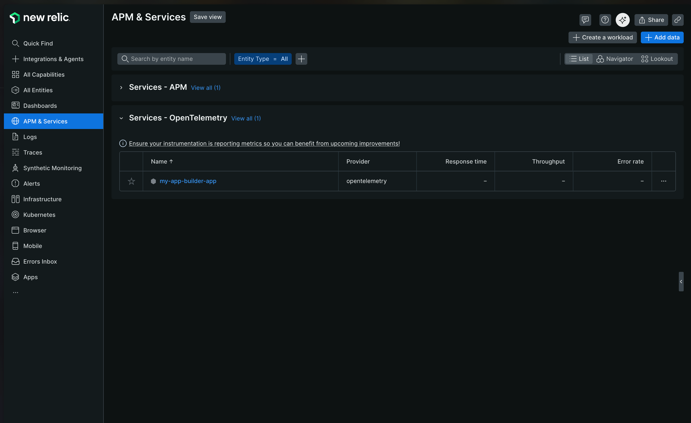
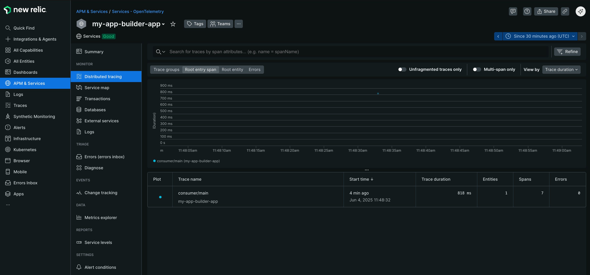
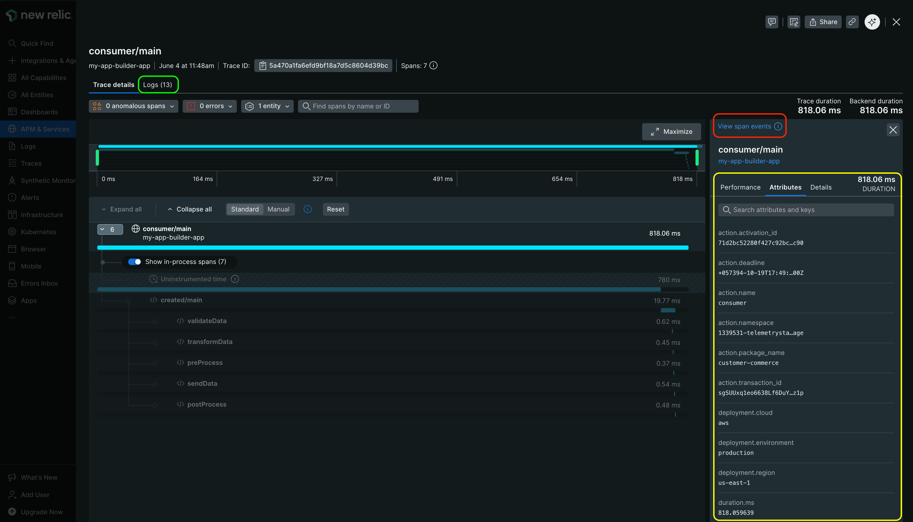
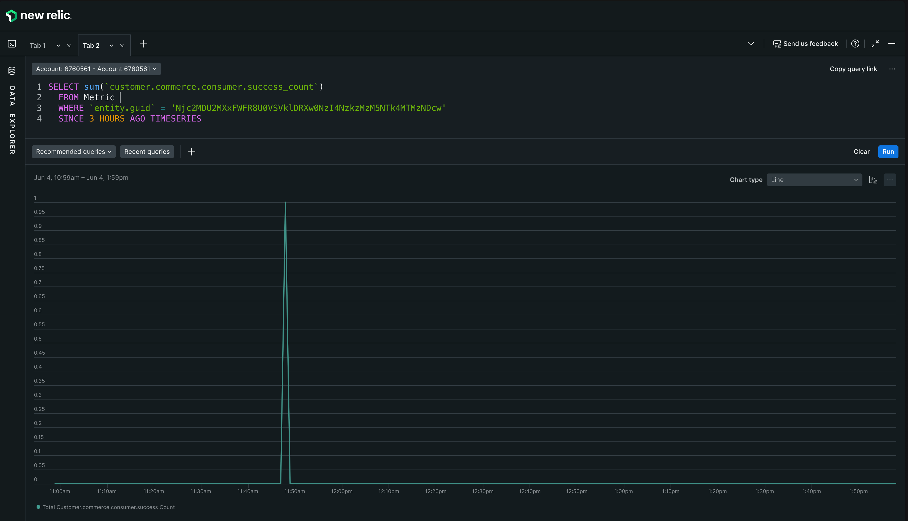
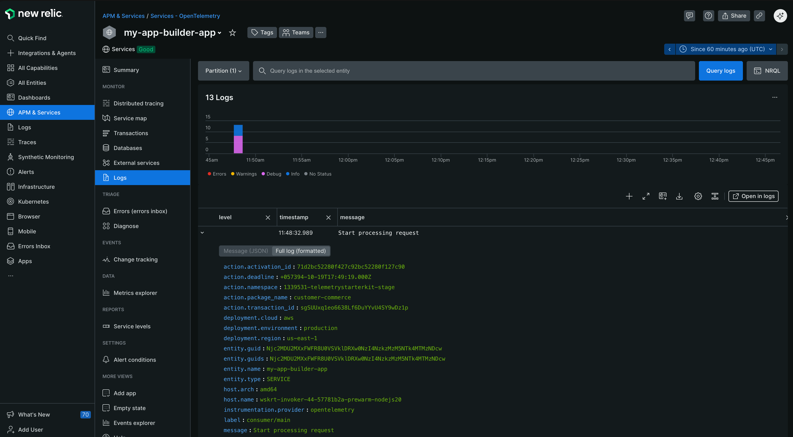

# New Relic instrumentation

This guide demonstrates how to configure runtime actions to send telemetry signals directly to New Relic. Since we will send signals without an OpenTelemetry Collector intermediary, this approach works seamlessly in both **development** (`aio app dev`) and **production** (`aio app deploy`) environments.

## Prerequisites

- A [New Relic](https://newrelic.com/) account with a [license key](https://docs.newrelic.com/docs/apis/intro-apis/new-relic-api-keys/).
- An App Builder project with OpenTelemetry instrumentation.

## Setup

In order for Adobe Commerce runtime actions to send telemetry signals to New Relic, you must configure the telemetry exporters to send data to the Open Telemetry Protocol (OTLP) ingestion endpoint provided by the platform.

<InlineAlert variant="info" slots="text" />

The OTLP endpoint URL varies based on your New Relic account's region. Additionally, New Relic requires or recommends specific configuration parameters for optimal signal ingestion.

For detailed configuration requirements, refer to the **Config** sections in the [OTLP ingestion endpoint documentation](https://docs.newrelic.com/docs/opentelemetry/best-practices/opentelemetry-otlp/). The following configuration section does not set any of the OTLP parameters, because it is intended to be a starting point for your own configuration.

### Configuration

The following sections cover configuring your App Builder actions to export traces, metrics, and logs directly to New Relic using the OpenTelemetry SDK and the appropriate OTLP exporters.


#### Environment variables

On New Relic's [API Keys page](https://one.eu.newrelic.com/admin-portal/api-keys/home), create or retrieve an ingestion **license** key. Copy that key and set it as an environment variable in your `.env` file. Make sure you are also declaring that same variable as an input in your runtime actions configuration file (`app.config.yaml`).

The following example uses the environment variable `NEW_RELIC_LICENSE_KEY`:

```yaml
my-action:
  function: path/to/my-action.js
  inputs:
    LOG_LEVEL: debug
    NEW_RELIC_LICENSE_KEY: $NEW_RELIC_LICENSE_KEY
# ...
```

#### SDK configuration

This configuration uses the HTTP/Protobuf exporter, as recommended in [New Relic's documentation](https://docs.newrelic.com/docs/opentelemetry/best-practices/opentelemetry-otlp/#configure-endpoint-port-protocol).

<InlineAlert variant="warning" slots="text" />

If you want to use gRPC exporters, switch the imported exporters to their gRPC counterparts. Also, ensure your ingestion endpoint points to the `4317` port, which is the default port for gRPC.

```ts
// telemetry.{ts,js}

import {
  defineTelemetryConfig,
  getAioRuntimeResourceWithAttributes,
  getPresetInstrumentations
} from "@adobe/aio-lib-telemetry";

import {
  OTLPTraceExporterProto,
  OTLPLogExporterProto,
  OTLPMetricExporterProto,
  PeriodicExportingMetricReader,
  SimpleLogRecordProcessor
} from "@adobe/aio-lib-telemetry/otel";

// Choose the correct endpoint for your region
// We are using HTTP/Protobuf protocol, which uses the 4318 port.
const NEW_RELIC_OTLP_ENDPOINT = "https://otlp.nr-data.net:4318";

function newRelicConfig(params) {
  const makeExporterConfig = (endpoint) => {
    return {
      url: `${NEW_RELIC_OTLP_ENDPOINT}/${endpoint}`,
      headers: {
        "api-key": params.NEW_RELIC_LICENSE_KEY,
      },
    }
  }

  // Use the HTTP/Protobuf exporter (recommended by New Relic docs)
  return {
    traceExporter: new OTLPTraceExporterProto(
      makeExporterConfig("v1/traces"),
    ),

    metricReader: new PeriodicExportingMetricReader({
      exporter: new OTLPMetricExporterProto(
        makeExporterConfig("v1/metrics"),
      ),
    }),

    logRecordProcessors: [
      // Or BatchLogRecordProcessor
      new SimpleLogRecordProcessor(
        new OTLPLogExporterProto(
          makeExporterConfig("v1/logs"),
        ),
      ),
    ],
  };
}

export const telemetryConfig = defineTelemetryConfig((params, isDev) => {
  const sdkConfig = {
    serviceName: "my-app-builder-app",
    instrumentations: getPresetInstrumentations("simple"),
    resource: getAioRuntimeResourceWithAttributes({
      "service.version": "1.0.0",
    }),

    ...newRelicConfig(params),
  };

  return {
    sdkConfig,
    diagnostics: {
      logLevel: isDev ? "debug" : "info",
    },
  };
});
```

Exporting directly to New Relic will seamlessly work in both development and production environments (no configuration changes required). Follow the [library documentation](../module.md#using-the-telemetry-module) to instrument your runtime actions.

## Visualize the data

Your OpenTelemetry instrumented service should appear under the [All Entities](https://one.eu.newrelic.com/nr1-core?filters=(domain%20IN%20('APM',%20'EXT')%20AND%20type%20IN%20('APPLICATION',%20'SERVICE'))) section or under the **APM & Services** menu, in a **Services - OpenTelemetry** dashboard.



Click on the service to see the [traces](#traces), [metrics](#metrics), and [logs](#logs).

### Traces

Navigate to your instrumented service's UI (`my-app-builder-app` in this example) and locate the traces under the **Monitor** section's **Distributed Tracing** tab. The following image is an example trace visualization.



Click on a trace to see its constituent spans, and additional details, like the [logs correlated to that trace](https://opentelemetry.io/docs/specs/otel/logs/#log-correlation) (**green square**). If you click on a span, you can see the associated [span events](https://opentelemetry.io/docs/concepts/signals/traces/#span-events) (**red square**), and the [span attributes](https://opentelemetry.io/docs/concepts/signals/traces/#attributes) (**yellow square**).

<InlineAlert variant="info" slots="text" />

You can configure span attributes at two levels: globally for all signals through the `resource` property in `sdkConfig`, or individually per span using the optional `attributes` property in the `spanConfig` object passed to `instrument` function helpers.



The example trace above begins with an Adobe App Builder `consumer` runtime action serving as a router. This action then triggers another runtime action that handles customer creation, with its workflow steps (`validate`, `transform`, and others) clearly visible in the trace.

<InlineAlert variant="info" slots="text" />

New Relic can display ghost spans for uninstrumented periods within a trace. While it sometimes correctly identifies these periods, in the example above, the majority of uninstrumented time represents the duration taken by the Adobe I/O Runtime to invoke the `created` runtime action, which cannot be avoided.

### Metrics

Use the [Query Bar](https://docs.newrelic.com/docs/data-apis/understand-data/metric-data/query-metric-data-type) to query and visualize your metrics. The code that reported the trace in the previous example had a metric named `customer.commerce.consumer.success_count`, which represents the successful invocations of the `consumer` runtime action.

See the following [New Relic Query Language (NRQL)](https://docs.newrelic.com/docs/nrql/get-started/introduction-nrql-new-relics-query-language/) query used to visualize that metric.



### Logs

Access your service logs through the **Logs** tab in the service UI (located under the **Monitor** section). The logs are service-specific and also include all resource attributes defined in the `resource` property of your `sdkConfig` object.

<InlineAlert variant="info" slots="text" />

When logging within a trace, the trace ID is automatically included, enabling log-trace correlation. New Relic simplifies this further by automatically linking logs to their corresponding traces. To view logs for a specific trace, click on the trace in the **Distributed Tracing** tab and navigate to the **Logs** tab. Refer to the [traces section](#traces) for more information.


