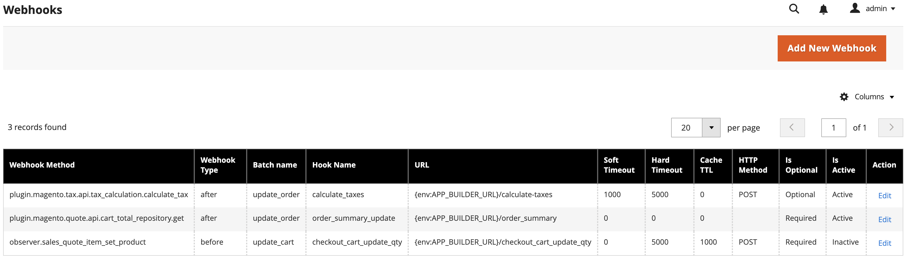
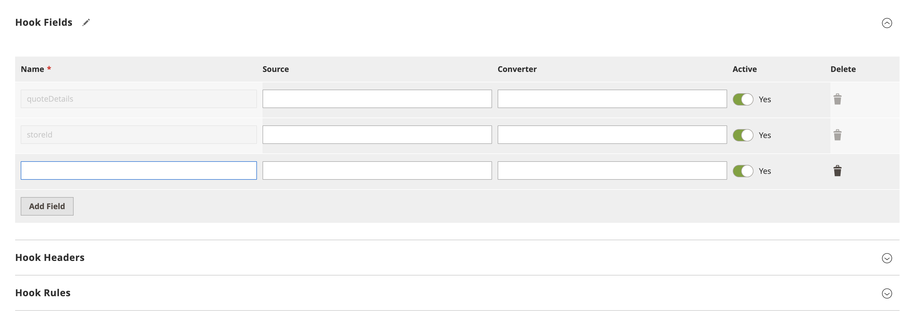

# Admin configuration

You can use the Commerce Admin to extend and override existing hooks defined in `webhooks.xml` files and to create new hooks. You can make webhook configuration changes without updating the source `webhooks.xml` files. XML  In Cloud instances, you do not need to redeploy.

Configuration changes made using the Commerce Admin will impact webhook execution and the output of the `webhooks:list` command.

## View registered hooks

A grid listing the registered hooks can be found in the Commerce Admin:

*  In the Admin, select **System** > Webhooks > **Webhooks** to display the _Webhooks_ grid page.

The rows of this grid show configuration settings for all registered hooks, both active and inactive.

## Edit an existing hook

Click **Edit** in the **Action** column to modify an existing hook.

In the **Hook settings** section of the form, hook attributes other than the hook name and names of the associated webhook method, webhook type, and batch can be modified. For a hook defined in a `webhooks.xml` file, the **Active** toggle can be used to override the value of the hook's `remove` attribute.

The **Hook fields**, **Hook Headers**, and **Hook Rules** form subsections can be used to edit or add hook fields, headers, and rules, respectively. For fields, headers, and rules defined in `webhooks.xml` files, the values of certain attributes cannot be changed through the form.

## Create a new hook

A form for creating a new hook can be accessed by clicking **Add New Webhook** from the grid page. If the plugin for the webhook method entered into the form has not been generated for the Commerce instance, a warning to run the `webhooks:generate:module` command will appear upon clicking **Save**.
