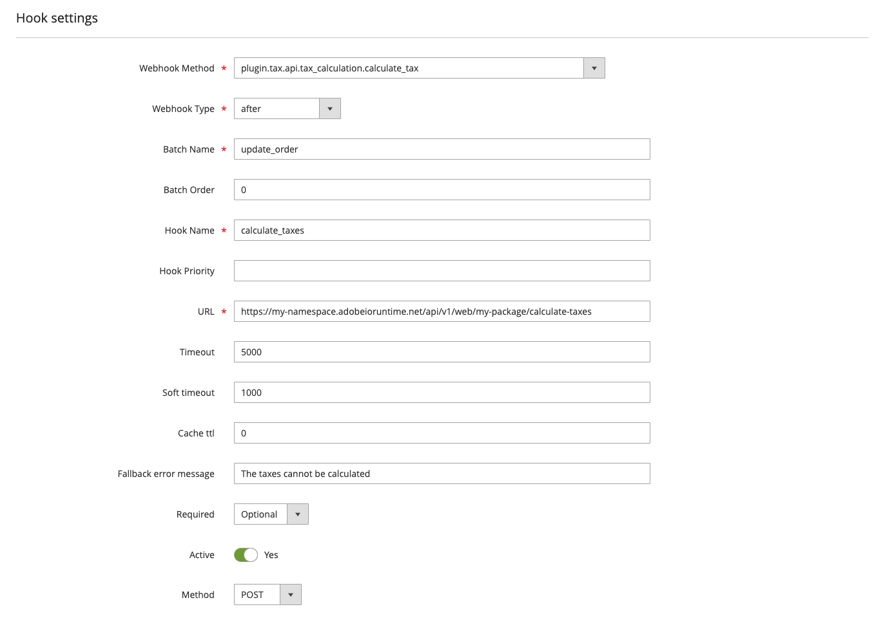

# Admin configuration

You can use the Commerce Admin to extend and override existing hooks defined in `webhooks.xml` files and to create new hooks. You can make webhook configuration changes without updating the source `webhooks.xml` files. In Cloud instances, you do not need to redeploy after making hook configuration changes through the Admin, provided that the plugin classes for any new hooks already exist.

Configuration changes made using the Admin override and extend the behavior of the webhooks defined in an XML file. The webhooks execute based on the updated configuration, and the `webhooks:list` command returns these values.

## View registered hooks

In the Admin, select **System** > Webhooks > **Webhooks** to display the _Webhooks_ grid page.

The rows of this grid show configuration settings for all registered hooks, both active and inactive.

## Create a new hook

Click **Add New Webhook** from the grid page to display the form for creating a new hook.

<InlineAlert variant="warning" slots="text" />

If the plugin for the webhook method and type entered into the form has not been generated for the Commerce instance, a warning to run the `webhooks:generate:module` command will appear upon clicking **Save**. You cannot run the `webhooks:generate:module` command on Cloud instances, due to its read-only file system. If you add a plugin-type webhook through the Admin, declare the method name and type in a `webhooks.xml` file.

The **Hook Settings** configuration panel contains the following fields:

Field | Description
--- | ---
**Webhook Method** | The internal name of a webhook. The value must be in the form `<type>.<webhook_name>`, where `type` is either `observer` or `plugin`, and `webhook_name` matches a valid Commerce event name. Use the [`bin/magento webhooks:list:all`](commands.md#return-a-list-of-supported-webhook-event-names) command to display a list of possible webhooks.
**Webhook Type** | Select whether to run the webhook  `before` or `after` the original action.
**Batch Name** | A unique name for the batch. Use a descriptive name that encompasses all the hooks in the batch. The name must contain English alphanumeric characters and underscores (_) only.
**Hook Name** |  A name that must be unique within a batch. The name must contain English alphanumeric characters and underscores (_) only.
**URL** | The HTTP endpoint to send the request for processing.
**Timeout** | A hard timeout limit (milliseconds) for the request. Requests exceeding this timeout are aborted and logged.  The default value of 0 indicates there is no timeout limit.
**Soft timeout** | A soft timeout limit (milliseconds) for the request. Requests exceeding this timeout are logged for debugging purposes.
**Cache TTL** | The cache time-to-live (in seconds) for requests with the same URL, body, and headers. If this attribute is not specified, or if the value set to `0`, the response is not cached.
**Fallback error message** | The error message to display when the hook fails.
**Required** | Specifies whether hook execution is required or optional. When set to `Optional`, if the hook fails to execute, the failure is logged and subsequent hooks continue to be processed. When set to `Required`, a failure terminates the process.
**Active** | Indicates whether to skip a removed hook during the batch execution.
**Method** | The HTTP method (POST, PUT, GET, or DELETE) used to invoke the hook.

### Configure hook fields

The **Hook Fields** configuration panel defines the payload of a webhook request. [Define the hook body](hooks.md#define-the-hook-body) describes how to construct the payload.

Field | Description
--- | ---
**Name** | The path to the field to include in the transmitted webhook, such as `product.sku`.
**Source** | The path to the value in the default webhook. If not set, the **Name** value is used.
**Converter** |  A class that transforms the value of a field, such as from integer to string.
**Active** | Indicates whether to include the field in the payload.

### Configure hook headers

The **Configure Hook Headers** configuration panel defines the headers of a webhook request. [Define request headers](hooks.md#define-request-headers) describes how to send authorization tokens and other connection parameters.

Field | Description
--- | ---
**Name** | The header name, in the same form as it will be sent. For example, `Authorization`.
**Value** | The value of the header, such as `Bearer: <token>`.
**Resolver** | The resolver class that appends headers dynamically.
**Active** | Set to **No** to remove the header from the request.

### Configure hook rules

The **Configure Hook rules** configuration panel allows you to define rules that trigger a webhook when certain conditions are met. [Create conditional webhooks](./conditional-webhooks.md) describes how to configure hook rules.

Field | Description
--- | ---
**Field** | The event field to be evaluated. For nested fields, use the dot-separated format, such as `data.order.product.id`.
**Value** | The value to be compared.
**Operator** | Defines which comparison operator to use. Examples include `equal`, `notEqual`, and `regex`.
**Active** | Set to **No** to remove the rule from the request.

## Edit an existing hook

Click **Edit** in the **Action** column to modify an existing hook.

You can fully edit any hook that was originally defined in the Admin. However, hooks defined in a `webhooks.xml` file are only partially editable. For these hooks, you cannot change the value of the webhook method, webhook type, batch name, or hook name. You can use the **Active** toggle to override the value of the `remove` attribute for any hook defined in an XML file.

The **Hook fields**, **Hook Headers**, and **Hook Rules** form subsections can be used to edit or add hook fields, headers, and rules, respectively. For fields, headers, and rules defined in `webhooks.xml` files, the values of certain attributes cannot be changed through the form.

