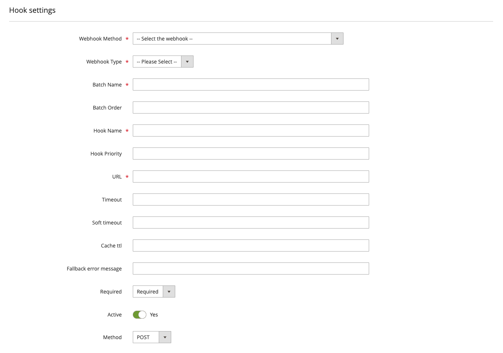

# Create a webhook

A webhook is a user-defined HTTP callback that is triggered by an event in Adobe Commerce. When the event occurs, the webhook sends an HTTP request to a specified URL with a payload containing information about the event. An event that can trigger a webhook is also known as a _webhook method_.

Before you create a webhook, you must resolve the following questions:

* What information does the event contain?

* What data structure does the remote server require for incoming requests?

A webhook subscription is a configuration that specifies the following sets of information:

* The basic definition of the webhook. This includes the webhook name, the event (webhook method) to listen for, the URL to send the HTTP POST request to, timeout settings, fallback error messages, and more.

* Authentication information (Adobe Commerce Cloud Service only). You can configure the details of an OAuth credential defined the Adobe Developer Console.

* The definition of one or more hooks. Specify which fields of a webhook method to include in the payload and transform the payload into a format that is compatible with the external system.

* The definition of one or more request headers. You can define the headers to include in the request, such as authorization tokens and other connection parameters.

* Optional rules that trigger only when certain conditions are met, such as when a string matches a specific value.

In Adobe Commerce Cloud Service, you can create a webhook subscription in the Admin or by using a REST endpoint. (See [Webhooks in Adobe Commerce as a Cloud Service](https://developer.adobe.com/commerce/services/cloud/guides/rest/webhooks/) for details.) In Platform as a Service (PaaS) and on-premises environments, you must create a custom module that includes a `webhooks.xml` file.

## Define webhook properties

Adobe Commerce Cloud Service customers can select **System** > Webhooks > **Webhooks Subscriptions** in the Admin to display the _Webhooks_ grid page.


The rows of this grid show configuration settings for all registered hooks, both active and inactive.

Click **Add New Webhook** from the grid page to display the form for creating a new hook.



Developers creating apps for PaaS systems create a `webhooks.xml` file in the `etc` directory of their custom module. The XML file has the following structure:

```tree
|__ config
    |__ method
        |__ hooks
            |__ batch
                |__ hook
                    |__ headers
                    |   |__ header
                    |__ fields
                    |   |__ field
                    |__ rules
                        |__ rule
```

[Webhooks configuration reference](./xml-schema.md) describes the XML schema in further detail.

The following table describes the properties of a webhook subscription. The **Admin field** column lists the field name in the Admin, and the **XML attribute** column describes the corresponding XML attribute in the `webhooks.xml` file.

Admin field | XML attribute | Description
--- | --- | ---
**Webhook Method** | `method.name` | If using the Admin, select one of the supported Commerce webhook names from the dropdown. Otherwise, The value of the webhook method name must be in the form `<event_type>.<webhook_name>`, where `event_type` is either `observer` or `plugin`, and `webhook_name` matches a valid Commerce event name. Use the `bin/magento webhooks:list:all` command to display a list of possible webhooks.
**Webhook Type** | `method.type` | Specify whether to run the webhook `before` or `after` the original action.
**Batch Name** | `batch.name` | A unique name for the batch. Use a descriptive name that encompasses all the hooks in the batch. The name must contain English alphanumeric characters and underscores (_) only.
**Batch Order** | `batch.order` | An integer that sets the order in which multiple webhooks are executed. All hooks within a batch are sent in parallel. Therefore, as you add hooks to a batch, keep in mind what task each hook will perform. For example, since the hooks are executed in parallel, you should not place a hook that relies on a response from another hook in the same batch. A default value of 0 is saved if no value is set.
**Hook Name** | `hook.name` | A name that must be unique within a batch. The name must contain English alphanumeric characters and underscores (_) only.
**Hook Priority** | `hook.priority` | The priority of the merging hook results in the batch. The priority is treated as 0 if a value is not set.
**URL** | `hook.url` | The HTTP endpoint to send the request for processing.
**Timeout** | `hook.timeout` | A hard timeout limit (milliseconds) for the request. Requests exceeding this timeout are aborted and logged. The default value of 0 indicates there is no timeout limit.
**Soft timeout** | `hook.softTimeout` | A soft timeout limit (milliseconds) for the request. Requests exceeding this timeout are logged for debugging purposes.
**Cache TTL** | `hook.ttl` | The cache time-to-live (in seconds) for requests with the same URL, body, and headers. If this attribute is not specified, or if the value set to `0`, the response is not cached.
**Fallback error message** | `hook.fallbackErrorMessage` | The error message to display if the hook fails.
**Required** | `hook.required` | Specifies whether hook execution is required or optional. When set to **Optional** (`false`), if the hook fails to execute, the failure is logged and subsequent hooks continue to be processed. When set to **Required** (`true`), a failure terminates the process.
**Active** | `hook.remove` | Indicates whether to skip a removed hook during the batch execution.
**Method** | `hook.method` | The HTTP method (POST, PUT, GET, or DELETE) used to invoke the hook.

You must define at least one hook field, and you will usually need to define request headers. You can also optionally define rules that allow the webhook to run in limited situations. Continue defining these entities and click **Save** when you have fully defined a new webhook from the Admin.

### Configure hook fields

Defining the hook requires knowledge of the structure of the original event and the requirements of the remote call. Adobe Commerce Cloud Service (SaaS) developers can view the list supported webhook methods by going to **System** > Webhooks > **Webhooks List** in the Admin. Then click on a webhook method name to display its default contents. PaaS developers can accomplish this by running the [`bin/magento webhooks:list:all` command](./commands.md#return-a-list-of-supported-webhook-event-names) to return a list of all supported webhooks methods and the [`bin/magento webhooks:info <webhook-name>` command](./commands.md#display-the-payload-of-a-webhook) to return the payload of a specified webhook method.

Make sure the webhook method you select contains the information you need. If your webhook needs to check product availability when a shopper attempts to add a product to their cart, you could use the `observer.sales_quote_add_item` webhook method as the foundation of your call. The default payload contains the following information:

```json
{
    "eventName": "string",
    "data": {
        "quoteItem": {
            "qty_options": "array",
            "product_type": "string",
            "real_product_type": "string",
            "item_id": "int",
            "sku": "string",
            "qty": "float",
            "name": "string",
            "price": "float",
            "quote_id": "string",
            "product_option": {
                "extension_attributes": "object{}"
            },
            "custom_attributes": [
                {
                    "attribute_code": "string",
                    "value": "mixed"
                }
            ]
        }
    }
}
```

At minimum, you need to transmit the `sku` and `qty` fields to check product availability. Other fields, such as `name` and `price`, might also be necessary, but others fields contain data that is outside the scope of your call.

Meanwhile, your external source probably does not accept data as a `quoteItem` object. Imagine that your remote application expects a payload with the following structure:

```json
{
    "product": {
        "name": "string",
        "sku": "string",
        "quantity": "float"
    }
}
```

Your webhook will specify exactly which fields to include in the payload and how to transform them into a format that the external source accepts. To transmit this object to the remote application, you will need to remove the `data` and `quoteItem` objects and all unnecessary fields from the payload. In addition, you must rename the `qty` field to `quantity`. 

The **Hook Fields** configuration panel defines the payload of a webhook request. [Define the hook body](./hooks.md#define-the-hook-body) describes how to construct the payload.

Admin field | XML attribute | Description
--- | --- | ---
| **Name** | `field.name`| The path to the field to include in the transmitted webhook, such as `product.sku`. |
| **Source** | `field.source`| The path to the value in the default webhook, such as `quoteItem.sku`. If not set, the **Name** value is used. |
| **Active** | `field.remove` | Indicates whether to include the field in the payload. By default, all fields are included. If you are building a `webhooks.xml` file, set `field.remove` to `true` to remove the field from the payload. |
| - | `field.converter` | A class that transforms the value of a field, such as from integer to string. This attribute is only available in `webhooks.xml` files. |

If the default payload of a webhook method contains an array of objects, use the following construction to select fields from that array:

```text
<object_name>[].<field_name>
```

The default `observer.sales_quote_add_item` webhook method contains an array of `custom_attributes` objects. To include the `attribute_code` and `value` fields in your webhook definition, use the following source name values:

* `data.quoteItem.custom_attributes[].attribute_code`
* `data.quoteItem.custom_attributes[].value`

Commerce transmits an array containing all the attribute/value pairs to the remote system.

The following XML fragment shows how to define the hook fields needed to transform the fields mentioned in this example:

```xml
<hook name="validate_stock" url="https://example.com/product-validate-stock" timeout="2000" softTimeout="200" required="true" fallbackErrorMessage="Can't add the product to the cart right now">
    <fields>
        <field name='product.name' source='data.product.name' />
        <field name='product.sku' source='data.product.sku' />
        <field name='product.quantity' source='data.product.qty' />
        <field name='product.custom-attribute' source='data.product.custom_attributes[].attribute_code' />
        <field name='product.custom-value' source='data.product.custom_attributes[].value' />
    </fields>
</hook>
```

### Configure hook headers

You will typically need to send authorization tokens and other connection parameters in the headers of your remote request. 

#### The **Hook Headers** configuration panel defines the headers of a webhook request.


[Define request headers](./hooks.md#define-request-headers) describes how to send authorization tokens and other connection parameters.

Admin field | XML attribute | Description
--- | --- | ---
| **Name** | `header.name` | The header name, in the same form as it will be sent. For example, `Authorization`
**Value** | | The value of the header, such as `Bearer: <token>`.
**Active** | |Set to **No** to remove the header from the request.

<InlineAlert variant="info" slots="text"/>

Secrets and other sensitive data should not be stored in the `webhooks.xml` file. Instead, use environment or configuration variables to relay this information.
### Configure hook rules

The **Hook Rules** configuration panel allows you to define rules that trigger a webhook when certain conditions are met. [Create conditional webhooks](./conditional-webhooks.md) describes how to configure hook rules.

Field | Description
--- | ---
**Field** | The event field to be evaluated. For nested fields, use the dot-separated format, such as `data.order.product.id`.
**Value** | The value to be compared.
**Operator** | Defines which comparison operator to use. Examples include `equal`, `notEqual`, and `regex`.
**Active** | Set to **No** to remove the rule from the request.

## Webhook grid actions

Actions for each hook in the **Webhooks** grid are available in the **Action** column.

### Edit or delete an existing hook

Click **Select** > **Edit** in the **Action** column to display a form for editing an existing hook's configuration.


Click **Select** > **Delete** in the **Action** column to delete an existing hook.

### Testing a webhook

Click **Select** > **Test Webhook** in the **Action** column for a hook to open a page for testing execution of all hooks configured for the same webhook method and webhook type.


In the **Request payload** textarea, input a webhook request payload in JSON format. After clicking the **Run Webhook** button, a banner will show at the top of the page indicating if webhook execution was successful or if an exception occurred. In the **Resolved payload** section, a JSON object showing the payload returned by the webhook after processing hook response operations is displayed.

### Accessing hook logs

Click **Select** > **Show Logs** in the **Action** column to open a grid displaying logging activity. The grid resembles the [Webhook Logs grid](./responses.md#database-logging), but displays activity for the one specific hook only.

### Configure developer console OAuth

The **Developer Console OAuth** configuration panel provides the ability to configure the details of an OAuth credential from the Adobe Developer Console. If configured and enabled, an IMS token will be generated using the credential details and passed in an Authorization header with the hook request.

See [Setting up the OAuth Server-to-Server credential](https://developer.adobe.com/developer-console/docs/guides/authentication/ServerToServerAuthentication/implementation/#setting-up-the-oauth-server-to-server-credential) for information on creating an OAuth credential in the Adobe Developer Console.

Field | Description
--- | ---
**Enabled** | Indicates whether to use OAuth credential details to generate an Authorization token for hook requests.
**Client ID** | The Client ID for the OAuth credential.
**Client Secret** | The Client Secret for the OAuth credential.
**Organization ID** | The Organization ID for the OAuth credential.
