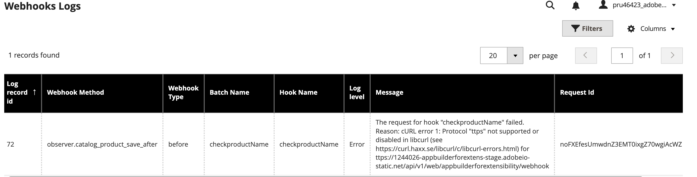
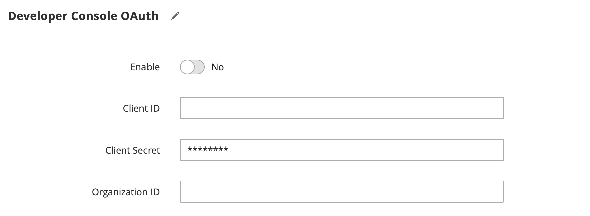

# Extend Adobe Commerce Webhooks and App Builder

Previously, adding custom validations or services in Adobe Commerce needed complex in-process code that was hard to manage. Now, with App Builder, developers can build scalable, event-driven integrations using webhooks and runtime actions. For example, you can use App Builder to validate data like product names in real time through synchronous webhook integrations in Adobe Commerce SaaS (ACCS).

This guide outlines step-by-step instructions for setting up an App Builder project . It covers writing simple action code, configuring webhook subscriptions in Adobe Commerce, debugging App Builder code using a debugger.

## Step-by-step guide and sample code

Before we dive into the setup, let's understand how this integration works end-to-end:

1. Adobe Commerce triggers a webhook when specific events occur. For example, when a new product is added or updated.

1. This webhook sends the event payload (e.g., product name, SKU, price) to an Adobe App Builder runtime action.

1. The App Builder action processes the payload and applies custom business logic (e.g., validating that the product name doesn't include restricted terms like "test").
Based on the logic, the action returns either a success or an error message.

1. Adobe Commerce uses this response for example in this case while saving the product
This setup allows you to offload validation and custom logic from the Commerce codebase to the scalable, serverless infrastructure of Adobe App Builder

### Prerequisites

* Adobe Commerce SaaS Instance
* Access to [Adobe Developer Console](https://developer.adobe.com/console)
* Access to [Adobe Developer App Builder](https://developer.adobe.com/app-builder/docs/get_started/app_builder_get_started/set-up#access-and-credentials)
* [AIO CLI](https://developer.adobe.com/app-builder/docs/guides/runtime_guides/tools/cli-install) (required to run commands)

### Set up the Adobe Developer Console and App Builder project locally

#### Create a new project in Adobe Developer Console

1. To add new project in developer console, Refer to the  [Adobe App Builder Getting Started guide](https://developer.adobe.com/app-builder/docs/get_started/app_builder_get_started/first-app) and complete Step 1: "Check your environment and tools" and Step 2: "Create a new project on Developer Console" before proceeding.
These steps are essential because the Adobe Developer Console provides the credentials and configuration required to deploy your App Builder app and access Adobe services like I/O Runtime and Commerce APIs. Without completing these steps, your app will not be able to authenticate or run within the Adobe ecosystem.

1. In your **stage** workspace, click the Add service pop-up menu and select API.
Add the following services to your workspace. Each service must be added individually. You cannot add multiple services simultaneously.

   * I/O Management API
   * I/O Events
   * Adobe I/O Events for Adobe Commerce

  Click one of these services, such as I/O Management API. Then click Next. On the Configure API page, select the OAuth Server-to-Server option and click Save configured API.

#### Set up your local App Builder environment using the CLI

After creating your project in the Adobe Developer Console, the next step is to set up your development environment using Adobe I/O CLI tools. This enables you to run your App Builder application locally and deploy it to Stage or Production workspaces configured in your Developer Console project.

**Prerequisites:**

Ensure you have the following tools installed:

* npm
* Node.js (v16.x or later)
* VS Code (or any other code editor of your choice)

**Steps**

1. Install Adobe I/O CLI

   ```bash
   npm install -g @adobe/aio-cli
   ```

1. Follow this step from the document to login via CLI. [Sign in from the CLI – Adobe App Builder Getting Started Guide](https://developer.adobe.com/app-builder/docs/get_started/app_builder_get_started/first_app/#3-sign-in-from-the-cli)

1. Retrieve the JSON file from the Admin Console by following the steps outlined in the provided this document [Developer with a Console Config File – Adobe App Builder Guide](https://developer.adobe.com/app-builder/docs/get_started/app_builder_get_started/first_app/#421-developer-with-a-console-config-file) You can ignore the remaining steps in the document. Note the location of the downloaded json file.

1. Run `aio app use [location to the downloaded json file] command to use the downloaded JSON file for your project.

```terminal
You are currently in:
1. Org: <org name>
2. Project: <project name specified in development console>
3. Workspace: Stage
```

1. Ensure you're working in the correct Organization, Project, and Workspace within the Adobe Developer Console through the below command

```bash
aio where
```

```terminal
You are currently in:
1. Org: Early Access - Adobe Commerce as a Cloud Service
2. Project: appbuilderforextensibility
3. Workspace: Stage
```

You can verify org and project details by opening the Developer Console and checking the top-right corner, where your organization name and project are displayed.

1. Run the following command to initialize your project:

```bash
aio app init < your projectname >
```

* When prompted, select the correct **Organization** and For **Project**, select the one you created earlier using the Developer Console.
* Choose a template listed under **Supported by My Org** to ensure compatibility with your environment.
* When prompted to **Select a template**, choose:
**All Templates → @adobe/generator-app-events-generic**
* When prompted to **Which Adobe I/O App features do you want to use?**, select:
**Actions: Deploy Runtime actions for I/O App features**
* When prompted to **Which type of actions do you want to generate?**, select:
**Generic**
* When prompted to **Which UI framework do you want to use?**, select:
**React Spectrum 3**
* When prompted to **Provide a name for the action**, enter your preferred action name

```terminal
? Select Org: <Select your Organization Name>
? Select a Project, or press + to create new: <Select project name created in development console>
? What templates do you want to search for? All Templates
✔ Downloaded the list of templates
? Choose the template(s) to install:
  Pressing <enter> without selection will skip templates and install a standalone application.
 (Press <space> to select, <Up and Down> to move rows)
┌──────┬─────────────────────────────────────────────────────────────┬─────────────────────────────────────────────────────────────┬────────────────────────────────────────┬────────────────────────────────────────┐
│      │ Template                                                    │ Description                                                 │ Extension Point                        │ Categories                             │
├──────┼─────────────────────────────────────────────────────────────┼─────────────────────────────────────────────────────────────┼────────────────────────────────────────┼────────────────────────────────────────┤
│  ◯   │ @adobe/aem-assets-details-ext-tpl *                         │ Asset Details extension template for the AEM Assets View    │ aem/assets/details/1                   │ action, ui                             │
├──────┼─────────────────────────────────────────────────────────────┼─────────────────────────────────────────────────────────────┼────────────────────────────────────────┼────────────────────────────────────────┤
│  ◯   │ @adobe/workfront-ui-ext-tpl *                               │ Template for AIO CLI App Builder plug? Choose the template(s) to install:
  Pressing <enter> without selection will skip templates and install a standalone application.
 
┌──────┬─────────────────────────────────────────────────────────────┬──────────────────────────────────────
───────────────────────┬────────────────────────────────────────┬────────────────────────────────────────┐
│      │ Template                                                    │ Description                          
                       │ Extension Point                        │ Categories                             │
├──────┼─────────────────────────────────────────────────────────────┼──────────────────────────────────────
───────────────────────┼────────────────────────────────────────┼────────────────────────────────────────┤
│  ◯   │ @adobe/aem-assets-details-ext-tpl *                         │ Asset Details extension template for 
the AEM Assets View    │ aem/assets/details/1                   │ action, ui                             │
├──────┼─────────────────────────────────────────────────────────────┼──────────────────────────────────────
───────────────────────┼────────────────────────────────────────┼────────────────────────────────────────┤
│  ◯   │ @adobe/workfront-ui-ext-tpl *                               │ Template for AIO CLI App Builder plug
in that allows         │ workfront/ui/1                         │ action, ui                             │
│      │                                                             │ generating code of UI Extension for W
orkfront product       │                                        │                                        │
├──────┼─────────────────────────────────────────────────────────────┼──────────────────────────────────────
───────────────────────┼────────────────────────────────────────┼────────────────────────────────────────┤
│ ❯◯   │ @adobe/generator-app-events-generic *                       │ Adds event registrations and a generi
c action               │ N/A                                    │ action, events                         │
├──────┼─────────────────────────────────────────────────────────────┼──────────────────────────────────────
───────────────────────┼────────────────────────────────────────┼────────────────────────────────────────┤
│  ◯   │ @adobe/aem-cf-editor-ui-ext-tpl *                           │ Extensibility template for AEM Conten
t Fragment Editor      │ aem/cf-editor/1                        │ action, ui                             │
├──────┼─────────────────────────────────────────────────────────────┼──────────────────────────────────────
───────────────────────┼────────────────────────────────────────┼────────────────────────────────────────┤
│  ◯   │ @adobe/generator-app-aem-react *                            │ Template for AEM React SPA based on W
KND content.           │ N/A                                    │ ui                                     │
└──────┴─────────────────────────────────────────────────────────────┴──────────────────────────────────────
───────────────────────┴────────────────────────────────────────┴────────────────────────────────────────┘
* = recommended by Adobe; to learn more about the templates, go to https://a
Bootstrapping code in: your project directory/commappwebhook
   create package.json
   create README.md
   create jest.setup.js
   create .env
   create .gitignore
   create .eslintrc.json

Changes to package.json were detected.
Skipping package manager install.

   create .github/workflows/deploy_prod.yml
   create .github/workflows/deploy_stage.yml
   create .github/workflows/pr_test.yml
? Which Adobe I/O App features do you want to enable for this project?
Select components to include Actions: Deploy Runtime actions, Events: Publish to Adobe I/O Events, Web 
Assets: Deploy hosted static assets
? Which type of sample actions do you want to create?
Select type of actions to generate Generic
? Which type of UI do you want to add to your project?
select template to generate React Spectrum 3
? We are about to create a new sample action that showcases how to access an external API.
How would you like to name this action? testwebhook
? We are about to create a new sample action that creates messages in cloud events format and publishes to 
Adobe I/O Events.
How would you like to name this action? testwebhook
    force package.json
   create app.config.yaml
   create actions/testwebhook/index.js
   create test/testwebhook.test.js
   create actions/utils.js
   create test/utils.test.js
   create e2e/testwebhook.e2e.test.js
   create web-src/index.html
   create web-src/src/config.json
   create web-src/src/exc-runtime.js
   create web-src/src/index.css
   create web-src/src/index.js
   create web-src/src/utils.js
   create web-src/src/components/About.js
   create web-src/src/components/ActionsForm.js
   create web-src/src/components/App.js
   create web-src/src/components/Home.js
   create web-src/src/components/SideBar.js
   create .babelrc
Project initialized for Workspace Stage, you can run 'aio app use -w <workspace>' to switch workspace.
⠸ Installing packages...
```

Folder structure after `app init`:

```terminal
commappwebhook/
├── README.md
├── app.config.yaml
├── dist/
├── e2e/
├── jest.setup.js
├── node_modules/
├── package-lock.json
├── package.json
├── test/
├── web-src/
└── actions/
    ├── constants.js
    ├── responses.js
    ├── testwebhook/
    │   └── index.js
    └── utils.js
```

### Implement the webhook action

This step is where the code logic for validating the product name is written in the action file in the App Builder project.

1. Create a new File validateProductName.js under testwebhook folder under actions folder.
commappwebhook/actions/testwebhook and add the below code. This file defines a function that runs as an action in Adobe App Builder. In App Builder, every action must have a function named main, as this is the entry point that gets called when the action is triggered. The function should accept input in JSON format and return a response in JSON as well. In this case, the action checks if the product name received from the Adobe Commerce webhook contains the word "test". If it does, the action passes validation; otherwise, it returns an error message.

```js
const { Core, Events } = require('@adobe/aio-sdk') // Adobe I/O SDK modules
const { errorResponse, stringParameters, checkMissingRequestInputs } = require('../utils') // Utility functions

// Main function executed by Adobe I/O Runtime
async function main(params) {
  // Create a logger instance
  const logger = Core.Logger('main', { level: params.LOG_LEVEL || 'info' })
  logger.info('Calling the main action ')

  try {
    const response = { statusCode: 200 }

    // Check if product name contains 'test'; return error response if true
    if (/test/.test(params.product.name.toLowerCase())) {
      response.body = JSON.stringify({
        op: "exception",
        message: "Invalid product name >> " + params.product.name
      })
    } else {
      // Success response
      response.body = JSON.stringify({
        op: "success"
      })
    }

    return response
  } catch (error) {
    // Log error and return a 500 server error response
    logger.error(error)
    return errorResponse(500, 'server error ' + JSON.stringify(params), logger)
  }
}

exports.main = main
```

1. Copy the contents of the utils.js file provided below into the utils.js file located under the actions/ folder.The utils.js file  provides common utility functions used by actions. One of its main functions, errorResponse, helps create a consistent error response and optionally logs the error details. This utility is useful when validating input or handling failures in actions.

```js
/* 
* <license header>
*/

/* This file exposes some common utilities for your actions */

/**
 *
 * Returns a log ready string of the action input parameters.
 * The `Authorization` header content will be replaced by '<hidden>'.
 *
 * @param {object} params action input parameters.
 *
 * @returns {string}
 *
 */
/**
 *
 * Returns an error response object and attempts to log.info the status code and error message
 *
 * @param {number} statusCode the error status code.
 *        e.g. 400
 * @param {string} message the error message.
 *        e.g. 'missing xyz parameter'
 * @param {*} [logger] an optional logger instance object with an `info` method
 *        e.g. `new require('@adobe/aio-sdk').Core.Logger('name')`
 *
 * @returns {object} the error object, ready to be returned from the action main's function.
 *
 */
function errorResponse (statusCode, message, logger) {
  if (logger && typeof logger.info === 'function') {
    logger.info(`${statusCode}: ${message}`)
  }
  return {
    error: {
      statusCode,
      body: {
        error: message
      }
    }
  }
}

module.exports = {
  errorResponse
}
```

### Configure app.config.yaml

The app.config.yaml file is used to configure your Adobe App Builder project. It defines project metadata, runtime actions, web assets, and settings like which file to use as the entry point for each action.This config file is available in the following location: `commappwebhook/app.config.yaml`. In `app.config.yaml`, change the `index.js` reference to `validateProductName.js`.

<InlineAlert variant="info" slots="text"/>

You must specify `web: 'yes'` in the config.

```yaml
application:
  actions: actions
  web: web-src
  runtimeManifest:
    packages:
      appbuilderforextensibility:
        license: Apache-2.0
        actions:
          webhook:
            function: actions/testwebhook/validateProductName.js
            web: 'yes'
            runtime: nodejs:22
            inputs:
              LOG_LEVEL: info
            annotations:
              require-adobe-auth: false
              final: true
  ```
  
### Deploy and Test

Run the following commands in your project directory:
npm install – to install all project dependencies
aio app deploy – to deploy the application to Adobe I/O Runtime

```terminal
prutech@Prutech-ka-MacBook-Pro appbuilderforextensibility % aio app deploy
✔ Built 2 action(s) for 'application'
✔ Building web assets for 'application'
✔ Deployed 1 action(s) for 'application'
✔ Deploying web assets for 'application'
✔ All static assets for the App Builder application in workspace: application were successfully deployed to the CDN. Files deployed :
  * 2 HTML page(s)
  * 2 Javascript file(s)
  * 3 .map file(s)
  * 1 CSS file(s)
 
Your deployed actions:
web actions:
  -> https://1244026-appbuilderforextens-stage.adobeio-static.net/api/v1/web/appbuilderforextensibility/testwebhook
  
To view your deployed application:
  -> https://1244026-appbuilderforextens-stage.adobeio-static.net/index.html
To view your deployed application in the Experience Cloud shell:
  -> https://experience.adobe.com/?devMode=true#/custom-apps/?localDevUrl=https://1244026-appbuilderforextens-stage.adobeio-static.net/index.html
skipping publish phase...
Successful deployment 🏄
```

Make a note of the Web Action URL — you'll need to specify it in the next step within the Commerce configuration.

#### Configure Webhooks in Adobe Commerce instance

In the Admin panel, navigate to **System**> **Webhooks** > **Webhook Subscriptions** to open the Webhooks grid page. Click the **Add New Webhook** button.

Fill in the fields as shown in the screenshot below. You can choose any values for the Hook Name and Batch Name, but ensure **Hook Fields** match the screenshot exactly. In the URLfield, enter the Web Action URL you noted in the previous step.Save the Webhook.


Below, you'll find the hook fields section. Here, you can specify the payload fields you want to send to App Builder.


#### Testing the integration using webhooks

You now have App Builder code set up to validate the product name received from Commerce. Whenever a new product is added in Commerce, the webhook triggers and synchronously invokes the App Builder code to perform the validation.

From the Commerce Admin panel, navigate to **Catalog** > **Add New Product**. Enter the product details such as Name, SKU, and Price. Set the Name as "testproduct", then click Save.

Upon saving, the webhook triggers the App Builder code, which validates the product name and returns an error message. The error **Invalid product name >>** will be displayed in the Commerce UI, confirming that the integration is working as expected.

As per the App Builder code logic, if the product name does not contain the word "test", the product should save successfully without triggering an error.

## Debugging

### Debug from Commerce ACCS Instance

1. Viewing Logs from the Commerce Side[ACCS Specific]
Log into your ACCS instance, navigate to Admin UI → **System** → **Webhook Logs**.
The logs will appear as shown in the screenshot below.



### Debug from App Builder Code Locally

Follow these steps to effectively debug your Adobe I/O app on your local environment.
Note that debugging web actions via ACCS or a deployed instance is not supported; they can only be simulated locally.

#### Prerequisites

Ensure the following before you start debugging:

**require-adobe-auth** is set to **false** in your app-config.yaml file under webhook action.

#### Step 1: Configuring Debugger

Create or Edit launch.json
in the root project folder, navigate to the .vscode folder. If it doesn't exist, create .vscode folder. Inside .vscode folder, create or edit the launch.json file.
To configure it quickly, copy and paste the recommended content from the  App builder documentation:

 [Debugging with VS Code – Adobe App Builder Guide](https://developer.adobe.com/app-builder/docs/guides/app_builder_guides/development#debugging-with-vs-code)

 This configuration sets up the VS Code debugger to work seamlessly with Adobe I/O App Builder projects.

#### Step 2: Enable source maps

In the root folder of your project , create a file called webpack-config.js with the following content:

```js
module.exports = {
    devtool: 'inline-source-map'
  }
```

#### Step 3: Rebuild the project

```bash
  aio app build
```

#### Step 4: Start Debugging

Go to the Run and Debug tab in VS Code (🪲 icon on the left sidebar).
From the dropdown at the top, select the launch profile App Builder:
Debug Actions (or a similar option), then click the Run button (▶️) or press F5 to start debugging.


Starting the debugger using the App Builder: Debug Action profile should automatically run the app using the `aio app dev` command. You will see output in the terminal similar to the following:

```terminal
Debugger attached.
Building the app...
To view your local application:
  -> https://localhost:9080
To view your deployed application in the Experience Cloud shell:
  -> https://experience.adobe.com/?devMode=true#/custom-apps/?localDevUrl=https://localhost:9080
 
Your actions:
web actions:
  -> https://localhost:9080/api/v1/web/commappwebhook/webhook
  
non-web actions:
 
press CTRL+C to terminate the dev environment
2025-05-22T06:41:55.969Z [watcher] info: watching action files at /Users/prutech/Documents/projects/devadvocate/appbuilderforextensibility/actions...
```

#### Step 5: Web action with a sample payload

Now that your local debugger is running, you can test your web action by sending a request to the local endpoint.
Use tools like Postman or any other API client to send a POST request to the above URL with the sample JSON payload.
https://localhost:9080/api/v1/web/commappwebhook/webhook

```json
{
  "product": {
    "_edit_mode": true,
    "store_id": 0,
    "entity_id": "1",
    "attribute_set_id": "16",
    "type_id": "simple",
    "sku": "Pr-1",
    "name": "abc1test",
    "tax_class_id": "0",
    "description": "<p>Product 1 description</p>",
    "price": "10.00"
  }
}
```

The request should trigger the web action and hit the breakpoint you set earlier in your code, allowing you to inspect the incoming payload and debug the action logic.

**Test using curl**

```bash
your-project-directory  % sudo curl --insecure --request POST \
  --url https://localhost:9080/api/v1/web/appbuilderforextensibility/webhook \
  --header 'Content-Type: application/json' \
  --header 'User-Agent: insomnia/10.1.1-adobe' \
  --data '{
          "product": {
              "_edit_mode": true,
              "store_id": 0,
              "entity_id": "1",
              "attribute_set_id": "16",
              "type_id": "simple",
              "sku": "Pr-1",
              "name": "abc1test",
              "tax_class_id": "0",
              "description": "<p>Product 1 description</p>",
              "price": "10.00"
          }
}
'
{"op":"exception","message":"Invalid product name >> abc1test"}%
```

### Debug using ngrok

You can test real webhook triggers from your Adobe Commerce  instance and debug them locally using ngrok. This setup allows requests from Adobe Commerce to be forwarded securely to your local App Builder environment.

Why Use ngrok?

* Test and debug live webhooks from Adobe Commerce.
* Inspect real payloads in your local aio app runtime.
* Troubleshoot and validate your code before deploying to the cloud.

**Steps to set and use ngrok**

1. Modify your action code to log incoming payloads.Open the file validateProductName.js and ensure it includes the following line to print the incoming webhook payload.`logger.info('Calling main with params: ' + JSON.stringify(params, null, 2));`.
Updated validateProductName.js below:

```js
```js
const { Core, Events } = require('@adobe/aio-sdk') // Adobe I/O SDK modules
const { errorResponse, stringParameters, checkMissingRequestInputs } = require('../utils') // Utility functions

// Main function executed by Adobe I/O Runtime
async function main(params) {
  // Create a logger instance
  const logger = Core.Logger('main', { level: params.LOG_LEVEL || 'info' })
  //Call to print payload
 logger.info('Calling main with params: ' + JSON.stringify(params, null, 2));

  try {
    const response = { statusCode: 200 }

    // Check if product name contains 'test'; return error response if true
    if (/test/.test(params.product.name.toLowerCase())) {
      response.body = JSON.stringify({
        op: "exception",
        message: "Invalid product name >> " + params.product.name
      })
    } else {
      // Success response
      response.body = JSON.stringify({
        op: "success"
      })
    }

    return response
  } catch (error) {
    // Log error and return a 500 server error response
    logger.error(error)
    return errorResponse(500, 'server error ' + JSON.stringify(params), logger)
  }
}

exports.main = main
```

1. Then build your AppBuilder project. From your project root, run:

``` terminal
aio app build
```

1. Start your App Builder app locally. From your project root, run:

``` terminal
aio app dev 
```

1. Now Install ngrok. Follow the instructions on the official ngrok documentation to install it for your operating system.

1. Start ngrok to expose your local endpoint. In a new terminal window, Run the command `ngrok http https://localhost:9080`.This will start a secure tunnel to your local app running on https://localhost:9080. You will see output similar to the following:

```terminal
Session Status                online                                                                                                               
Account                       Rekha (Plan: Free)                                                                                                   
Version                       3.23.1                                                                                                               
Region                        India (in)                                                                                                           
Latency                       79ms                                                                                                                 
Web Interface                 http://127.0.0.1:4040                                                                                                
Forwarding                    https://6d3c-130-248-127-xx.ngrok-free.app -> https://localhost:9080                                                 
                                                                                                                                                   
Connections                   ttl     opn     rt1     rt5     p50     p90                                                                          
                              25      0       0.00    0.00    11.45   64.75     

```

Note the "Forwarding" URL – in this example, it is `https://6d3c-130-248-127-xx.ngrok-free.app`
This is your public URL that exposes your local AppBuilder app to the internet.

1. Go to your Adobe Commerce admin panel and update the webhook configuration with this ngrok forwarding URL. The final URL should look like this:
`https://6d3c-130-248-127-xx.ngrok-free.app/api/v1/web/appbuilderforextensibility/webhook`

1. When the webhook is triggered from the live Adobe Commerce instance(in this case when a product is newly added or modified from Admin), the request will hit your local code, allowing you to inspect the payload in the terminal where `aio app dev` was issued.

## Development tips

### Securing Webhook Communication Using OAuth Credentials

Since the webhook URL is easily accessible, it's important to secure it. The following steps outline recommended best practices for secure communication between App Builder and Adobe Commerce:

##### Step 1: Generate OAuth Credentials from Developer Console

1. Navigate to your project and select Stage.
1. On the left-hand menu, go to Credentials and click on OAuth Server-to-Server.
1. Here, you will find the Client ID and Organization ID.Click on Retrieve Client Secret and make a note of the Client Secret — this will only be displayed once.
These credentials will be required in the next step when configuring the integration on the Commerce side.

##### Step 2: Configure OAuth in Adobe Commerce

1. Navigate to the Admin UI in Commerce Instance → Webhook Subscriptions and select the webhook you want to configure.
Expand the Developer Console OAuth section, enable it, and enter the required credentials: Client ID, Client Secret, and Organization ID.



##### Step 3: Enable Adobe Authentication in App Builder

1. In your App Builder project code, open the app.config.yaml file and set require-adobe-auth to true.Then, rebuild and deploy the project using the command:

  ```bash
      aio app deploy
  ```

##### Step 4: Test Secure Webhook Call

You can now test the webhook from Adobe Commerce by adding a product. The calls will be securely authenticated using the configured OAuth credentials.

### Accessing the Developer Console

Ensure you have Developer Access to the Adobe Developer Console. This is required to create and manage projects.
 If you don't have developer access, your role will be shown as "User" in the top right corner, and a blue box will highlight restricted access.

 To proceed, request Developer Access from your organization admin.
Below are screenshots showing both restricted and developer access views for quick reference.


### Redeploy changes

1. If you've made changes to the action code, run the below commands:

   ```bash
   aio app build 
   ```

1. If you have multiple actions in your project and want to deploy only a specific action you modified, run the following command to rebuild and redeploy only the specified action.

   ```bash
   aio app deploy --action=webhook/product-update
   ```

### Retrieve an action URL

To get the URL of an action you've created, run:

```bash
aio runtime action get testwebhook --url
```

### Webhook Troubleshooting & Debugging Tips

For detailed webhook logs, navigate to **System** > **Webhook** Logs in the Admin.

**"Cannot perform the operation due to an error."**  
This message may appear in the Commerce UI when a product is added to the catalog, typically due to issues like incorrectly configured webhook fields.

To rule out an issue with the App Builder code, you can use the **aio app dev** command to generate the action URL, which should point to localhost. Then test the action code with the payload using Postman, Postbuster, or a curl command. If the action executes successfully outside of Commerce, the issue is likely a configuration error within the Commerce instance.

### App Builder configuration considerations

If you set **web: 'no'** in **app-config.yaml**, the action will be treated as a non-web action.

This means:

* The action will not have a public HTTP endpoint.
* It cannot be invoked directly by external systems (such as Adobe Commerce).
* It is only accessible internally within Adobe I/O Runtime, such as through events or other actions.

If a webhook in Adobe Commerce is configured to call this non-web action, it will fail silently or throw a generic error.
 For example, when trying to add and save a product in the Commerce Admin UI, you will see the following error message:
 **Cannot perform the operation due to an error.**

 This error occurs because Commerce cannot reach the non-web action endpoint.

### Recommended Practice for Webhooks

For any action meant to be triggered by a Commerce webhook, make sure to define it as a web action by setting set **web: 'yes'** in **app-config.yaml**.
This ensures the action is exposed via a public URL and can be properly invoked by Adobe Commerce.

For further assistance or inquiries, please post your question in the [#app-builder-community](hhttps://magentocommeng.slack.com/).
