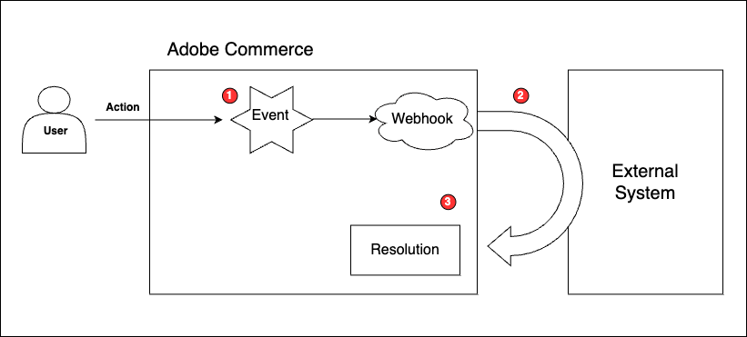

# Adobe Commerce Webhooks Overview

Webhooks enable developers to configure synchronous logic to execute calls to external systems when an Adobe Commerce event triggers. Synchronous calls are required when Commerce needs to immediately compute or validate something (order totals, taxes, payments) using a 3rd-party endpoint and write the result back into Adobe Commerce.

This process is illustrated in the following diagram.

1. Webhook execution always starts with an event occurring in Adobe Commerce. This event can occur from many different types of user flows. For example, an event fires when a shopper adds a product to their shopping cart or an administrator creates a quote.

1. The event triggers a real-time call from Commerce to a URL endpoint, such as an Order Management System. This call contains relevant data, such as the Commerce product SKU and requests information from that external system. As an example, the call could request a product's stock status to make sure it is available to be purchased.

1. Execution completes by resolving the response from the external system back into the Commerce application. For example, if the external system responds that the product is available, Commerce completes the shopper's action and adds the product to the shopping cart. If the product is not available, the flow is interrupted and an exception is thrown. ("Exception: Product is not in stock"). The shopper cannot add the product to the cart.

Not all situations are ideal for webhooks. You should create a webhook only if synchronous communication with the external server is critical. For many scenarios, asynchronous communication is sufficient, and as a result, [Adobe I/O Events for Adobe Commerce](../events/index.md) might be a better fit.

The resolution of a remote call also determines whether you should implement a webhook. Webhooks currently can be resolved as successful, by throwing an exception, or by modifying the data payload of the event. [Use cases](use-cases.md) can help you understand when to implement webhooks.

## Webhook development process

Use these guidelines to develop your own webhooks:

1. Identify the Adobe Commerce event that triggers a webhook. Adobe Commerce merchants can browse the available events from the Admin by selecting **System** > Events > **Events List** to display the Events list page.

1. Understand the default payload of the corresponding webhook by running the [`bin/magento webhooks:info` command](commands.md#display-the-payload-of-a-webhook).

1. Gather the requirements to make a web call to the external server. This includes the URL, connection information, headers, and the payload the server expects.

1. Create a [`webhooks.xml` file](hooks.md). Review the sample [use cases](use-cases.md) for ideas. Extension developers should place this file in the `etc` directory of their custom module. Merchants who want to implement their own webhooks can define them in the system `app/etc/webhooks.xml` file.

1. [Test](testing.md) your `webhooks.xml` file and interpret the [response](responses.md).
