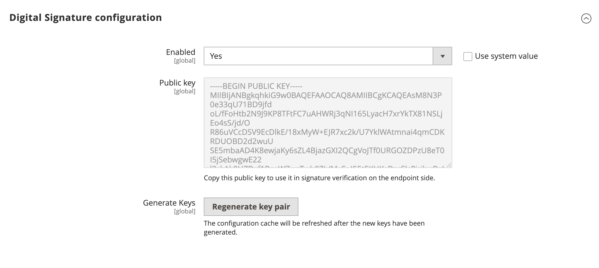

# Webhooks signature verification

Because webhook URLs are publicly accessible, it is important to ensure that the incoming requests are sent by Adobe Commerce and not by a third-party actor. You can enable signature verification to ensure your webhooks are secure.

## Enable signature verification

Signature verifications are disabled by default, because you might have other ways for securing your webhooks. Authorization headers and IP whitelisting are common techniques.

To enable signature verification, navigate to **Stores** > Settings > **Configuration** > **Adobe Services** > **Webhooks** and change the **Enabled** to **Yes**. Then click **Regenerate key pair** to generate a new key pair.



After enabling the signature verification, Commerce adds the `x-adobe-commerce-webhook-signature` header. The value of this header is a base64 encoded HMAC SHA256 signature of the request body based on the private key.

## Verify the signature

To verify the signature you must decode value of `x-adobe-commerce-webhook-signature` header and compare it with the HMAC SHA256 signature of the base64 encoded request body using the public key from the webhooks configuration.

Here is an example of the verification method of the signature using node.js:

```javascript
const fs = require("fs");
const crypto = require("crypto");

module.exports = {
    validate: function (req){
        const publicKey = fs.readFileSync(__dirname + '/publickey', 'utf-8');

        if (!req.headers['x-adobe-commerce-webhook-signature']) {
            return false;
        }

        const signature = req.headers['x-adobe-commerce-webhook-signature'];
        const verifier = crypto.createVerify('SHA256');

        const base64Payload = Buffer.from(JSON.stringify(req.body)).toString('base64');
        verifier.update(base64Payload);

        return verifier.verify(publicKey, signature, 'base64');
    }
}
```

The following example shows how to use the signature verification in the webhook action:

```javascript
const signatureValidator = require('../signatureValidator');

app.post('/validate-signature', function (req, res) {
    console.log(JSON.stringify(req.body, null, 4));
    console.log(JSON.stringify(req.headers, null, 4));

    let operations = [];
    if (signatureValidator.validate(req)) {
        // Perform the webhook action
        console.log("The signature is valid.");
        operations.push({
            op: 'success'
        });
    } else {
        console.log("The signature is invalid.");
        operations.push({
            op: 'exception',
        });
    }
    console.log(operations);
    res.json(operations);
});
```

Keep in mind that when the key pair is regenerated, the old public key will be invalid. You must subsequently update the public key in the signature verification code.

## Verify the signature in the App Builder action

To verify the signature in the App Builder action, set the `raw-http` annotation in the `app.config.yaml` file. When the `raw-http` annotation is configured, the HTTP request query and body parameters are passed to the action as reserved properties.

```yaml
    inputs:
      PUBLIC_KEY: $PUBLIC_KEY
    annotations:
      raw-http: true
```

Store the public key in the `PUBLIC_KEY` parameter in the `.env` file using the same format as provided in the Adobe Commerce Admin:

```env
# Other secrets and configuration
# ...............................

PUBLIC_KEY="-----BEGIN PUBLIC KEY-----
MIIBIjANBgkqhkiG9w0BAQEFAAOCAQ8AMIIBCgKCAQEAtglXYVz5pVn3HDluGG5T
t9coO5NKSWjx3xCDMHVa3CEqVM76PKg8UJH9fQOA57xoNv7Llc916pF0UswtudQh
Fyg+WQCFFadqGZOyL2nUKI9xWBiUi4dN8+9yMd3TE1fszVUBnk/XdLKNDQn4O6ic
doQZi5arrjNjInkimtcT2jPXs34p9G9P5CvCubPUmbGsWDgwo5an9LEX/nJfnCdZ
R10XPkRWzEM7o1OGzf7CYo06Xl+msGVM02Er265PsMAWB11cWwKmyg6dLPa8q+Qh
KNXZiEMvdVusV8aA6EkCZYFdWSBXv+jltn6NnY5qvYcuQ3SujQ9xKEANjeMWcW90
PwIDAQAB
-----END PUBLIC KEY-----"
```

**Note:** Do not commit the `.env` file to version control.

[App Builder Configuration Files](https://developer.adobe.com/app-builder/docs/guides/configuration/#env) describes `.env` file usage in detail.

The following code example below shows how the signature can be verified in the App Builder action:

```javascript
const { Core } = require('@adobe/aio-sdk')
const { errorResponse } = require('../utils')
const crypto = require('crypto');

async function main (params) {
  const logger = Core.Logger('main', { level: params.LOG_LEVEL || 'info' })

  try {
    const signature = params.__ow_headers['x-adobe-commerce-webhook-signature'] || '';
    const verifier = crypto.createVerify('SHA256');
    verifier.update(params.__ow_body);

    const isSignatureValid = verifier.verify(params.PUBLIC_KEY, signature, 'base64');

    let operations = [];
    if (isSignatureValid) {
      logger.info('The signature is valid.');
      // Here will be performed real action logic
      // payload is base64 encoded, so we need to decode it before using   
      const payload = JSON.parse(atob(params.__ow_body))

      // a simple validation if the provided postcode from Commerce webhook is less than 50000  
      if (payload.address.postcode > 50000) {
        operations.push({
            op: 'exception',
            message: 'The postcode is not allowed. Provided postcode: ' + payload.address.postcode
        });
      } else {
        operations.push({
            op: 'success'
        });
      }
    } else {
      logger.info('The signature is invalid.');
      operations.push({
        op: 'exception',
        message: 'The signature is invalid.'
      });
    }

    return {
      statusCode: 200,
      body: JSON.stringify(operations)
    }
  } catch (error) {
    logger.error(error)

    return errorResponse(500, 'server error', logger)
  }
}

exports.main = main
```
