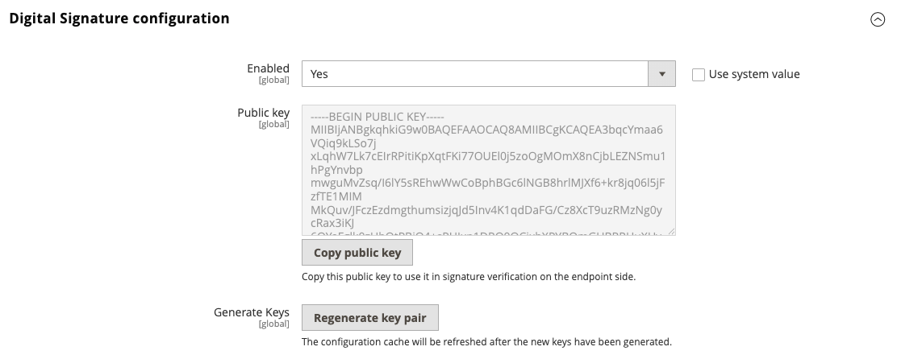

# Webhooks Signature Verification

As webhook URL is publicly accessible, it is important to ensure that the incoming requests are sent by Adobe Commerce and not by a third-party actor. Adobe Commerce Webhooks provides a way to secure your webhook by enabling signature verification.

## Enable signature verification

By default, the signature verification is disabled as you may use another way to secure your webhook with authorization headers or IP whitelisting.

To enable it navigate to **Stores** > Settings > **Configuration** > **Adobe Services** > **Webhooks** and change the **Enabled** to **Yes** and click **Regenerate key pair** to generate a new key pair.



After enabling the signature verification the new header `x-adobe-commerce-webhook-signature` will be added to the webhook requests from the Adobe Commerce. The value of this header is a base64 encoded HMAC SHA256 signature of the request body using the private key.

## Verify the signature

To verify the signature you need to decode the base64 encoded signature `x-adobe-commerce-webhook-signature` and compare it with the HMAC SHA256 signature of the base64 encoded request body using the public key from the webhooks configuration.

Here is an example of the verification method of the signature using node.js:

```javascript
const fs = require("fs");
const crypto = require("crypto");

module.exports = {
    validate: function (req){
        const publicKey = fs.readFileSync(__dirname + '/publickey', 'utf-8');

        if (!req.headers['x-adobe-commerce-webhook-signature']) {
            return false;
        }

        const signature = req.headers['x-adobe-commerce-webhook-signature'];
        const verifier = crypto.createVerify('SHA256');

        const base64Payload = Buffer.from(JSON.stringify(req.body)).toString('base64');
        verifier.update(base64Payload);

        return verifier.verify(publicKey, signature, 'base64');
    }
}
```

Here is an example of how to use the signature verification in the webhook action:

```javascript
const signatureValidator = require('../signatureValidator');

app.post('/validate-signature', function (req, res) {
    console.log(JSON.stringify(req.body, null, 4));
    console.log(JSON.stringify(req.headers, null, 4));

    let operations = [];
    if (signatureValidator.validate(req)) {
        // Perform the webhook action
        console.log("The signature is valid.");
        operations.push({
            op: 'success'
        });
    } else {
        console.log("The signature is invalid.");
        operations.push({
            op: 'exception',
        });
    }
    console.log(operations);
    res.json(operations);
});
```

Keep in mind if the key pair is regenerated the old public key will be invalid and you need to update the public key in the signature verification code.

## Verify the signature in the APP Builder action

To verify the signature in the APP Builder action the `raw-http` annotation needs to be set for the webhook action. When `raw-http` annotation is set, the HTTP request query and body parameters are passed to the action as reserved properties.

Sets the `PUBLIC_KEY` as environment variable in the webhook action configuration and use it to verify the signature.

```yaml
    inputs:
      PUBLIC_KEY: $PUBLIC_KEY
    annotations:
      raw-http: true
```

The code example below shows how the signature can be verified in the APP Builder action:

```javascript
const { Core } = require('@adobe/aio-sdk')
const { errorResponse } = require('../utils')
const crypto = require('crypto');

async function main (params) {
  const logger = Core.Logger('main', { level: params.LOG_LEVEL || 'info' })

  try {
    const signature = params.__ow_headers['x-adobe-commerce-webhook-signature'] || '';
    const verifier = crypto.createVerify('SHA256');
    verifier.update(params.__ow_body);

    const isSignatureValid = verifier.verify(params.PUBLIC_KEY, signature, 'base64');

    let operations = [];
    if (isSignatureValid) {
      logger.info('The signature is valid.');
      // Here will be performed real action logic
      operations.push({
        op: 'success'
      });
    } else {
      logger.info('The signature is invalid.');
      operations.push({
        op: 'exception',
        message: 'The signature is invalid.'
      });
    }

    return {
      statusCode: 200,
      body: JSON.stringify(operations)
    }
  } catch (error) {
    logger.error(error)

    return errorResponse(500, 'server error', logger)
  }
}

exports.main = main
```
