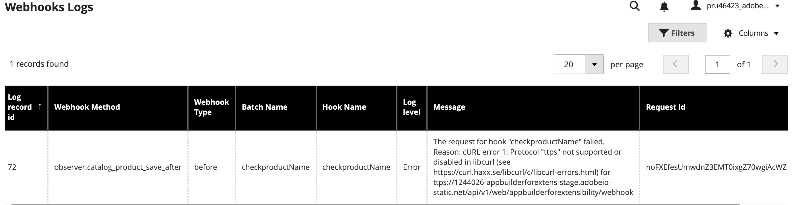
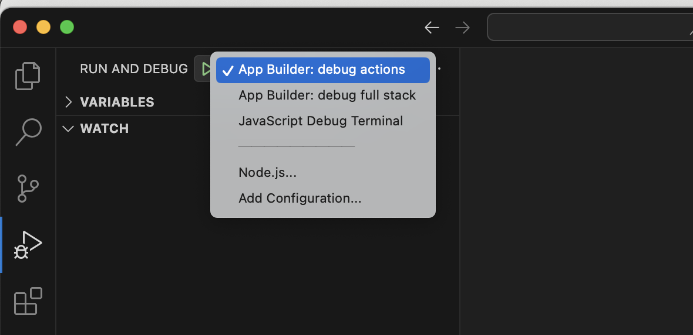

# Debugging your project

The following tips provide assistance for debugging your Adobe Commerce App Builder project, focusing on webhooks and actions. These best practices cover debugging from the Commerce instance, local development environment, and using ngrok for real-time testing.

## Debug from the Commerce Admin

You can view logs from the Admin to debug your webhooks and actions. This is useful for identifying issues with your webhook configuration or action logic. Log into your Commerce instance and navigate to **System** > **Webhook Logs**.



[Logging](../responses.md#logging) describes some

## Debug from App Builder code locally

Debugging web actions using Adobe Commerce as a Cloud Service or a deployed instance is not supported; web actions can only be simulated locally.

Follow these steps to effectively debug your Adobe I/O app on your local environment.

### Prerequisite

Ensure the `require-adobe-auth` setting in your `app.config.yaml` file is set to `false`:

`require-adobe-auth: false`

### Step 1: Configure your debugger

To debug your Adobe I/O App Builder project in Visual Studio Code (VS Code), set up a launch configuration. This allows you to run and debug your app directly from VS Code, making it easier to inspect code, set breakpoints, and view logs.

1. Create a `.vscode` folder in the root of your project if one does not already exist. Inside this folder, create or edit the `launch.json` file.

1. Copy and paste the recommended content from [debugging with VS Code](https://developer.adobe.com/app-builder/docs/guides/app_builder_guides/development#debugging-with-vs-code).

1. Save your changes.

This configuration sets up the VS Code debugger to work with Adobe I/O App Builder projects.

### Step 2: Enable source maps

In the root folder of your project, create a `webpack-config.js` file with the following content:

```js
module.exports = {
    devtool: 'inline-source-map'
  }
```

### Step 3: Rebuild the project

Use the following command to rebuild your project to apply the changes.

```bash
aio app build
```

### Step 4: Start debugging

In VS Code, on the **Run and Debug** tab, select the launch configuration you created in Step 1. This will allow you to run your app in debug mode.



Click the Run button or press **F5** to start the debugger. This starts the app using the `aio app dev` command. Output similar to the following is displayed in the terminal:

```terminal
Debugger attached.
Building the app...
To view your local application:
  -> https://localhost:9080
To view your deployed application in the Experience Cloud shell:
  -> https://experience.adobe.com/?devMode=true#/custom-apps/?localDevUrl=https://localhost:9080
 
Your actions:
web actions:
  -> https://localhost:9080/api/v1/web/commappwebhook/webhook
  
non-web actions:
 
press CTRL+C to terminate the dev environment
2025-05-22T06:41:55.969Z [watcher] info: watching action files at /Users/prutech/Documents/projects/devadvocate/appbuilderforextensibility/actions...
```

### Step 5: Web action with a sample payload

Now that your local debugger is running, you can test your web action by sending a request to the local endpoint.
Use tools like Postman or any other API client to send a POST request to the listed URL, such as `https://localhost:9080/api/v1/web/commappwebhook/webhook`, with the sample JSON payload.

```json
{
  "product": {
    "_edit_mode": true,
    "store_id": 0,
    "entity_id": "1",
    "attribute_set_id": "16",
    "type_id": "simple",
    "sku": "Pr-1",
    "name": "abc1test",
    "tax_class_id": "0",
    "description": "<p>Product 1 description</p>",
    "price": "10.00"
  }
}
```

The request should trigger the web action and hit the breakpoint you set earlier in your code, allowing you to inspect the incoming payload and debug the action logic.

### Test using curl

You can also test your web action using `curl` from the command line. Use the following command, replacing the URL with your local endpoint:

```bash
sudo curl --insecure --request POST \
  --url https://localhost:9080/api/v1/web/appbuilderforextensibility/webhook \
  --header 'Content-Type: application/json' \
  --header 'User-Agent: insomnia/10.1.1-adobe' \
  --data '{
          "product": {
              "_edit_mode": true,
              "store_id": 0,
              "entity_id": "1",
              "attribute_set_id": "16",
              "type_id": "simple",
              "sku": "Pr-1",
              "name": "abc1test",
              "tax_class_id": "0",
              "description": "<p>Product 1 description</p>",
              "price": "10.00"
          }
}
'
{"op":"exception","message":"Invalid product name >> abc1test"}%
```

## Debug using ngrok

You can test real webhook triggers from your Adobe Commerce instance and debug them locally using [ngrok](https://ngrok.com/). This setup allows requests from Adobe Commerce to be forwarded securely to your local App Builder environment.

Reasons to use ngrok:

* Test and debug live webhooks from Adobe Commerce.
* Inspect real payloads in your local aio app runtime.
* Troubleshoot and validate your code before deploying to the cloud.

To set and use ngrok:

1. Modify your action code to log incoming payloads. Open the file `validateProductName.js` and ensure it includes the following line to print the incoming webhook payload.

   `logger.info('Calling main with params: ' + JSON.stringify(params, null, 2));`.

   The updated `validateProductName.js` file should look like this:
  
   ```js
   const { Core, Events } = require('@adobe/aio-sdk') // Adobe I/O SDK modules
   const { errorResponse, stringParameters, checkMissingRequestInputs } = require('../utils') // Utility functions

   // Main function executed by Adobe I/O Runtime
   async function main(params) {
     // Create a logger instance
     const logger = Core.Logger('main', { level: params.LOG_LEVEL || 'info' })
     //Call to print payload
     logger.info('Calling main with params: ' + JSON.stringify(params, null, 2));

     try {
       const response = { statusCode: 200 }

       // Check if product name contains 'test'; return error response if true
       if (/test/.test(params.product.name.toLowerCase())) {
         response.body = JSON.stringify({
           op: "exception",
           message: "Invalid product name >> " + params.product.name
         })
       } else {
         // Success response
         response.body = JSON.stringify({
           op: "success"
         })
       }

       return response
     } catch (error) {
        // Log error and return a 500 server error response
        logger.error(error)
        return errorResponse(500, 'server error ' + JSON.stringify(params), logger)
     }
   }

   exports.main = main
   ```

1. Rebuild your App Builder project.

   ```bash
   aio app build
   ```

1. Start your app locally in development mode. This command starts the app and listens for incoming requests on port `9080`.

   ```bash
   aio app dev
   ```

1. Install ngrok. Follow the instructions in the official ngrok documentation to install it for your operating system.

1. Start ngrok to expose your local endpoint. In a new terminal window, run the following command:

   ```bash
   ngrok http https://localhost:9080
   ```

   The command starts a secure tunnel to your local app running on https://localhost:9080. You will see output similar to the following:

  ```terminal
   Session Status            online
   Account                   User (Plan: Free)
   Version                   3.23.
   Region                    India (in)
   Latency                   79ms
   Web Interface             http://127.0.0.1:4040
   Forwarding                https://1a2b-123-456-127-xx.ngrok-free.app -> https://localhost:9080

  Connections                ttl     opn     rt1     rt5     p50     p90
                             25      0       0.00    0.00    11.45   64.75
  ```

  The forwarding URL in this example is `https://1a2b-123-456-127-xx.ngrok-free.app`. This is your public URL that exposes your local app to the internet.

1. Go to the Commerce Admin and update the webhook configuration with this ngrok forwarding URL. The final URL should look like this:

  `https://1a2b-123-456-127-xx.ngrok-free.app/api/v1/web/appbuilderforextensibility/webhook`

1. When the webhook is triggered from the live Adobe Commerce instance (in this case when a product is added or modified from the Admin), the request will hit your local code, allowing you to inspect the payload in the terminal where `aio app dev` was issued.
