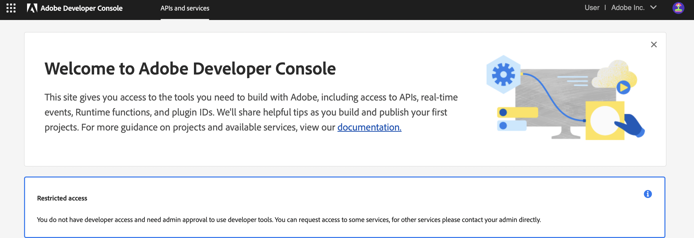
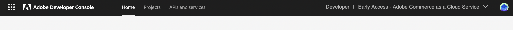

# Extend Adobe Commerce with webhooks and App Builder

With Adobe App Builder, you can build scalable, event-driven integrations using webhooks and runtime actions. These integrations allow you to extend Adobe Commerce capabilities without modifying the core codebase, making it easier to maintain and scale your applications. For example, you can use App Builder to validate data, such as product names, in real time through synchronous webhook integrations in Adobe Commerce as a Cloud Service (SaaS).

This tutorial provides instructions for setting up an App Builder project. It covers writing simple action code, configuring webhook subscriptions in Adobe Commerce, and debugging App Builder code using a debugger.

## How it works

This tutorial demonstrates how to extend Adobe Commerce using webhooks and Adobe App Builder. The integration allows you to validate product names in real time when products are added or updated in Adobe Commerce. The following provides an overview of how this example works:

1. Adobe Commerce triggers a webhook when specific events occur, such as when a new product is added or updated.

1. This webhook sends the relevant event payload (the product name, in this case) to an Adobe App Builder runtime action.

1. The App Builder action processes the payload and applies custom business logic. Validate that the product name does not include restricted terms like "test" or "example". Based on the logic, the action returns either a success or an error message.

1. Adobe Commerce uses this response to determine whether to save changes to the product.

This setup allows you to offload validation and custom logic from the Commerce codebase to the scalable, serverless infrastructure of Adobe App Builder.

## Set up the Adobe Developer Console and App Builder project locally

Before you can start building your App Builder application, you need to set up your development environment and create a project in the Adobe Developer Console. This process involves installing the necessary tools, configuring your workspace, and creating a new project that will host your App Builder application.

### Prerequisites

* An [Adobe Commerce as a Cloud Service](https://experienceleague.adobe.com/en/docs/commerce/cloud-service/overview) instance
* Access to [Adobe Developer Console](https://developer.adobe.com/console)
* Access to [Adobe Developer App Builder](https://developer.adobe.com/app-builder/docs/get_started/app_builder_get_started/set-up#access-and-credentials)

### Accessing the Developer Console

Ensure you have Developer access to the Adobe Developer Console. This is required to create and manage projects.

If you do not have developer access, your role displays as "User" in the top-right corner, and you will see a restricted access message on the Developer Console home page.

To proceed, request Developer Access from your organization admin.

The following images indicate both restricted and developer access views.





### Create a new project in Adobe Developer Console

Follow the steps described in [Create an App Builder project](https://developer.adobe.com/commerce/extensibility/events/project-setup/). These steps are essential because the Adobe Developer Console provides the credentials and configuration required to deploy your App Builder app and access Adobe services like I/O Runtime and Commerce APIs. Without completing these steps, your app will not be able to authenticate or run within the Adobe ecosystem.

This procedure allows you to quickly set up a new App Builder project with the necessary configurations and dependencies. You must install multiple APIs in your project, though the exact APIs vary, depending on whether you have Adobe Commerce as a Cloud Service (SaaS) or Adobe Commerce on Cloud or on-premises (PaaS).

&#8203;<Edition name="saas" /> Install the following APIs in your **Stage** workspace:

*  Adobe Commerce as a Cloud Service API
*  I/O Events
*  Adobe I/O Events for Adobe Commerce

&#8203;<Edition name="paas" /> Install the following APIs in your **Stage** workspace:

*  I/O Management API
*  I/O Events
*  Adobe I/O Events for Adobe Commerce

When you have installed the applicable APIs, save the project configuration. This step is crucial because it generates a JSON file that contains the necessary credentials and configurations for your App Builder project. You will use this file later to set up your local development environment.

For more information about these APIs, refer to the [Adobe Commerce Extensibility documentation](https://developer.adobe.com/commerce/extensibility/events/project-setup/).

### Set up your local App Builder environment using the CLI

After creating your project in the Adobe Developer Console, set up your development environment using Adobe I/O CLI tools. This enables you to run your App Builder application locally and deploy it to Stage or Production workspaces configured in your Developer Console project.

The following software is required to set up your App Builder project:

* npm
* Node.js (v16.x or later)
* VS Code (or any other code editor of your choice)

1. Install the Adobe I/O CLI

   ```bash
   npm install -g @adobe/aio-cli
   ```

1. Log in to the Developer Console using the CLI.

   ```bash
    aio login
    ```

    This command opens a browser window where you can sign in to your Adobe Developer Console account. After signing in, you will be redirected back to the CLI. The command returns a user token string, which is automatically stored in your local environment. This token is used to authenticate your CLI commands with the Adobe Developer Console.

1. Retrieve the JSON file from the Admin Console by following the steps outlined in [Download the workspace configuration file](https://developer.adobe.com/commerce/extensibility/events/project-setup/#download-the-workspace-configuration-file).

1. Optionally, run the `aio where` command to verify the current context of your Adobe Developer Console project.

   ```terminal
   You are currently in:
   1. Org: Adobe Commerce as a Cloud Service
   2. Project: appbuilderforextensibility
   3. Workspace: Stage
   ```

   You can also verify organization and project details in the Developer Console UI by checking the top-right corner, where your organization name and project are displayed.

1. Run the `aio app use <path-to-json-config-file>` command to use the downloaded JSON file for your project.

   ```terminal
   You are currently in:
   1. Org: <org name>
   2. Project: <project name specified in development console>
   3. Workspace: Stage
   ```

1. Run the following command to initialize your project:

   ```bash
   aio app init <your project name>
   ```

   The command displays multiple prompts to configure your App Builder project. Follow these steps:
   * Select the correct **Organization** and **Project**.
   * Choose a template listed under **Supported by My Org** to ensure compatibility with your environment.
   * For the following prompts, make the corresponding selection:
     * **Select a template** - **All Templates → @adobe/generator-app-events-generic**.
     * **Which Adobe I/O App features do you want to use?** - **Actions: Deploy Runtime actions for I/O App features**
     * **Which type of actions do you want to generate?** - **Generic**.
     * **Which UI framework do you want to use?** - **React Spectrum 3**.
     * **Provide a name for the action** -  Enter your preferred action name, such as `testwebhook`.

After the command completes, the folder structure is similar to the following:

```tree
commappwebhook/
├── README.md
├── app.config.yaml
├── dist/
├── e2e/
├── jest.setup.js
├── node_modules/
├── package-lock.json
├── package.json
├── test/
├── web-src/
└── actions/
    ├── constants.js
    ├── responses.js
    ├── testwebhook/
    │   └── index.js
    └── utils.js
```

### Implement the webhook action

1. Create an `actions/<action-name>/validateProductName.js` file in the project directory (such as `commappwebhook/actions/testwebhook/validateProductName.js`) and add the following code.

   This file defines a function that runs as an action in Adobe App Builder. In App Builder, every action must have a function named main, as this is the entry point that gets called when the action is triggered. The function must accept input in JSON format and return a response in JSON as well. In this case, the action checks if the product name received from the Adobe Commerce webhook contains the word `test`. If it does not, the action passes validation. Otherwise, it returns an error message.

   ```js
   const { Core, Events } = require('@adobe/aio-sdk') // Adobe I/O SDK modules
   const { errorResponse, stringParameters, checkMissingRequestInputs } = require('../utils') // Utility functions
   // 
   Main function executed by Adobe I/O Runtime
   async function main(params) {
    // Create a logger instance
    const logger = Core.Logger('main', { level: params.LOG_LEVEL || 'info' })
    logger.info('Calling the main action ')
    
    try {
      const response = { statusCode: 200 }
      
      // Check if product name contains 'test'; return error response if true
      if (/test/.test(params.product.name.toLowerCase())) {
      response.body = JSON.stringify({
        op: "exception",
        message: "Invalid product name >> " + params.product.name
      })
    } else {
      // Success response
      response.body = JSON.stringify({
        op: "success"
      })
    }
    
    return response
    } catch (error) {
      // Log error and return a 500 server error response
      logger.error(error)
      return errorResponse(500, 'server error ' + JSON.stringify(params), logger)
      }
    }
    exports.main = main
    ```

1. Copy the contents of the `utils.js` file provided below into the `utils.js` file located under the `actions` folder. The `utils.js` file  provides common utility functions used by actions. One of its main functions, `errorResponse`, helps create a consistent error response and optionally logs the error details. This utility is useful when validating input or handling failures in actions.

   ```js
   /* 
   * <license header>
   */
   
   /* This file exposes some common utilities for your actions */
   
   /**
    *
    * Returns a log ready string of the action input parameters.
    * The `Authorization` header content will be replaced by '<hidden>'.
    *
    * @param {object} params action input parameters.
    *
    * @returns {string}
    *
    */
    /**
    *
    * Returns an error response object and attempts to log.info the status code and error message
    *
    * @param {number} statusCode the error status code.
    *        e.g. 400
    * @param {string} message the error message.
    *        e.g. 'missing xyz parameter'
    * @param {*} [logger] an optional logger instance object with an `info` method
    *        e.g. `new require('@adobe/aio-sdk').Core.Logger('name')`
    *
    * @returns {object} the error object, ready to be returned from the action main's function.
    *
    */
    function errorResponse (statusCode, message, logger) {
        if (logger && typeof logger.info === 'function') {
              logger.info(`${statusCode}: ${message}`)
            }
        return {
          error: {
            statusCode,
          body: {
            error: message
            }
          }
        }
      }
      
    module.exports = {
      errorResponse
    }
   ```

### Configure the `app.config.yaml` file

The `app.config.yaml` file, located in the root of your project, configures your Adobe App Builder project. It defines project metadata, runtime actions, web assets, and settings like which file to use as the entry point for each action.

Change the value of the `function` line from `index.js` reference to the location of your `validateProductName.js` file.

<InlineAlert variant="info" slots="text"/>

You must specify `web: 'yes'` in the config. This ensures the action is exposed via a public URL and can be properly invoked by Adobe Commerce.

```yaml
application:
  actions: actions
  web: web-src
  runtimeManifest:
    packages:
      appbuilderforextensibility:
        license: Apache-2.0
        actions:
          webhook:
            function: actions/testwebhook/validateProductName.js
            web: 'yes'
            runtime: nodejs:22
            inputs:
              LOG_LEVEL: info
            annotations:
              require-adobe-auth: false
              final: true
```
  
### Deploy and test

Run the following commands in your project directory:

1. Install all project dependencies:

   ```bash
   npm install

1. Build the web assets:

   ```bash
   aio app deploy
   ```
  
   The deploy command builds the application, deploys the action, and uploads web assets to the CDN. The output is similar to the following, showing the deployed action URL and the URL to access your application.

   ```terminal
   ✔ Built 2 action(s) for 'application'
   ✔ Building web assets for 'application'
   ✔ Deployed 1 action(s) for 'application'
   ✔ Deploying web assets for 'application'
   ✔ All static assets for the App Builder application in workspace: application were successfully deployed to the CDN. Files deployed :
   
   * 2 HTML page(s)
   * 2 Javascript file(s)
   * 3 .map file(s)
   * 1 CSS file(s)
   
   Your deployed actions:
   
   web actions:
   -> https://1244026-appbuilderforextens-stage.adobeio-static.net/api/v1/web/appbuilderforextensibility/testwebhook
   
   To view your deployed application:
   -> https://1244026-appbuilderforextens-stage.adobeio-static.net/index.html
   
   To view your deployed application in the Experience Cloud shell:
   
   -> https://experience.adobe.com/?devMode=true#/custom-apps/?localDevUrl=https://1244026-appbuilderforextens-stage.adobeio-static.net/index.html
   
   skipping publish phase...
   Successful deployment
   ```

Make a note of the Web Action URL. You will need to specify it in the next step within the Commerce configuration.

#### Configure a webhook in the Admin

In the Commerce Admin, navigate to **System** > **Webhooks** > **Webhook Subscriptions** to display the Webhooks grid page. Click the **Add New Webhook** button.

1. Define the webhook settings as follows. The batch name and hook name can be any value. You can leave unlisted fields blank.

   Field | Value
   --- | ---
   **Webhook Method** | `observer.catalog_product_save_after`
   **Webhook Type** | `after`
   **Batch Name** | `checkproductName`
   **Hook Name** | `checkproductName`
   **URL** | The URL you noted in the previous step, such as `https://1244026-appbuilderforextens-stage.adobeio-static.net/api/v1/web/appbuilderforextensibility/testwebhook`

1. Define a hook field to specify the payload you want to send to App Builder. Click the **Add Hook Field** button and enter the following information:

   Field | Value
   --- | ---
   **Name** | `product`
   **Source** | `data.product`
   **Active** | `Yes`
  
#### Testing the integration using webhooks

You now have App Builder code set up to validate the product name received from Commerce. Whenever a product is added or edited in Commerce, the webhook triggers and synchronously invokes the App Builder code to perform the validation.

From the Commerce Admin panel, navigate to **Catalog** > **Add New Product**. Enter the product details such as name, SKU, and price. Set the name as "testproduct", then click **Save**.

Upon saving, the webhook triggers the App Builder code, which validates the product name and possibly returns an error message. The error **Invalid product name >>** will be displayed in the Commerce UI, confirming that the integration is working as expected.

As configured, if the product name does not contain the word `test`, the product should save successfully without triggering an error.
